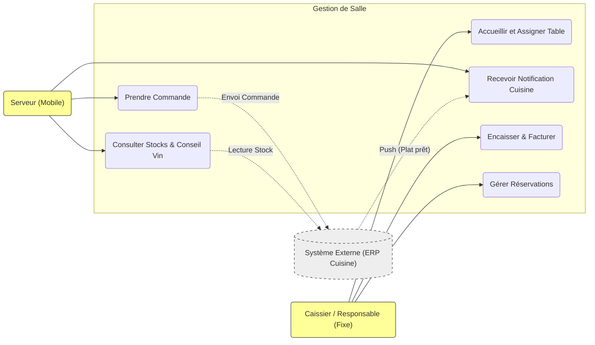

# Cas d'utilisation - Système de Gestion de Salle

## 1. Avant l'arrivée du client (Phase Réservation)
*Note : Cette phase implique des données personnelles (RGPD).*
- **Gérer les réservations** (Responsable de Salle / Caissier)
    - Enregistrer une réservation (Nom, Tel, Date, Heure, Nb personnes).
    - Noter les demandes spécifiques (Allergies, PMR, Chaise bébé).
    - *Contrainte Juridique* : Consentement collecte données (RGPD), Droit à l'oubli.

## 2. À l'arrivée du client (Phase Accueil)
- **Accueillir et Placer** (Responsable de Salle)
    - Consulter le plan de salle et l'état des tables (Libre/Occupé).
    - Assigner une table adaptée (Capacité vs Groupe).
    - Assigner un Serveur à la table.
    - Présenter le Serveur aux clients.

## 3. À la table (Phase Commande et Service)
- **Prendre la commande** (Serveur - Mobile)
    - Ouvrir la table sur l'application mobile.
    - Consulter les stocks en temps réel (Lien ERP Cuisine).
    - **Proposer un accord Mets-Vins** (Fonctionnalité automatique requise).
    - Saisir les choix (Entrées, Plats, Desserts, Boissons).
    - Valider et envoyer la commande (Dispatcher vers Cuisine / Bar).
- **Service en salle** (Serveur)
    - Recevoir une notification "Plats Prêts" (Depuis Cuisine).
    - Servir les plats/boissons.
    - Saisir un recommandement (Boissons, Desserts, Cafés).

## 4. Fin de repas (Phase Encaissement)
- **Gérer l'addition** (Caissier - Poste Fixe)
    - Consolider les commandes de la table.
    - Gérer les paiements divisés (Paiement par article oubli "chacun sa part").
    - Gérer les paiements tiers (Une personne paie pour X autres).
- **Encaisser** (Caissier)
    - Sélectionner le mode de paiement (CB, Chèque Restaurant, Espèces).
    - *Exclusion* : Chèques bancaires non acceptés.
    - Valider l'encaissement.
    - Imprimer le ticket de caisse / Note de frais.
    - *Contrainte Juridique* : Certification NF525 (Inaltérabilité, Sécurisation, Archivage des transactions).

---

## Diagramme des Cas d'Utilisation (Mermaid)

