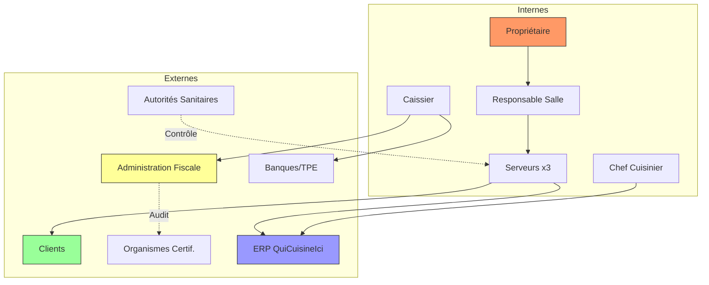

# C2 - Parties Prenantes du Projet

## Définition
Les parties prenantes (*stakeholders*) sont l'ensemble des acteurs, personnes physiques ou morales, qui ont un intérêt direct ou indirect dans le projet, influencent sa conception ou sont impactées par son déploiement.

---

## 1. Parties Prenantes INTERNES

### 1.1. Le Propriétaire / Gérant du Restaurant
**Rôle** : Commanditaire du projet, décideur final.  
**Enjeux** :
*   Rentabilité (augmentation du chiffre d'affaires, réduction des erreurs de commande).
*   Contrôle de gestion (reporting des ventes, statistiques via NF525).
*   Conformité légale (éviter les amendes fiscales et sanitaires).

**Besoins exprimés** :
*   Solution low-cost (pas d'investissement matériel autre que 3 téléphones).
*   Interface simple pour consultation des rapports (CA, plats les plus vendus).

**Impact projet** : Définit les contraintes budgétaires et valide les choix technologiques.

---

### 1.2. Le Responsable de Salle
**Rôle** : Organisateur du service, interface entre clients et serveurs.  
**Enjeux** :
*   Optimisation du placement (maximiser le taux d'occupation, gérer les flux).
*   Qualité de service (pas d'oubli, temps d'attente maîtrisé).

**Besoins** :
*   Accès au plan de salle en temps réel (tables occupées/libres).
*   Interface pour assigner les serveurs aux tables.
*   Gestion des réservations (si implémentée).

**Impact projet** : Utilisateur principal de l'**Interface Caisse/Ordinateur** (Module "Gestion Tables").

---

### 1.3. Les Serveurs (x3)
**Rôle** : Prise de commande, service en salle, relation client directe.  
**Enjeux** :
*   Rapidité et efficacité (pas de retour en cuisine pour vérifier les stocks).
*   Précision de la commande (éviter les allergènes non signalés).
*   Conseil client (accords mets-vins).

**Besoins** :
*   Application mobile intuitive et réactive.
*   Consultation des stocks en temps réel.
*   Affichage des allergènes par plat.
*   Suggestion automatique de vin (1 recommandation par plat).
*   Notifications "plat prêt" pour synchroniser le service.

**Contraintes spécifiques** :
*   Chacun gère **sa** zone en exclusivité (pas d'intervention croisée).
*   Terminal Android personnel assigné.

**Impact projet** : Utilisateurs intensifs de l'**Application Mobile Serveur**.

---

### 1.4. Le Caissier / Hôte d'Accueil
**Rôle** : Encaissement des paiements, édition des tickets de caisse.  
**Enjeux** :
*   Conformité fiscale (NF525).
*   Rapidité d'encaissement (éviter les files d'attente à la sortie).
*   Gestion des paiements divisés (chacun sa part).

**Besoins** :
*   Interface claire pour sélectionner les articles à facturer par client.
*   Liaison TPE (Terminal de Paiement Électronique).
*   Impression tickets NF525.

**Impact projet** : Utilisateur de l'**Interface Caisse/Ordinateur** (Module "Encaissement").

---

### 1.5. Le Chef Cuisinier
**Rôle** : Production culinaire, gestion des stocks (via ERP externe "QuiCuisineIci").  
**Enjeux** :
*   Réception en temps réel des commandes validées.
*   Contrôle du rythme de production (éviter la surcharge).

**Besoins** :
*   **PAS de développement spécifique** dans ce projet (déjà couvert par l'ERP).
*   L'ERP doit **recevoir** les commandes depuis l'application mobile des serveurs.
*   L'ERP doit **envoyer** les notifications "plat prêt" vers le serveur concerné.

**Impact projet** : Interface système (API) entre notre SI et l'ERP "QuiCuisineIci".

---

## 2. Parties Prenantes EXTERNES

### 2.1. Les Clients Finaux
**Rôle** : Consommateurs du service, générateurs de revenus.  
**Enjeux** :
*   Qualité de service (rapidité, précision des commandes).
*   Transparence (affichage des prix, allergènes, origine des produits).
*   Expérience fluide (paiement facile, respect des demandes spécifiques).

**Besoins** :
*   Serveurs informés et réactifs (grâce à l'application).
*   Respect des restrictions alimentaires (allergènes).
*   Paiement individuel possible.

**Impact projet** : Bénéficiaires indirects de la qualité du système (pas d'interaction directe avec le SI).

---

### 2.2. L'Administration Fiscale (DGFIP)
**Rôle** : Contrôle de la conformité fiscale (TVA, lutte anti-fraude).  
**Enjeux** :
*   Vérifier l'inaltérabilité des transactions.
*   Auditer les archives (6 ans légalement).

**Besoins** :
*   Certification NF525 ou LNE du logiciel de caisse.
*   Accès aux exports de données en cas de contrôle.

**Impact projet** : **Contrainte réglementaire forte** (conception NF525-compliant dès l'origine).

---

### 2.3. Les Organismes de Certification (AFNOR, LNE)
**Rôle** : Audit et certification du logiciel de caisse.  
**Enjeux** :
*   S'assurer que l'application respecte les critères ISCA (Inaltérabilité, Sécurisation, Conservation, Archivage).

**Besoins** :
*   Documentation technique complète.
*   Accès au code source / architecture pour audit.

**Impact projet** : Phase de certification **post-développement** (prévoir 3-6 mois).

---

### 2.4. Le Prestataire ERP "QuiCuisineIci"
**Rôle** : Éditeur du logiciel de gestion cuisine déjà en place.  
**Enjeux** :
*   Maintenir la compatibilité avec ses clients existants.
*   Éviter les modifications coûteuses de son API.

**Besoins** :
*   **Documentation de l'API** (endpoints, formats, authentification).
*   Stabilité des flux (pas de surcharge réseau).

**Impact projet** : **Dépendance technique critique** → Nécessite une phase d'analyse de l'API existante.

---

### 2.5. Les Organismes Bancaires / Processeurs de Paiement
**Rôle** : Gestion des transactions cartes bancaires.  
**Enjeux** :
*   Conformité PCI DSS.
*   Prévenir la fraude.

**Besoins** :
*   Liaison sécurisée (TLS) entre Caisse et TPE.
*   Pas de stockage des données sensibles (CVV, PIN).

**Impact projet** : Contrainte de sécurité (architecture réseau segmentée).

---

### 2.6. Les Autorités Sanitaires (DDPP - Direction Départementale de la Protection des Populations)
**Rôle** : Contrôle de l'hygiène et de l'affichage des allergènes.  
**Enjeux** :
*   Respect du règlement INCO.
*   Traçabilité (HACCP).

**Besoins** :
*   Pouvoir vérifier que les allergènes sont bien affichés/communiqués aux clients.

**Impact projet** : **Fonctionnalité obligatoire** (affichage allergènes sur l'application mobile).

---

### 2.7. Le Fournisseur d'Accès Internet (FAI) / Opérateur Wifi
**Rôle** : Fourniture de la connectivité (Fibre optique + Wifi).  
**Enjeux** :
*   Disponibilité 99,9% (critique pour le service).
*   Bande passante suffisante (3 mobiles + 1 caisse + ERP).

**Besoins** :
*   Contrat SLA (Service Level Agreement).

**Impact projet** : Risque d'indisponibilité à anticiper (mode dégradé papier ?).

---

### 2.8. Les Développeurs / Intégrateurs (Prestataire externe ou équipe interne)
**Rôle** : Conception, développement, maintenance du logiciel.  
**Enjeux** :
*   Respect du cahier des charges.
*   Maintenance évolutive (nouvelles normes, bugs).

**Besoins** :
*   Spécifications fonctionnelles claires.
*   Environnement de test (données fictives, ERP de test).

**Impact projet** : **Vous** en tant que prestataire êtes cette partie prenante.

---

## 3. Synthèse des Interactions

---

## 4. Tableau Récapitulatif

| Partie Prenante | Type | Niveau d'Impact | Priorité |
| :--- | :---: | :---: | :---: |
| Propriétaire | Interne | ⭐⭐⭐ Critique | 1 |
| Serveurs (x3) | Interne | ⭐⭐⭐ Critique | 1 |
| Caissier | Interne | ⭐⭐⭐ Critique | 1 |
| Administration Fiscale | Externe | ⭐⭐⭐ Bloquant | 1 |
| ERP "QuiCuisineIci" | Externe | ⭐⭐⭐ Bloquant | 1 |
| Responsable de Salle | Interne | ⭐⭐ Important | 2 |
| Chef Cuisinier | Interne | ⭐⭐ Important | 2 |
| Clients | Externe | ⭐⭐ Important | 2 |
| Banques/TPE | Externe | ⭐⭐ Important | 2 |
| Autorités Sanitaires | Externe | ⭐ Modéré | 3 |
| Organismes Certification | Externe | ⭐ Modéré | 3 |
