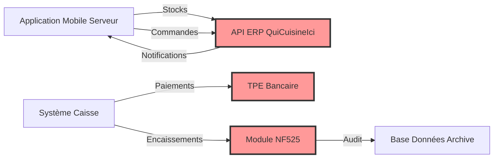

# C2 - Synthèse et Orchestration de l'Analyse

## Objectif de ce Document
Ce document fait la **synthèse** des deux analyses précédentes et propose une **orchestration** des actions à mener pour finaliser le cadrage du projet.

---

## 1. Cartographie Parties Prenantes → Besoins

Le tableau suivant croise les parties prenantes identifiées dans `C2-Parties-Prenantes.md` avec les besoins issus de `C2-Analyse-Besoins.md` :

| Partie Prenante | Besoins Fonctionnels Principaux | Besoins Non-Fonctionnels | Points Critiques |
| :--- | :--- | :--- | :--- |
| **Propriétaire** | Dashboard Reporting (CA, Stats) | Conformité NF525/RGPD | Coût Certification |
| **Serveurs (x3)** | Prise commande Mobile, Stocks temps réel, Allergènes, Conseil Vin | Performance (< 2s chargement), Mode Offline | Dépendance API ERP |
| **Responsable Salle** | Plan de salle, Assignation serveurs, (Réservations ?) | Interface intuitive | Clarifier scope Réservations |
| **Caissier** | Encaissement divisé/groupé, Liaison TPE, Tickets NF525 | Sécurité PCI DSS | Segmentation réseau |
| **Chef Cuisinier** | Réception commandes (via ERP externe) | Disponibilité 99% | Documentation API ERP |
| **Administration Fiscale** | Inaltérabilité, Archives | Certification Tier-Partie | Audit pré-certification |
| **Clients** | Service rapide, Allergènes visibles | Transparence | Respect INCO |

---

## 2. Matrice Risques & Dépendances

### Risques Majeurs Identifiés

| Risque | Probabilité | Impact | Mitigation |
| :--- | :---: | :---: | :--- |
| **API ERP non documentée** | Haute | Bloquant | Exiger doc avant démarrage |
| **Certification NF525 refusée** | Moyenne | Bloquant | Pré-audit interne + Expert NF525 |
| **Panne Wifi prolongée** | Moyenne | Grave | Mode Offline + Sync différée |
| **Résistance utilisateurs** | Moyenne | Modéré | Formation + Mode Démo |
| **Évolution API ERP** | Faible | Grave | Clause contractuelle maintenance |

### Dépendances Techniques Critiques

*Légende : Rouge = Dépendance externe critique*

---

## 3. Plan d'Action pour Finaliser le Cadrage

### Phase 1 : Clarification Client (Avant Conception)
**Durée estimée** : 1 semaine  
**Livrable** : Procès-Verbal de Cadrage Validé

| Action | Responsable | Deadline |
| :--- | :--- | :--- |
| Organiser atelier client (2h) | Chef de Projet | J+3 |
| Préparer questionnaire (15 questions clés) | Analyste Fonctionnel | J+2 |
| Obtenir documentation API ERP | Client (via Chef Cuisinier) | J+7 |
| Valider scope Réservations (In/Out) | Propriétaire | J+5 |
| Définir fréquence MAJ Carte | Chef + Responsable Salle | J+5 |

**Questions Prioritaires au Client** :
1.  L'API de l'ERP "QuiCuisineIci" est-elle documentée ? Pouvons-nous avoir accès à un environnement de test ?
2.  Souhaitez-vous un module de gestion des réservations dans la V1 ou peut-il être reporté en V2 ?
3.  La carte est-elle mise à jour quotidiennement, hebdomadairement ou de manière ad-hoc ?
4.  En cas de panne Wifi, quel est le processus actuel (papier/crayon) ? Faut-il prévoir un mode dégradé numérique ?
5.  Disposez-vous déjà d'un contrat avec un organisme de certification (AFNOR/LNE) ou faut-il l'inclure dans le devis ?

---

### Phase 2 : Analyse Technique Approfondie
**Durée estimée** : 2 semaines  
**Livrable** : Dossier d'Architecture Technique (DAT)

| Tâche | Composant | Objectif |
| :--- | :--- | :--- |
| Reverse Engineering API ERP | Backend | Comprendre endpoints, auth, formats |
| Audit réseau existant | Infrastructure | Vérifier segmentation VLAN, débit Wifi |
| Benchmark solutions NF525 | Caisse | Identifier bibliothèques/frameworks certifiables |
| Prototypage Mode Offline | Mobile | Valider faisabilité cache local + sync |

---

### Phase 3 : Conception Détaillée
**Durée estimée** : 3 semaines  
**Livrable** : Spécifications Fonctionnelles & Techniques Détaillées (SFTD)

**Contenu attendu** :
*   Modèle de données complet (MCD/MLD) → Verra C7.
*   Diagrammes de séquence (scénarios critiques) → Voir C7.
*   Maquettes IHM (Mobile Serveur + Interface Caisse) → Voir C5.
*   Plan de tests (Unitaires, Intégration, Conformité NF525).

---

## 4. Proposition de Périmètre V1 vs V2

Vu les ambiguïtés et oublis identifiés, nous proposons une approche **itérative** :

### Version 1 (MVP - Minimum Viable Product) - 4 mois
**Objectif** : Socle fonctionnel certifiable NF525.

**Périmètre IN** :
*   ✅ Prise de commande Mobile (Stocks temps réel, Conseil Vin, Allergènes).
*   ✅ Interface Caisse (Encaissement divisé/groupé, TPE, Tickets NF525).
*   ✅ Interface ERP (Envoi commandes, Réception notifications).
*   ✅ Plan de salle (Assignation serveurs).
*   ✅ Mode Offline de base (Cache stocks local).

**Périmètre OUT (reporté V2)** :
*   ❌ Gestion des Réservations (Web/Mobile).
*   ❌ Dashboard Analytics Propriétaire (Reporting avancé).
*   ❌ Module de Gestion des Pourboires.
*   ❌ Historique Client (Fidélisation).

---

### Version 2 (Extensions) - +2 mois
**Périmètre** :
*   Module Réservations (avec confirmation SMS via API Twilio/Sendinblue).
*   Dashboard Web Propriétaire (Charts CA, Top plats, Export Excel).
*   Gestion Pourboires (Répartition entre serveurs).
*   Historique commandes clients (CRM basique).

---

## 5. Indicateurs de Succès (KPI)

Pour valider que le système répond bien aux besoins, nous proposons les KPI suivants :

| KPI | Cible | Mesure |
| :--- | :--- | :--- |
| **Temps moyen de prise de commande** | < 3 min/table | Logs application mobile |
| **Taux d'erreur commande** | < 2% | Comparaison Commande/Retour cuisine |
| **Disponibilité système** | > 99% | Monitoring serveur (uptime) |
| **Temps d'encaissement moyen** | < 2 min/client | Logs caisse |
| **Conformité NF525** | 100% | Certification officielle obtenue |
| **Satisfaction utilisateurs** | > 4/5 | Questionnaire post-formation (1 mois) |

---

## 6. Estimation Budgétaire Préliminaire

*(Ordre de grandeur - à affiner après phase de cadrage)*

| Poste | Détail | Estimation HT |
| :--- | :--- | ---: |
| **Conception** | Analyse, Spécifications, Maquettes | 8 000 € |
| **Développement V1** | Backend + 2 Frontends + Intégration ERP | 25 000 € |
| **Infrastructure** | Serveur Cloud (1 an), BDD, Backup | 2 000 € |
| **Certification NF525** | Audit + Redevance annuelle | 3 500 € |
| **Formation** | 1 jour (6 personnes) | 1 200 € |
| **Maintenance (Année 1)** | Support + Mises à jour | 4 000 € |
| **TOTAL V1** | | **43 700 €** |

*Hors matériel (3 téléphones Android : ~2 000 €)*

---

## Conclusion

L'analyse des parties prenantes et la reprise critique du besoin mettent en évidence :
1.  Un **besoin réel et bien cadré** dans ses grandes lignes.
2.  Des **zones d'ombre critiques** (API ERP, Mode dégradé, Réservations) nécessitant un **cadrage formel** avant démarrage.
3.  Une **approche itérative V1/V2** recommandée pour valider le socle fonctionnel avant d'ajouter des fonctionnalités avancées.

**Prochaines étapes** :
→ Validation de cette analyse par le client.  
→ Atelier de cadrage (Phase 1).  
→ Passage à la conception architecturale (C4, C5, C7).
