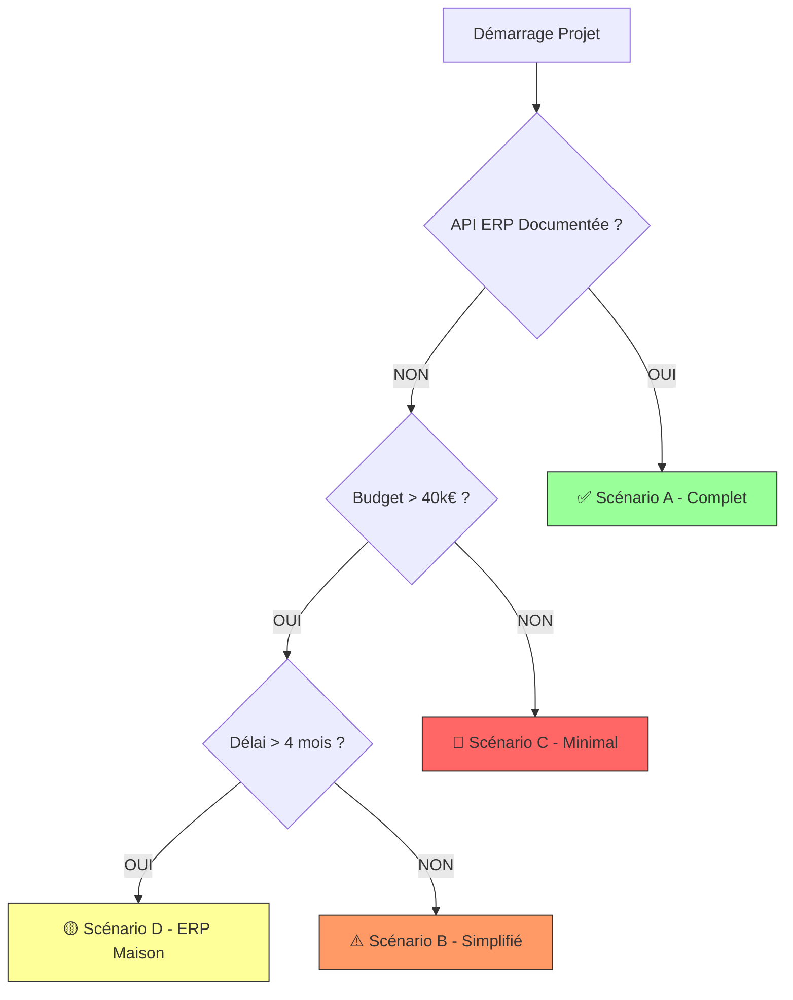

# C3 - Étude et Évaluation de la Faisabilité du Projet

## Objectif
Identifier les éléments du besoin qui présentent des **risques d'infaisabilité** ou des **complexités techniques majeures** pouvant compromettre le projet.

---

## 1. Éléments FAISABLES (Complexité Maîtrisable)

### 1.1. Application Mobile Serveur (Android)
**Besoin** : 3 serveurs avec des téléphones Android pour prise de commande en salle.

**Analyse** :
- ✅ **Faisable** : Technologies matures (React Native, Flutter, Java/Kotlin natif).
- ✅ Écosystème Android bien documenté.
- ✅ Accès aux API natives (Notifications push, stockage local).

**Complexité** : ⭐⭐ Faible (Standard industriel)

---

### 1.2. Système de Caisse avec Certification NF525
**Besoin** : Encaissement conforme à la loi anti-fraude TVA.

**Analyse** :
- ✅ **Faisable** : Nombreuses bibliothèques/frameworks certifiables existent.
- ✅ Référentiels NF525 publics (critères ISCA documentés).
- ⚠️ **Contrainte** : Nécessite un audit par organisme tiers (AFNOR/LNE) → Délai 3-6 mois.

**Complexité** : ⭐⭐⭐ Moyenne (Certification longue mais process connu)

---

### 1.3. Gestion des Stocks en Temps Réel
**Besoin** : Affichage instantané du nombre de plats disponibles sur les mobiles serveurs.

**Analyse** :
- ✅ **Faisable** : Lecture de données via API REST depuis l'ERP "QuiCuisineIci".
- ✅ Technologies de push/notification (WebSockets, Firebase Cloud Messaging).

**Complexité** : ⭐⭐ Faible (Architecture classique)

---

### 1.4. Paiement Divisé / Groupé
**Besoin** : Chacun paie sa part OU une personne paie pour plusieurs.

**Analyse** :
- ✅ **Faisable** : Modélisation base de données avec liaison `Article → Convive`.
- ✅ Interface de sélection d'articles pour facturation (déjà implémenté dans de nombreux POS).

**Complexité** : ⭐⭐ Faible (Logique métier classique)

---

## 2. Éléments à RISQUE (Faisabilité Conditionnelle)

### 2.1. Intégration avec l'ERP "QuiCuisineIci"
**Besoin** : Interface bidirectionnelle (Envoi commandes + Réception notifications "plat prêt").

**Analyse** :
- ⚠️ **Faisabilité CONDITIONNÉE** à :
  1. **Documentation de l'API** : Si l'éditeur ne fournit pas de specs, nécessité de reverse engineering → Risque juridique (violation CGU).
  2. **Stabilité de l'API** : Si l'éditeur modifie son API sans préavis → Rupture de service.
  3. **Performances** : Si l'API a des temps de réponse > 5s → Expérience utilisateur dégradée.

**Points de blocage possibles** :
- 🔴 API non documentée ou fermée (pas d'accès développeurs).
- 🔴 Authentification propriétaire non accessible.
- 🔴 Pas d'environnement de test/sandbox.

**Recommandation** :
```
EXIGENCE CONTRACTUELLE : Obtenir AVANT démarrage du projet :
1. Documentation API complète (Endpoints, Formats, Auth).
2. Accès à un environnement de TEST.
3. Engagement écrit de l'éditeur sur la stabilité (pas de breaking change sans préavis 6 mois).
```

**Complexité** : ⭐⭐⭐⭐ Élevée (Dépendance externe critique)

---

### 2.2. Conseil Automatique "Accord Mets-Vins"
**Besoin** : L'application propose **automatiquement** un vin unique par plat.

**Analyse** :
- ✅ **Version Simple (Faisable)** : Table de correspondance statique `Plat_ID → Vin_ID`.
  - Géré manuellement par le Responsable/Chef.
  - Mise à jour quotidienne nécessaire (car carte changeante).
  
- ⚠️ **Version Avancée (Complexe)** : Moteur de recommandation intelligent.
  - Prise en compte des stocks de vins en temps réel.
  - Algorithme d'apprentissage basé sur les préférences clients.
  - → **Risque** : Nécessite un Data Scientist + base de données historique.

**Recommandation** : Démarrer avec version simple (table manuelle), puis évoluer en V2 si besoin.

**Complexité** :
- Simple : ⭐⭐ Faible
- Avancée : ⭐⭐⭐⭐⭐ Très élevée (Machine Learning)

---

### 2.3. Carte Changeante "Tous les Jours"
**Besoin** : *« La carte évolue selon la saison, tous les jours. »*

**Analyse** :
- ✅ **Techniquement Faisable** : Interface d'administration pour modifier la carte.
- ⚠️ **Risque Opérationnel** : Si changement quotidien **littéral** :
  - Qui met à jour ? Quand (le matin avant ouverture ?) ?
  - Synchronisation avec l'ERP (stocks) → Timing critique.
  - Formation nécessaire (interface simple et rapide).

**Ambiguïté non levée** :
> 🔶 **Question au client** : La carte change-t-elle réellement **365 fois/an** ou s'agit-il de **variations hebdomadaires/saisonnières** ?

**Complexité** :
- Si quotidien : ⭐⭐⭐ Moyenne (Contrainte opérationnelle forte)
- Si hebdo/saison : ⭐⭐ Faible

---

### 2.4. Mode Dégradé (Perte de Wifi)
**Besoin** : (Non exprimé dans le cahier des charges, mais **critique**)

**Analyse** :
- ⚠️ **Risque d'Infaisabilité Totale** en cas de panne réseau si aucun mode offline.
- ✅ **Faisable** avec architecture adaptée :
  - Cache local des stocks (dernière valeur connue).
  - File d'attente locale pour commandes (envoi différé).
  - Synchronisation automatique à la reconnexion.

**Technologies** :
- SQLite local (mobile) + Room (Android).
- Queue persistante (Workmanager Android).

**⚠️ Limitation** :
- Les stocks affichés en mode dégradé peuvent être **obsolètes** (risque de vendre un plat épuisé).

**Recommandation** : Prévoir ce mode + alerte visuelle "Données non synchronisées".

**Complexité** : ⭐⭐⭐ Moyenne (Architecture Offline-First)

---

## 3. Éléments POTENTIELLEMENT INFAISABLES

### 3.1. Garantie de Conformité PCI DSS sans Audit Initial
**Contexte** : Le restaurant accepte les cartes bancaires via TPE.

**Problème identifié** :
- 🔴 **Infaisable** de garantir la conformité PCI DSS **sans audit réseau préalable**.
- Le cahier des charges ne mentionne pas l'état actuel du réseau :
  - Le Wifi est-il segmenté (VLAN) ?
  - Le TPE est-il déjà isolé du réseau public ?
  - Existe-t-il un pare-feu ?

**Impact** :
- Si l'infrastructure réseau actuelle n'est **PAS conforme**, le projet logiciel seul ne suffit pas.
- → Nécessité d'investissements matériels (routeur, switch manageable, firewall).

**Recommandation** :
```
PRÉ-REQUIS : Audit réseau PCI DSS par un QSA (Qualified Security Assessor) AVANT démarrage projet.
Sinon, risque de non-conformité → Impossibilité légale d'utiliser le système.
```

**Faisabilité** : ❌ **Conditionnée** à la mise en conformité préalable de l'infrastructure.

---

### 3.2. Synchronisation Parfaite Multi-Dispositifs en Temps Réel
**Problème théorique** :
- 3 mobiles + 1 caisse + ERP → Risque de **race conditions** (deux serveurs commandent simultanément le dernier plat disponible).

**Analyse** :
- ⚠️ **Complexe** mais **faisable** avec :
  - Verrouillage optimiste (Optimistic Locking) en base de données.
  - Transaction ACID (Atomicité, Cohérence, Isolation, Durabilité).
  - WebSockets pour notification instantanée.

**Risque résiduel** :
- Latence réseau (Wifi) → Décalage de ~500ms acceptable.
- Si latence > 2s → Expérience dégradée.

**Faisabilité** : ✅ **Faisable** avec architecture robuste (transaction BDD + notifications push).

**Complexité** : ⭐⭐⭐⭐ Élevée (Système distribué temps réel)

---

### 3.3. Interface "Sans Formation" pour Personnel Non Technique
**Besoin implicite** : Les serveurs doivent adopter l'outil rapidement.

**Risque** :
- 🔴 **Infaisable** de concevoir une interface **zéro formation** pour un système métier complexe.
- Même les meilleurs UX/UI nécessitent une **prise en main minimale**.

**Recommandation** :
- Prévoir **obligatoirement** :
  - 1 journée de formation en présentiel.
  - Tutoriels vidéo intégrés dans l'app.
  - Mode démo/sandbox pour s'entraîner.

**Faisabilité** : ✅ Faisable **avec formation**.

---

## 4. Synthèse des Risques d'Infaisabilité

| Élément | Faisabilité | Condition(s) Bloquante(s) | Priorité Action |
| :--- | :---: | :--- | :---: |
| **Intégration ERP** | 🟡 Conditionnelle | Documentation API + Environnement Test | ⚠️ CRITIQUE |
| **Conformité PCI DSS** | 🟡 Conditionnelle | Audit réseau préalable | ⚠️ CRITIQUE |
| **Certification NF525** | 🟢 Faisable | Délai 3-6 mois à intégrer | 🔵 Important |
| **Mode Dégradé Offline** | 🟢 Faisable | Architecture Offline-First | 🔵 Important |
| **Conseil Vin Automatique** | 🟢 Faisable | Version Simple (Pas ML en V1) | 🟢 Normal |
| **Sync Temps Réel** | 🟢 Faisable | Architecture robuste (ACID + WebSocket) | 🔵 Important |
| **Carte Quotidienne** | 🟡 Ambiguë | Clarifier fréquence réelle | 🔵 Important |

**Légende** :
- 🟢 Faisable (risque maîtrisé)
- 🟡 Conditionnelle (blocage possible)
- 🔴 Infaisable (en l'état actuel)

---

## 5. Actions Bloquantes à Adresser AVANT Démarrage

### 🔴 BLOQUANT 1 : Documentation API ERP "QuiCuisineIci"
**Action** : Réunion tripartite (Client + Chef Cuisinier + Éditeur ERP).  
**Livrable attendu** :
- Spécifications API (Swagger/OpenAPI ou équivalent).
- Accès environnement de test (credentials).
- Engagement stabilité (pas de breaking change sans préavis 6 mois).

**Deadline** : Avant signature contrat de développement.

---

### 🔴 BLOQUANT 2 : Audit Réseau PCI DSS
**Action** : Intervention d'un expert QSA (Qualified Security Assessor).  
**Livrable attendu** :
- Rapport d'audit (conformité actuelle).
- Plan de mise en conformité si nécessaire (ex: installation VLAN).
- Budget additionnel si infrastructure à refondre.

**Deadline** : Avant démarrage développement caisse.

---

### 🟡 URGENT 3 : Clarification Fréquence MAJ Carte
**Action** : Question directe au Propriétaire/Chef.  
**Impact** : Conception interface d'administration (simple vs complexe).

---

## 7. Plans de Mitigation Détaillés

Pour chaque risque critique identifié, voici les **stratégies de mitigation** avec trois niveaux de réponse.

---

### 7.1. RISQUE : API ERP "QuiCuisineIci" Non Documentée

#### Niveau 1 : Solution Idéale ✅
**Action** : Obtenir documentation officielle API + environnement de test.  
**Avantages** :
- Intégration native et pérenne.
- Support technique assuré par l'éditeur ERP.
- Évolutions futures facilitées.

**Délai** : +0 semaine (si fournie immédiatement).  
**Coût** : 0 € additionnel.

---

#### Niveau 2 : Solution Acceptable ⚠️
**Action** : Reverse Engineering de l'API (analyse du trafic réseau ERP).  
**Méthode** :
1. Installer un proxy MITM (Man-In-The-Middle) type `mitmproxy` ou `Burp Suite`.
2. Capturer les requêtes HTTP/WebSocket entre l'ERP et ses clients existants.
3. Reconstituer les endpoints, payloads et mécanismes d'authentification.

**Avantages** :
- Permet de débloquer le projet sans dépendre de l'éditeur.
- Coût maîtrisé.

**Inconvénients** :
- ⚠️ **Risque juridique** : Possible violation des CGU de l'ERP.
- ⚠️ **Fragilité** : Si l'API change, nécessité de refaire le reverse engineering.
- ⚠️ **Pas de support officiel**.

**Délai** : +2 semaines (analyse + développement).  
**Coût** : +3 000 € (expert sécurité).

**⚠️ Validation juridique requise** avant engagement.

---

#### Niveau 3 : Solution Minimale (Plan B) 🔴
**Action** : Abandon de l'intégration temps réel → Mode manuel.  
**Architecture de repli** :
- **Stocks** : Mise à jour manuelle dans notre BDD le matin (Chef saisit les quantités).
- **Commandes** : Impression papier en cuisine (pas d'envoi numérique à l'ERP).
- **Notifications** : Serveurs surveillent physiquement la cuisine (sonnette).

**Avantages** :
- Projet réalisable sans dépendance externe.
- Coût minimal.

**Inconvénients** :
- ❌ Perte de la valeur ajoutée principale (temps réel).
- ❌ Risque d'erreurs (stocks non synchronisés).
- ❌ Expérience utilisateur dégradée.

**Délai** : -3 semaines (simplification architecture).  
**Coût** : -8 000 € (module intégration supprimé).

**⚠️ À éviter** : Ne répond pas au besoin initial.

---

### 7.2. RISQUE : Infrastructure Réseau Non Conforme PCI DSS

#### Niveau 1 : Solution Idéale ✅
**Action** : Mise en conformité totale avant démarrage projet.  
**Plan d'action** :
1. Audit QSA (Qualified Security Assessor).
2. Installation équipements réseau (switch manageable, firewall).
3. Segmentation VLAN (3 réseaux isolés) :
   - VLAN 10 : Réseau Monétique (TPE + Caisse)
   - VLAN 20 : Réseau Métier (Mobiles Serveurs + ERP)
   - VLAN 30 : Réseau Invités (Wifi public si futur)
4. Certification PCI DSS niveau SAQ A-EP.

**Délai** : +4 semaines.  
**Coût** : 5 000 € à 12 000 € (selon état initial).

---

#### Niveau 2 : Solution Acceptable ⚠️
**Action** : Externalisation totale du paiement (TPE autonome).  
**Architecture** :
- Le TPE fonctionne **en mode standalone** (pas de liaison logicielle avec la caisse).
- Le caissier saisit **manuellement** le montant sur le TPE.
- La caisse enregistre le paiement comme "CB" sans données bancaires.

**Avantages** :
- ✅ Pas de contrainte PCI DSS sur l'architecture logicielle.
- ✅ Coût infrastructure réduit.

**Inconvénients** :
- ⚠️ Double saisie (montant sur caisse + montant sur TPE) → Risque d'erreur.
- ⚠️ Pas de rapprochement automatique bancaire.

**Délai** : +0 semaine.  
**Coût** : 0 € (TPE déjà présent).

---

#### Niveau 3 : Solution Minimale (Paiements Espèces/Tickets Resto Uniquement) 🔴
**Action** : Refuser les paiements par carte bancaire temporairement.  
**Conditions** :
- Affichage légal "Paiements CB temporairement indisponibles".
- Accepter uniquement espèces + tickets restaurant papier.

**⚠️ Impact commercial majeur** : Perte estimée de 60-70% des clients (usage massif de la CB en France).

**Délai** : +0 semaine.  
**Coût** : 0 €.

**⚠️ Non viable** : Doit rester une solution d'extrême urgence uniquement.

---

### 7.3. RISQUE : Certification NF525 Refusée

#### Niveau 1 : Solution Idéale ✅
**Action** : Pré-audit par expert NF525 avant soumission officielle.  
**Processus** :
1. Engagement d'un consultant certifié NF525 (freelance ou cabinet).
2. Audit blanc (simulation) à J+60 du développement.
3. Corrections itératives jusqu'à conformité.
4. Soumission officielle AFNOR/LNE à J+90.

**Avantages** :
- ✅ Taux de réussite ~95% (vs 60% sans pré-audit).
- ✅ Économie de temps (pas de refus → resoumission).

**Délai** : +0 semaine (intégré au planning).  
**Coût** : +2 500 € (consultant).

---

#### Niveau 2 : Solution Acceptable ⚠️
**Action** : Utilisation d'un framework Open Source pré-certifié.  
**Exemples** :
- **OdooPOS** (module certifié NF525 disponible).
- **PrestaShop** (module tiers certifié).

**Adaptation** : Personnaliser le module pour le contexte restaurant.

**Avantages** :
- ✅ Garantie de conformité (déjà audité).
- ✅ Communauté active.

**Inconvénients** :
- ⚠️ Moins flexible (contraintes du framework).
- ⚠️ Personnalisation limitée.

**Délai** : -2 semaines (développement simplifié).  
**Coût** : 0 € (Open Source) + Licence module (~500 €/an).

---

#### Niveau 3 : Solution Minimale (Auto-Attestation) 🔴
**Action** : Exploiter la période transitoire (jusqu'à fin 2025).  
**Contexte réglementaire** :
- Jusqu'à fin 2025, l'auto-attestation éditeur est encore tolérée.
- À partir de 2026, certification tierce **obligatoire**.

**Plan** :
1. Lancer avec auto-attestation (conformité déclarative).
2. Planifier la certification pour 2026.

**Risques** :
- 🔴 Si contrôle fiscal avant 2026 : Amende possible (1 500 € à 7 500 €).
- 🔴 Si non-conformité avérée : Obligation de migrer en urgence.

**⚠️ Non recommandé** : Risque juridique trop élevé pour le client.

---

### 7.4. RISQUE : Performance Réseau Wifi Insuffisante

#### Niveau 1 : Solution Idéale ✅
**Action** : Audit préalable + Upgrade si nécessaire.  
**Tests à réaliser** :
1. Mesure débit réel (WiFi Analyzer, Speedtest).
2. Test charge (simulation 3 mobiles + caisse + ERP en simultané).
3. Vérification couverture (toute la salle + cuisine).

**Seuils requis** :
- Débit min : 10 Mbps download / 5 Mbps upload.
- Latence max : < 50 ms.
- Couverture : Signal > -70 dBm partout.

**Si insuffisant** : Ajout d'un point d'accès (AP) + switch PoE.

**Coût** : 0 € (si OK) à 1 500 € (upgrade).

---

#### Niveau 2 : Solution Acceptable ⚠️
**Action** : Optimisation logicielle (réduction bande passante).  
**Mesures** :
- Compression des images (carte, plats) → WebP au lieu de PNG.
- Limitation des requêtes (polling → WebSocket).
- Lazy loading (chargement différé).

**Gain** : Réduction ~40% du trafic.

**Délai** : +1 semaine (optimisation).  
**Coût** : 0 €.

---

#### Niveau 3 : Solution Minimale (Mode 4G/5G de Secours) 🔴
**Action** : Carte SIM data dans chaque mobile serveur.  
**Fonctionnement** :
- En cas de Wifi défaillant, basculement automatique sur réseau mobile.

**Avantages** :
- ✅ Redondance totale.

**Inconvénients** :
- ⚠️ Coût récurrent (abonnement data x3 : ~60 €/mois).
- ⚠️ Sécurité réduite (sortie du réseau privé).

**Coût** : 720 €/an.

---

## 8. Scénarios Alternatifs (Plans B/C)

En cas d'impossibilité de lever les blocages critiques, voici les **architectures alternatives** possibles.

---

### Scénario A : Projet Complet (Architecture Cible) ✅

**Conditions** :
- ✅ API ERP documentée et accessible.
- ✅ Infrastructure réseau conforme PCI DSS.
- ✅ Budget et délais respectés.

**Architecture** :
```
┌─────────────┐
│ Mobile      │──┬──▶ API Backend ──▶ Base de Données
│ Serveur (x3)│  │         │
└─────────────┘  │         ├──▶ ERP QuiCuisineIci (REST)
                 │         │
┌─────────────┐  │         ├──▶ Module NF525
│ Caisse      │──┘         │
│ (Fixe)      │────────────┤
└─────────────┘            │
                          TPE (PCI DSS)
```

**Fonctionnalités** :
- ✅ Temps réel (stocks, notifications).
- ✅ Mode offline de secours.
- ✅ Paiements CB + Certification NF525.
- ✅ Dashboard propriétaire.

**Budget** : 43 700 € HT.  
**Délai** : 5 mois (incluant certification).

---

### Scénario B : Projet Simplifié (Sans Intégration ERP Temps Réel) ⚠️

**Conditions** :
- 🔴 API ERP inaccessible OU Reverse engineering refusé.
- ✅ Infrastructure réseau OK.

**Architecture** :
```
┌─────────────┐
│ Mobile      │──▶ API Backend ──▶ Base de Données (Stocks Manuels)
│ Serveur (x3)│           │
└─────────────┘           ├──▶ Module NF525
                          │
┌─────────────┐           │
│ Caisse      │───────────┤
│ (Fixe)      │           │
└─────────────┘          TPE

Cuisine : Impression papier des commandes (pas de lien ERP)
```

**Fonctionnalités** :
- ✅ Prise de commande mobile (stocks mise à jour manuelle matin).
- ✅ Encaissement certifié NF525.
- ❌ Pas de notification "plat prêt" automatique.
- ❌ Pas de synchronisation temps réel avec cuisine.

**Workflow** :
1. Chef met à jour les stocks à 9h dans l'interface web.
2. Serveurs prennent commandes sur mobile.
3. **Impression ticket cuisine** (pas d'envoi ERP).
4. Chef sonne une cloche quand plat prêt (pas de notification).

**Budget** : 32 000 € HT (-26%).  
**Délai** : 3,5 mois.

**⚠️ Inconvénients** :
- Risque de vendre un plat épuisé (stocks non temps réel).
- Retour à un fonctionnement semi-manuel.

---

### Scénario C : Solution Minimale (Caisse Certifiée Uniquement) 🔴

**Conditions** :
- 🔴 API ERP inaccessible.
- 🔴 Budget réduit de moitié.
- 🔴 Délai court (< 2 mois).

**Architecture** :
```
┌─────────────┐
│ Caisse      │──▶ Module NF525 ──▶ Base de Données
│ (Fixe)      │           │
└─────────────┘          TPE

Mobiles Serveurs : Abandon (commandes prises sur carnet papier)
```

**Fonctionnalités** :
- ✅ Encaissement certifié NF525 (légalité).
- ✅ Paiements CB sécurisés.
- ❌ Pas d'application mobile serveurs.
- ❌ Retour au papier/crayon pour commandes.

**Budget** : 18 000 € HT (-59%).  
**Délai** : 2 mois.

**⚠️ Impact** :
- Perte totale de la valeur ajoutée "digitalisation salle".
- Ne répond qu'à l'obligation légale (NF525).

**Recommandation** : **À éviter**. Ne satisfait pas le besoin initial du client.

---

### Scénario D : Hybride (ERP Interne Maison) 🟡

**Conditions** :
- 🔴 API ERP externe définitivement inaccessible.
- ✅ Client accepte budget augmenté.
- ✅ Délai étendu (+2 mois).

**Solution** : Développer un **mini-ERP cuisine interne** pour remplacer "QuiCuisineIci".

**Architecture** :
```
┌─────────────┐
│ Mobile      │──▶ API Backend ──┬──▶ BDD Salle
│ Serveur (x3)│                  │
└─────────────┘                  ├──▶ Module NF525
                                 │
┌─────────────┐                  │
│ Caisse      │──────────────────┤
└─────────────┘                  │
                                 ▼
┌─────────────────────────────────┐
│ Interface Cuisine (Web/Tablette)│
│ - Réception commandes           │
│ - Gestion stocks                │
│ - Notification "Plat prêt"      │
└─────────────────────────────────┘
```

**Fonctionnalités** :
- ✅ Autonomie totale (pas de dépendance externe).
- ✅ Intégration native temps réel.
- ✅ Possibilité d'ajouter des features spécifiques.

**Inconvénients** :
- ⚠️ Double développement (salle + cuisine).
- ⚠️ Formation du Chef à un nouvel outil.
- ⚠️ Pas de gestion avancée stocks (contrairement à "QuiCuisineIci").

**Budget** : 58 000 € HT (+33%).  
**Délai** : 7 mois.

**⚠️ Risque** : Le Chef a explicitement refusé de changer son ERP actuel → Approche diplomatique requise.

---

## 9. Tableau Comparatif des Scénarios

| Critère | Scénario A (Complet) | Scénario B (Simplifié) | Scénario C (Minimal) | Scénario D (Hybride) |
| :--- | :---: | :---: | :---: | :---: |
| **Intégration ERP** | ✅ Temps réel | ❌ Manuel | ❌ Aucune | ✅ ERP Maison |
| **App Mobile Serveurs** | ✅ Complète | ✅ Simplifiée | ❌ Absente | ✅ Complète |
| **Certification NF525** | ✅ Oui | ✅ Oui | ✅ Oui | ✅ Oui |
| **Notifications Cuisine** | ✅ Auto | ❌ Manuelle | ❌ Aucune | ✅ Auto |
| **Conformité PCI DSS** | ✅ Oui | ✅ Oui | ✅ Oui | ✅ Oui |
| **Budget** | 43 700 € | 32 000 € | 18 000 € | 58 000 € |
| **Délai** | 5 mois | 3,5 mois | 2 mois | 7 mois |
| **Risque Technique** | 🟢 Faible* | 🟡 Moyen | 🟢 Faible | 🟡 Moyen |
| **Satisfaction Besoin** | 100% | 60% | 20% | 100%+ |

*Si conditions bloquantes levées*

---

## 10. Recommandation Finale avec Décision Tree



---

## 6. Conclusion sur la Faisabilité Globale

### ✅ Verdict : Projet FAISABLE sous conditions

Le projet est **techniquement réalisable** avec les technologies actuelles, **MAIS** comporte **deux risques bloquants** :

1. **Dépendance à l'ERP externe** (API non documentée = infaisable).
2. **Conformité réseau PCI DSS** (infrastructure actuelle inconnue).

**Recommandation** :
> Ne pas démarrer le développement avant d'avoir **levé ces deux incertitudes**. Un démarrage prématuré pourrait conduire à un projet **non livrable** ou **non conforme légalement**.

**Plan d'action proposé** :
1. **Phase 0 (2 semaines)** : Audit technique (API ERP + Réseau PCI DSS).
2. **Go / No-Go** : Décision de démarrage basée sur résultats audit.
3. **Phase 1 (Conception)** : Si Go, démarrer conception détaillée.

---

## Réponse Directe à la Question Posée (C3)

> *« Existe-t-il des éléments parmi le besoin qui semblent infaisables ? Si oui, lesquelles ? »*

**Réponse** :

Aucun élément n'est **intrinsèquement infaisable** d'un point de vue technologique. Cependant, **deux éléments sont infaisables en l'état actuel du dossier** :

1. **Intégration ERP "QuiCuisineIci"** → Infaisable sans documentation API.
2. **Conformité bancaire (PCI DSS)** → Infaisable sans audit réseau préalable.

Ces deux points **DOIVENT** être résolus avant tout engagement contractuel de développement.
