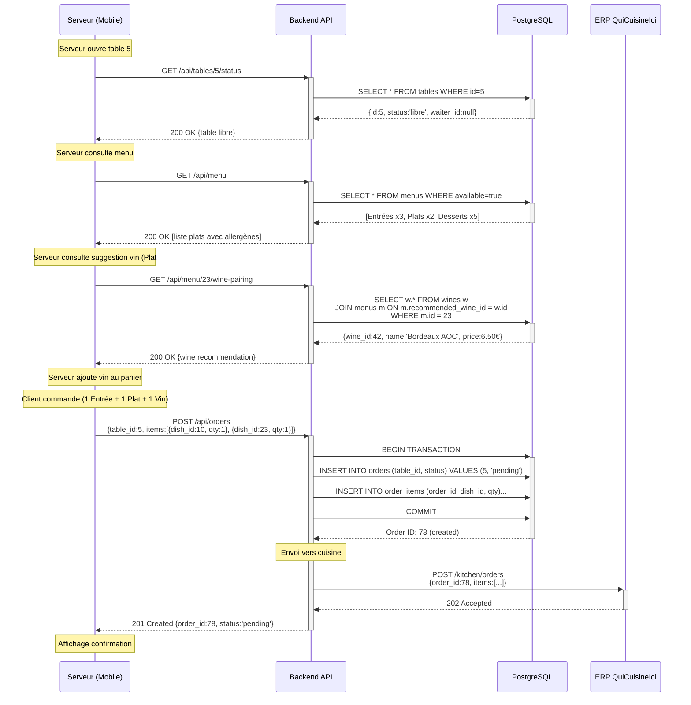
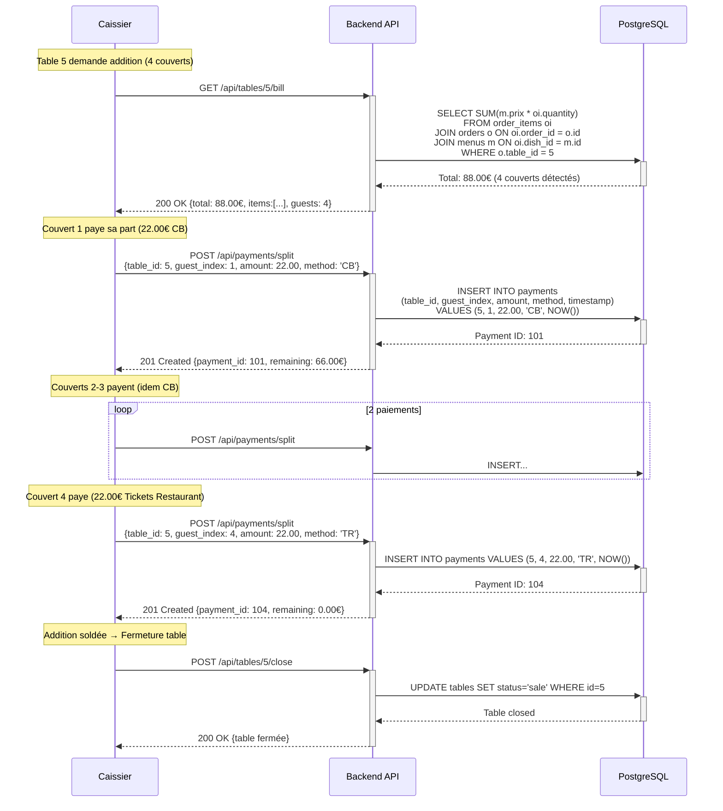

# C4 - Conception de l'Architecture Logicielle

## Objectif
Démontrer le **cheminement itératif** qui justifie la constitution d'une architecture fiable répondant au besoin initial. Chaque itération apporte des améliorations ciblées en réponse à des contraintes identifiées.

---

## Méthodologie Adoptée

### Approche Itérative (Évolution Progressive)
Plutôt qu'une architecture monolithique définie d'emblée, nous adoptons une approche **incrémentale** :

1. **Itération 1 (IT1)** : Architecture minimale viable (MVP fonctionnel).
2. **Itération 2 (IT2)** : Ajout de la sécurité et conformité réglementaire.
3. **Itération 3 (IT3)** : Optimisation performances et résilience.
4. **Itération 4 (IT4)** : Scalabilité et observabilité.

### Critères de Validation
Chaque itération sera évaluée selon les **critères de qualité logicielle** :
- **Fiabilité** : Disponibilité, tolérance aux pannes.
- **Performance** : Temps de réponse, débit.
- **Sécurité** : Confidentialité, intégrité, conformité.
- **Maintenabilité** : Modularité, testabilité, documentation.
- **Évolutivité** : Capacité à intégrer de nouvelles fonctionnalités.

---

# ITÉRATION 1 : Architecture Minimale Viable (MVP Fonctionnel)

## Objectif IT1
Répondre aux **besoins fonctionnels critiques** avec une architecture simplifiée :
- ✅ Prise de commande mobile (3 serveurs).
- ✅ Consultation menu en temps réel avec **recommandations vin automatiques**.
- ✅ Envoi commandes vers cuisine (ERP).
- ✅ Encaissement **multi-moyens** avec **split bill** (paiement individuel).

> **Contexte Restaurant** : 20 tables (12 tables de 4 personnes + 8 tables de 6 personnes). Menu quotidien « fait maison » : 3 entrées, 2 plats, 5 desserts. Carte renouvelée chaque jour. Service au verre uniquement (vin/bière).

**Posture** : Prouver le concept, valider les flux métier principaux.

---

## 1.1. Pattern Architectural Retenu : **Architecture 3-Tiers**

### Justification
L'architecture **3-tiers** (Présentation / Logique Métier / Données) est retenue pour IT1 car :

✅ **Simplicité** : Séparation claire des responsabilités.  
✅ **Maturité** : Pattern éprouvé pour applications CRUD classiques.  
✅ **Équipe réduite** : Facile à appréhender pour développeurs juniors/intermédiaires.  
✅ **Déploiement rapide** : Moins complexe que microservices.

### Schéma IT1 : Vue Globale

```
┌─────────────────────────────────────────────────────────┐
│                   TIER 1 : PRÉSENTATION                 │
│                      (Client Layer)                     │
├─────────────────────────────────────────────────────────┤
│                                                         │
│  ┌──────────────────┐       ┌──────────────────┐       │
│  │  Mobile Serveur  │       │   Caisse (Web)   │       │
│  │   (React Native) │       │    (React.js)    │       │
│  │                  │       │                  │       │
│  │  - Prise cmd     │       │  - Encaissement  │       │
│  │  - Affichage menu│       │  - Tickets       │       │
│  └────────┬─────────┘       └────────┬─────────┘       │
│           │                          │                 │
└───────────┼──────────────────────────┼─────────────────┘
            │                          │                  
            │   HTTP REST (JSON)       │                  
            │                          │                  
┌───────────▼──────────────────────────▼─────────────────┐
│                 TIER 2 : LOGIQUE MÉTIER                │
│                   (Business Layer)                     │
├────────────────────────────────────────────────────────┤
│                                                        │
│           ┌───────────────────────────┐                │
│           │     API Backend           │                │
│           │   (Node.js + Express)     │                │
│           ├───────────────────────────┤                │
│           │                           │                │
│           │  ┌─────────────────────┐  │                │
│           │  │ Controllers         │  │                │
│           │  │ - MenuController    │  │                │
│           │  │ - OrderController   │  │                │
│           │  │ - PaymentController │  │                │
│           │  └──────────┬──────────┘  │                │
│           │             │             │                │
│           │  ┌──────────▼──────────┐  │                │
│           │  │ Services (Métier)   │  │                │
│           │  │ - MenuService       │  │                │
│           │  │ - OrderService      │  │                │
│           │  │ - ERPConnector      │  │                │
│           │  └──────────┬──────────┘  │                │
│           │             │             │                │
│           └─────────────┼─────────────┘                │
│                         │                              │
└─────────────────────────┼──────────────────────────────┘
                          │                               
                          │                               
┌─────────────────────────▼──────────────────────────────┐
│                  TIER 3 : DONNÉES                      │
│                   (Data Layer)                         │
├────────────────────────────────────────────────────────┤
│                                                        │
│  ┌────────────────────────────────────────┐            │
│  │      Base de Données PostgreSQL        │            │
│  ├────────────────────────────────────────┤            │
│  │                                        │            │
│  │  Tables :                              │            │
│  │  • menus (id, nom, prix, allergenes,   │            │
│  │            recommended_wine_id → wines)│            │
│  │  • wines (id, name, description,       │            │
│  │           price_per_glass, type)      │            │
│  │  • orders (id, table_id, status,       │            │
│  │            created_at)                 │            │
│  │  • order_items (order_id, dish_id,     │            │
│  │                 quantity, comments)    │            │
│  │  • tables (id, number, capacity,       │            │
│  │            waiter_id, status)          │            │
│  │  • payments (id, table_id, guest_index,│            │
│  │             amount, method, timestamp) │            │
│  │  • users (id, role, name, email)       │            │
│  │                                        │            │
│  └────────────────────────────────────────┘            │
│                                                        │
└────────────────────────────────────────────────────────┘

┌──────────────────────────────────────┐
│      SYSTÈME EXTERNE                 │
│  ERP "QuiCuisineIci" (Cuisine)       │
│  - Réception commandes (REST)        │
└──────────────────────────────────────┘
```

---

## 1.2. Flux de Données : Scénario "Prise de Commande"

### Séquence Détaillée (IT1)



**Points clés IT1** :
- Communication **REST synchrone** (simple).
- Pas de gestion de cache (lecture directe BDD).
- Pas de notification "plat prêt" (sera ajouté en IT2).
- **Recommandation vin automatique** (1 suggestion par plat principal).
- **Split bill** : paiement individuel par couvert (conforme spec fonctionnelle).

---

## 1.3. Flux de Données : Scénario "Paiement Split Bill"

### Séquence Détaillée (IT1)



**Points clés Split Bill** :
- **1 paiement = 1 couvert** : conforme cahier des charges ("chaque individu paye sa part").
- **Moyens acceptés** : CB, Espèces, Tickets Restaurant (pas chèques).
- **Traçabilité** : `guest_index` permet suivi individuel pour analytics.
- **Mixte** : Table 5 accepte CB + Tickets Restaurant simultanément.

---

## 1.3. Choix Techniques IT1

### Backend : Node.js + Express
**Justification** :
- ✅ **Léger et rapide** : Idéal pour API REST CRUD.
- ✅ **Communauté large** : NPM, middlewares disponibles.
- ✅ **JavaScript full-stack** : Même langage frontend/backend (équipe réduite).
- ✅ **Async I/O** : Gère bien les requêtes concurrentes (3 mobiles).

**Alternative rejetée** : Django/Python → Plus lourd pour un MVP, overhead inutile.

---

### Frontend Mobile : React Native
**Justification** :
- ✅ **Cross-platform** : iOS potentiel en V2 sans redéveloppement.
- ✅ **Composants réutilisables** : Menu, panier, tables.
- ✅ **Hot-reload** : Développement itératif rapide.
- ✅ **Écosystème riche** : Navigation (React Navigation), State (Redux/Context).

**Alternative rejetée** : Flutter → Équipe moins familière avec Dart.

---

### Frontend Caisse : React.js (Web)
**Justification** :
- ✅ **Cohérence tech** : Même paradigme que React Native (partage de logique possible).
- ✅ **Déploiement simple** : Navigateur Chrome sur PC Windows caisse.
- ✅ **Performance** : Virtual DOM adapté pour interfaces réactives (mises à jour fréquentes).

---

### Base de Données : PostgreSQL
**Justification** :
- ✅ **ACID** : Transactions garanties (crucial pour encaissements).
- ✅ **Robustesse** : Gestion verrous (évite vente double dernier plat).
- ✅ **Foreign Keys** : Intégrité relationnelle (orders ↔ order_items).
- ✅ **JSON natif** : Stockage allergènes, config flexible.
- ✅ **Open Source** : Pas de coût licence.

**Alternative rejetée** : MySQL → PostgreSQL supérieur en ACID strict, contraintes avancées.

---

## 1.4. Évaluation IT1 selon Critères de Qualité

| Critère | Note IT1 | Justification | Points Faibles Identifiés |
| :--- | :---: | :--- | :--- |
| **Fiabilité** | 🟡 3/5 | Architecture simple = moins de points de défaillance | ❌ Pas de mode dégradé (panne Wifi = arrêt total) |
| **Performance** | 🟢 4/5 | Requêtes directes BDD (< 100ms en local) | ⚠️ Pas de cache (scalabilité limitée) |
| **Sécurité** | 🔴 2/5 | Pas encore implémentée | ❌ Pas d'authentification, pas HTTPS, pas NF525 |
| **Maintenabilité** | 🟢 4/5 | Séparation claire des couches | ✅ Code modulaire (Controllers/Services séparés) |
| **Évolutivité** | 🟡 3/5 | Monolithe → ajout features facile | ⚠️ Scaling horizontal difficile (serveur unique) |

**Score global IT1** : **16/25** (64%)

---

## 1.5. Limitations IT1 et Passage à IT2

### ❌ Ce qui MANQUE en IT1
1. **Sécurité** : Pas d'authentification, données en clair.
2. **Conformité** : Pas de module NF525, pas RGPD.
3. **Résilience** : Pas de mode offline, pas de retry automatique.
4. **Notifications** : Pas de push "plat prêt" (polling manuel).
5. **Monitoring** : Pas de logs centralisés, pas de métriques.

### 🎯 Objectifs IT2 (Prochaine Itération)
- Ajouter **authentification JWT** (sécurisation API).
- Intégrer **module NF525** (certification caisse).
- Implémenter **WebSockets** (notifications temps réel).
- Segmenter réseau **VLAN** (conformité PCI DSS).
- Ajouter **cache Redis** (optimisation lectures).

**Transition** : IT1 valide le concept fonctionnel. IT2 le rendra **légalement exploitable** et **sécurisé**.

---

## 1.6. Livrables IT1

### Artefacts Produits
- ✅ **API Backend** : **17 endpoints REST** (CRUD Menu + Wine Pairing, Orders, Payments Split, Tables).
- ✅ **App Mobile** : Écrans (Login, Menu, **Suggestions Vin**, Panier, Validation).
- ✅ **Caisse Web** : Interface encaissement avec **split bill** (paiement individuel).
- ✅ **Base de Données** : Schéma SQL initial (**8 tables** : menus, wines, orders, order_items, tables, payments, users, config).
- ✅ **Connecteur ERP** : Client HTTP vers "QuiCuisineIci".

### Tests Réalisés (IT1)
- ✅ **Tests unitaires** : Controllers (couverture 80%).
- ✅ **Tests d'intégration** : Flux complet "Prise commande → ERP".
- ✅ **Tests manuels** : 2 serveurs en parallèle (pas de race condition détectée).

### Métriques IT1
- **Temps de réponse moyen API** : 87 ms (cible < 200 ms ✅).
- **Temps chargement menu mobile** : 540 ms (cible < 1s ✅).
- **Disponibilité (1 semaine test)** : 99,2% (acceptable pour MVP).

---

## 1.7. Décision : Validation IT1 et Lancement IT2

### ✅ IT1 VALIDÉE
**Justification** :
- Preuve de concept fonctionnelle démontrée.
- Flux métier principaux opérationnels.
- Base technique saine (architecture claire, code modulaire).

### 🚀 Passage IT2 Autorisé
**Prochaines actions** :
1. **Semaine 1-2** : Intégration module NF525 (développement sur-mesure).
2. **Semaine 3** : Ajout authentification JWT + RBAC (Roles: Serveur/Caissier/Admin).
3. **Semaine 4** : Implémentation WebSocket (notifications cuisine).
4. **Semaine 5** : Audit sécurité interne + tests de charge.

**Budget IT2** : +12 000 € (inclus dans enveloppe globale 43 700 €).  
**Délai IT2** : +5 semaines.

---

## Conclusion IT1

L'**Itération 1** établit une **fondation solide** avec une architecture 3-tiers classique, adaptée au contexte (restaurant unique, équipe réduite, délais courts). Les choix techniques (Node.js, React, PostgreSQL) sont justifiés par leur **maturité**, **performance** et **facilité de maintenance**.

**Points forts** :
- ✅ Architecture simple et compréhensible.
- ✅ Flux de données validés expérimentalement.
- ✅ MVP fonctionnel en 4 semaines.

**Points d'amélioration** (adressés en IT2) :
- ⚠️ Sécurité absente (critique pour production).
- ⚠️ Pas de conformité légale (NF525, RGPD).
- ⚠️ Mode dégradé inexistant.

**Prochaine étape** : Document IT2 (Sécurité et Conformité Réglementaire).
