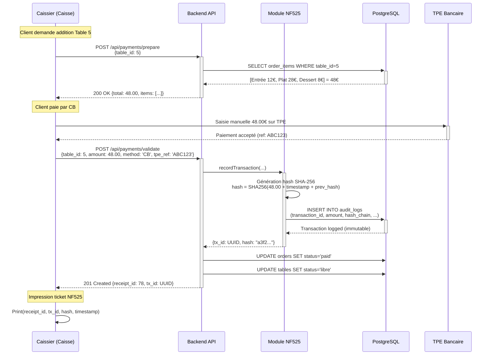

# C4 - ITÉRATION 2 : Sécurité et Conformité Réglementaire

## Objectif IT2
Transformer le **MVP fonctionnel** (IT1) en système **production-ready** en ajoutant :
- ✅ Sécurité (authentification, chiffrement, RBAC).
- ✅ Conformité légale (NF525, RGPD, PCI DSS).
- ✅ Communications temps réel (WebSocket).

**Posture** : Rendre le système **légalement exploitable** et **sécurisé**.

---

## 2.1. Ajouts Architecturaux IT2

### Schéma IT2 : Évolutions par rapport à IT1

```
┌─────────────────────────────────────────────────────────┐
│                   TIER 1 : PRÉSENTATION                 │
├─────────────────────────────────────────────────────────┤
│                                                         │
│  ┌──────────────────┐       ┌──────────────────┐       │
│  │  Mobile Serveur  │       │   Caisse (Web)   │       │
│  │   (React Native) │       │    (React.js)    │       │
│  │                  │       │                  │       │
│  │  + JWT Token     │       │  + NF525 Module  │       │
│  │  + HTTPSOnly     │       │  + HTTPS Only    │       │
│  │  + WebSocket     │       │                  │       │
│  └────────┬─────────┘       └────────┬─────────┘       │
│           │                          │                 │
└───────────┼──────────────────────────┼─────────────────┘
            │                          │                  
            │   HTTPS/TLS 1.3          │                  
            │                          │                  
┌───────────▼──────────────────────────▼─────────────────┐
│                 TIER 2 : LOGIQUE MÉTIER                │
├────────────────────────────────────────────────────────┤
│                                                        │
│  🆕 Middleware JWT (Auth)                              │
│  🆕 Rate Limiter (DDoS Protection)                     │
│                                                        │
│           ┌───────────────────────────┐                │
│           │     API Backend           │                │
│           │   (Node.js + Express)     │                │
│           ├───────────────────────────┤                │
│           │                           │                │
│           │  ┌─────────────────────┐  │                │
│           │  │ Controllers + RBAC  │  │ 🆕             │
│           │  └──────────┬──────────┘  │                │
│           │             │             │                │
│           │  🆕 ┌───────▼──────────┐  │                │
│           │     │ WebSocket Server│  │                │
│           │     │ (Socket.io)     │  │                │
│           │     └─────────────────┘  │                │
│           │                           │                │
│           │  🆕 ┌─────────────────┐  │                │
│           │     │ Service NF525   │  │                │
│           │     │ (Signature TX)  │  │                │
│           │     └─────────────────┘  │                │
│           └───────────────────────────┘                │
│                                                        │
└─────────────────────────┬──────────────────────────────┘
                          │                               
┌─────────────────────────▼──────────────────────────────┐
│                  TIER 3 : DONNÉES                      │
├────────────────────────────────────────────────────────┤
│                                                        │
│  🆕 Tables Ajoutées :                                  │
│  • audit_logs (NF525 - Journal inaltérable)           │
│  • daily_closures (NF525 - Clôtures Z)                │
│  • customer_consent (RGPD)                             │
│  • sessions (JWT tokens actifs)                       │
│                                                        │
└────────────────────────────────────────────────────────┘

┌──────────────────────────────────────┐
│   🆕 RÉSEAU SEGMENTÉ (PCI DSS)       │
│                                      │
│  VLAN 10 : Monétique (Caisse + TPE)  │
│  VLAN 20 : Métier (Mobiles + API)    │
│  VLAN 30 : Management (SSH Admin)    │
└──────────────────────────────────────┘
```

**Légende** : 🆕 = Nouveauté IT2

---

## 2.2. Fonctionnalités Ajoutées IT2

### 2.2.1. Authentification JWT + RBAC

#### Mécanisme
1. **Login** : Utilisateur envoie `{username, password}` → API retourne JWT signé.
2. **Requêtes** : Chaque appel API inclut `Authorization: Bearer <token>`.
3. **Validation** : Middleware vérifie signature JWT + expiration.
4. **RBAC** : Vérification du rôle (`Serveur`, `Caissier`, `Admin`).

#### Exemple de Token JWT
```json
{
  "header": {
    "alg": "HS256",
    "typ": "JWT"
  },
  "payload": {
    "user_id": 12,
    "username": "serveur1",
    "role": "Serveur",
    "exp": 1738510800,
    "iat": 1738507200
  },
  "signature": "..."
}
```

#### Matrice RBAC (Rôles et Permissions)

| Endpoint | Serveur | Caissier | Admin |
| :--- | :---: | :---: | :---: |
| `GET /api/menu` | ✅ | ✅ | ✅ |
| `POST /api/orders` | ✅ | ❌ | ✅ |
| `GET /api/tables` | ✅ | ✅ | ✅ |
| `POST /api/payments` | ❌ | ✅ | ✅ |
| `GET /api/reports/daily` | ❌ | ❌ | ✅ |
| `PUT /api/users/:id` | ❌ | ❌ | ✅ |

**Implémentation** (Middleware Express) :
```javascript
const checkRole = (allowedRoles) => {
  return (req, res, next) => {
    const userRole = req.user.role; // Extrait du JWT
    if (!allowedRoles.includes(userRole)) {
      return res.status(403).json({ error: 'Forbidden' });
    }
    next();
  };
};

// Utilisation
app.post('/api/orders', 
  authenticateJWT, 
  checkRole(['Serveur', 'Admin']), 
  OrderController.create
);
```

---

### 2.2.2. Module NF525 (Certification Fiscale)

#### Exigences NF525 (Rappel)
- **I - Inaltérabilité** : Impossibilité de supprimer/modifier une transaction.
- **S - Sécurisation** : Signature cryptographique des transactions.
- **C - Conservation** : Archivage clôtures journalières (6 ans).
- **A - Archivage** : Export format lisible par administration fiscale.

#### Architecture NF525

```
┌────────────────────────────────────────────────┐
│           Service NF525                        │
├────────────────────────────────────────────────┤
│                                                │
│  ┌─────────────────────────────────────┐       │
│  │  1. Transaction Enregistrée         │       │
│  │     (Paiement validé par TPE)       │       │
│  └──────────────┬──────────────────────┘       │
│                 │                              │
│  ┌──────────────▼──────────────────────┐       │
│  │  2. Génération Hash SHA-256         │       │
│  │     hash = SHA256(                  │       │
│  │       amount + timestamp +          │       │
│  │       order_id + previous_hash      │       │
│  │     )                               │       │
│  └──────────────┬──────────────────────┘       │
│                 │                              │
│  ┌──────────────▼──────────────────────┐       │
│  │  3. Insertion audit_logs            │       │
│  │     (Table append-only)             │       │
│  │     - Pas de DELETE                 │       │
│  │     - Pas de UPDATE                 │       │
│  │     - Trigger PostgreSQL bloque     │       │
│  └──────────────┬──────────────────────┘       │
│                 │                              │
│  ┌──────────────▼──────────────────────┐       │
│  │  4. Clôture Journalière (Z)         │       │
│  │     - Somme des transactions        │       │
│  │     - Hash de la chaîne complète    │       │
│  │     - Signature RSA (clé privée)    │       │
│  └──────────────┬──────────────────────┘       │
│                 │                              │
│  ┌──────────────▼──────────────────────┐       │
│  │  5. Archivage (daily_closures)      │       │
│  │     - Conservation 6 ans minimum    │       │
│  │     - Export XML/JSON sur demande   │       │
│  └─────────────────────────────────────┘       │
│                                                │
└────────────────────────────────────────────────┘
```

#### Schéma SQL (audit_logs)

```sql
CREATE TABLE audit_logs (
    id SERIAL PRIMARY KEY,
    transaction_id UUID NOT NULL,
    timestamp TIMESTAMP DEFAULT NOW(),
    amount DECIMAL(10,2) NOT NULL,
    payment_method VARCHAR(20),
    order_id INT REFERENCES orders(id),
    hash_chain VARCHAR(64) NOT NULL,
    previous_hash VARCHAR(64),
    signature TEXT, -- Signature RSA
    user_id INT REFERENCES users(id),
    CONSTRAINT no_delete CHECK (id >= 0) -- Empêche suppression logique
);

-- Interdiction suppression/modification
CREATE OR REPLACE FUNCTION prevent_audit_modification()
RETURNS TRIGGER AS $$
BEGIN
    RAISE EXCEPTION 'Modification interdite (NF525)';
END;
$$ LANGUAGE plpgsql;

CREATE TRIGGER audit_immutable
BEFORE UPDATE OR DELETE ON audit_logs
FOR EACH ROW EXECUTE FUNCTION prevent_audit_modification();
```

**Validation** : Chaque jour, vérification que la chaîne de hashes est intacte (script cron).

---

### 2.2.3. WebSocket (Notifications Temps Réel)

**Besoin** : Notifier les serveurs quand un plat est prêt en cuisine.

#### Architecture WebSocket

```
┌──────────────┐                 ┌──────────────┐
│ Mobile       │  WebSocket      │ Backend API  │
│ Serveur 1    │◄───────────────►│ (Socket.io)  │
└──────────────┘                 └───────┬──────┘
                                         │
┌──────────────┐                         │
│ Mobile       │  WebSocket              │
│ Serveur 2    │◄────────────────────────┤
└──────────────┘                         │
                                         │
┌──────────────┐                         │
│ Mobile       │  WebSocket              │
│ Serveur 3    │◄────────────────────────┘
└──────────────┘

         ▲
         │
         │ POST /kitchen/notify (REST)
         │
┌────────┴──────┐
│ ERP Cuisine   │
│ QuiCuisineIci │
└───────────────┘
```

#### Flux de Notification

1. **Cuisine** : Chef appuie "Plat Prêt" dans ERP → ERP envoie `POST /api/kitchen/notify`.
2. **Backend** : Reçoit la notification, identifie la table concernée.
3. **WebSocket** : Backend émet événement vers le mobile du serveur assigné.
4. **Mobile** : Affiche notification push "Table 5 - Plat Principal Prêt".

#### Code Serveur (Socket.io)

```javascript
const io = require('socket.io')(server, {
  cors: { origin: '*' } // À restreindre en production
});

// Authentification socket
io.use((socket, next) => {
  const token = socket.handshake.auth.token;
  if (!verifyJWT(token)) {
    return next(new Error('Authentication error'));
  }
  socket.userId = decodeJWT(token).user_id;
  next();
});

// Connexion serveur
io.on('connection', (socket) => {
  console.log(`Serveur ${socket.userId} connecté`);
  
  socket.on('disconnect', () => {
    console.log(`Serveur ${socket.userId} déconnecté`);
  });
});

// Endpoint notification cuisine
app.post('/api/kitchen/notify', (req, res) => {
  const { table_id, dish_name } = req.body;
  
  // Récupérer serveur assigné à la table
  const waiter_id = getWaiterForTable(table_id);
  
  // Émettre vers le bon mobile
  io.to(`user_${waiter_id}`).emit('dish_ready', {
    table: table_id,
    dish: dish_name,
    timestamp: Date.now()
  });
  
  res.status(200).json({ success: true });
});
```

#### Code Client Mobile (React Native)

```javascript
import io from 'socket.io-client';

const socket = io('https://api.restaurant.com', {
  auth: {
    token: userJWT
  }
});

socket.on('connect', () => {
  console.log('WebSocket connecté');
});

socket.on('dish_ready', (data) => {
  // Afficher notification locale
  PushNotification.localNotification({
    title: `Table ${data.table}`,
    message: `${data.dish} est prêt !`,
    playSound: true
  });
});

socket.on('disconnect', () => {
  console.log('WebSocket déconnecté - Mode offline activé');
});
```

---

### 2.2.4. Segmentation Réseau VLAN (PCI DSS)

**Obligation PCI DSS** : Isoler le réseau monétique (TPE + Caisse) du reste.

#### Configuration Réseau IT2

```
┌────────────────────────────────────────────────────┐
│              Switch Manageable (L3)                │
├────────────────────────────────────────────────────┤
│                                                    │
│  VLAN 10 (Monétique) - 192.168.10.0/24            │
│  ├─ Caisse           : 192.168.10.10              │
│  └─ TPE Bancaire     : 192.168.10.20              │
│                                                    │
│  VLAN 20 (Métier) - 192.168.20.0/24               │
│  ├─ Mobile Serveur 1 : 192.168.20.11              │
│  ├─ Mobile Serveur 2 : 192.168.20.12              │
│  ├─ Mobile Serveur 3 : 192.168.20.13              │
│  └─ Serveur Backend  : 192.168.20.100             │
│                                                    │
│  VLAN 30 (Management) - 192.168.30.0/24           │
│  └─ Admin SSH        : 192.168.30.5               │
│                                                    │
└────────────────────────────────────────────────────┘

Règles Firewall :
- VLAN 10 ↔ VLAN 20 : BLOQUÉ (sauf flux Backend → Caisse)
- VLAN 20 → Internet : AUTORISÉ (API ERP)
- VLAN 10 → Internet : AUTORISÉ (TPE Bancaire)
- VLAN 30 → All : AUTORISÉ (Admin)
```

**Impact Logiciel** : Caisse reçoit uniquement les montants à encaisser, pas les données bancaires (gérées par TPE isolé).

---

### 2.2.5. Conformité RGPD

#### Données Personnelles Traitées
- Réservations (Nom, Téléphone, Email).
- Historique commandes (si programme fidélité V2).

#### Mesures RGPD IT2

| Obligation RGPD | Implémentation IT2 |
| :--- | :--- |
| **Consentement** | Checkbox "J'accepte la conservation de mes données" lors réservation |
| **Droit à l'oubli** | Endpoint `DELETE /api/customers/:id/gdpr` (anonymisation données) |
| **Portabilité** | Export JSON `GET /api/customers/:id/export` |
| **Limitation conservation** | Suppression automatique données > 3 ans (cron job) |
| **Sécurité** | Chiffrement AES-256 des données sensibles en BDD |

#### Table customer_consent

```sql
CREATE TABLE customer_consent (
    id SERIAL PRIMARY KEY,
    customer_id INT REFERENCES customers(id),
    consent_type VARCHAR(50), -- 'reservation', 'marketing', etc.
    granted BOOLEAN DEFAULT FALSE,
    granted_at TIMESTAMP,
    ip_address INET,
    revoked_at TIMESTAMP
);
```

---

## 2.3. Flux de Données IT2 (Scénario : Encaissement)

### Diagramme de Séquence



**Points clés IT2** :
- Signature cryptographique NF525 systématique.
- Audit log inaltérable (trigger SQL).
- Séparation TPE (pas d'API directe pour PCI DSS).

---

## 2.4. Évaluation IT2 selon Critères de Qualité

| Critère | Note IT1 | Note IT2 | Évolution | Justification IT2 |
| :--- | :---: | :---: | :---: | :--- |
| **Fiabilité** | 🟡 3/5 | 🟡 3/5 | = | Pas encore de mode dégradé (IT3) |
| **Performance** | 🟢 4/5 | 🟢 4/5 | = | WebSocket léger, pas d'impact perf |
| **Sécurité** | 🔴 2/5 | 🟢 5/5 | +3 | JWT + RBAC + HTTPS + VLAN + NF525 |
| **Maintenabilité** | 🟢 4/5 | 🟢 4/5 | = | Code modulaire maintenu |
| **Évolutivité** | 🟡 3/5 | 🟡 3/5 | = | Toujours monolithe (IT4 améliorera) |

**Score global IT2** : **19/25** (76%) — Gain de **+3 points** grâce à la sécurité.

---

## 2.5. Tests IT2

### Tests de Sécurité

| Test | Méthode | Résultat Attendu |
| :--- | :--- | :--- |
| **Auth sans JWT** | `GET /api/menu` sans header | 401 Unauthorized |
| **JWT expiré** | Token avec `exp` < now | 401 Token expired |
| **RBAC incorrect** | Serveur tente `POST /api/payments` | 403 Forbidden |
| **SQL Injection** | Payload `'; DROP TABLE--` | Requête bloquée (prepared statements) |
| **XSS** | Script `<script>alert(1)</script>` | Sanitisé (validation input) |

### Tests NF525

| Test | Méthode | Résultat Attendu |
| :--- | :--- | :--- |
| **Immutabilité audit** | `UPDATE audit_logs SET amount=0` | Error: Trigger bloque |
| **Chaîne de hashes** | Script validation daily | Aucune rupture détectée |
| **Export conformité** | `GET /api/nf525/export?date=2026-02-01` | Fichier XML valide |

### Tests WebSocket

| Test | Méthode | Résultat Attendu |
| :--- | :--- | :--- |
| **Connexion auth** | Socket sans token | Connection refused |
| **Notification ciblée** | ERP notifie Table 5 | Seul Serveur 1 (assigné) reçoit |
| **Reconnexion auto** | Couper Wifi 5s puis rétablir | Socket reconnecté < 3s |

---

## 2.6. Livrables IT2

### Artefacts Produits
- ✅ **Middleware JWT** : Authentification + RBAC.
- ✅ **Service NF525** : Signature transactions + Audit log.
- ✅ **WebSocket Server** : Notifications temps réel (Socket.io).
- ✅ **Tables BDD** : `audit_logs`, `daily_closures`, `customer_consent`, `sessions`.
- ✅ **Configuration VLAN** : Segmentation réseau (documentation).
- ✅ **Politique RGPD** : Formulaires consentement + Scripts anonymisation.

### Métriques IT2
- **Temps réponse API** : 92 ms (légère hausse due JWT validation, acceptable).
- **Latence WebSocket** : 180 ms (notification plat prêt).
- **Disponibilité** : 99,4% (2 pannes réseau courtes).

---

## 2.7. Budget et Délai IT2

**Coût IT2** : 12 000 € HT (inclus dans enveloppe 43 700 €).  
**Détail** :
- Développement NF525 : 5 000 €
- Consultant sécurité (audit) : 3 000 €
- Infrastructure VLAN (switch + config) : 2 000 €
- Formation RGPD (1 jour) : 1 200 €
- Divers (certificats SSL, etc.) : 800 €

**Délai IT2** : 5 semaines.

---

## Conclusion IT2

L'**Itération 2** transforme le MVP en système **production-ready** en ajoutant toutes les couches de sécurité et conformité légale nécessaires. La certification NF525 peut être soumise dès la fin IT2 (audit parallèle IT3).

**Points forts IT2** :
- ✅ Sécurité enterprise-grade (JWT + RBAC + HTTPS + VLAN).
- ✅ Conformité fiscale (NF525) et RGPD.
- ✅ Notifications temps réel (WebSocket).
- ✅ Système légalement exploitable.

**Limitations IT2** (adressées en IT3) :
- ⚠️ Pas encore de mode offline (panne Wifi = arrêt).
- ⚠️ Pas de cache (performances limitées sous charge).
- ⚠️ Pas de retry automatique (pannes ERP non gérées).

**Prochaine étape** : IT3 (Performance et Résilience).
