# C5 - Diagramme UML Global des Fonctionnalités

## Objectif
Présenter l'**ensemble des fonctionnalités** de l'application de gestion restaurant via **un diagramme UML de cas d'utilisation global unique**, optimisé pour la lisibilité et la compréhension rapide.

---

## Diagramme de Cas d'Utilisation Global

### Légende

**Couleurs par domaine fonctionnel** :
- 🟦 **Bleu clair** : Gestion Tables & Plan de Salle
- 🟩 **Vert** : Menu & Recommandations Vin
- 🟧 **Orange** : Commandes & Flux ERP
- 🟥 **Rouge clair** : Paiements & Split Bill
- 🟪 **Violet** : Conformité NF525 & Sécurité
- 🟨 **Jaune** : Administration & Rapports

**Acteurs** :
- Serveur (Mobile) : Cyan
- Caissier (Caisse) : Orange clair
- Administrateur : Rouge clair
- Systèmes externes (ERP, TPE) : Vert clair

---

## Vue Complète du Système

```mermaid
%%{init: {'theme':'base', 'themeVariables': { 'fontSize':'14px'}}}%%
graph TB
    %% ============================================
    %% ACTEURS
    %% ============================================
    Serveur([👤 SERVEUR<br/>Mobile])
    Caissier([💰 CAISSIER<br/>Caisse])
    Admin([👨‍💼 ADMIN<br/>Dashboard])
    Client([🧑 CLIENT])
    ERP([🍳 ERP<br/>QuiCuisineIci])
    TPE([💳 TPE<br/>Bancaire])
    
    %% ============================================
    %% DOMAINE 1: GESTION TABLES
    %% ============================================
    subgraph T["📋 GESTION TABLES (IT1)"]
        T1["Visualiser plan salle<br/>(20 tables)"]
        T2["Consulter état tables"]
        T3["Ouvrir table"]
        T4["Fermer table"]
        T5["Assigner serveur"]
        T6["Modifier couverts"]
    end
    
    %% ============================================
    %% DOMAINE 2: MENU & VIN
    %% ============================================
    subgraph M["📖 MENU & VIN (IT1)"]
        M1["Consulter carte<br/>(3E/2P/5D)"]
        M2["Voir prix TTC"]
        M3["Allergènes INCO"]
        M4["Stocks temps réel"]
        M5["🍷 Recommandation vin<br/>(1 par plat)"]
        M6["🍷 Détails vin"]
        M7["🍷 Ajouter vin panier"]
    end
    
    %% ============================================
    %% DOMAINE 3: COMMANDES
    %% ============================================
    subgraph C["🛒 COMMANDES (IT1)"]
        C1["Créer commande"]
        C2["Ajouter plats"]
        C3["Modifier quantités"]
        C4["Commentaires<br/>(allergies, cuisson)"]
        C5["Envoyer cuisine"]
        C6["Consulter commandes"]
        C7["Modifier en attente"]
    end
    
    %% ============================================
    %% DOMAINE 4: PAIEMENTS
    %% ============================================
    subgraph P["💳 PAIEMENTS (IT1)"]
        P1["Afficher addition"]
        P2["💳 Split Bill<br/>(individuel)"]
        P3["Paiement global"]
        P4["CB via TPE"]
        P5["Espèces"]
        P6["Tickets Restaurant"]
        P7["Imprimer ticket NF525"]
    end
    
    %% ============================================
    %% DOMAINE 5: CONFORMITÉ NF525
    %% ============================================
    subgraph N["🔐 NF525 & SÉCURITÉ (IT2)"]
        N1["Enregistrer TX"]
        N2["Hash SHA-256"]
        N3["Chaîne hashes"]
        N4["Signature RSA"]
        N5["Audit log immuable"]
        N6["Clôture Z journalière"]
        N7["Export fiscal XML"]
        N8["Authentification JWT"]
        N9["RBAC Rôles"]
    end
    
    %% ============================================
    %% DOMAINE 6: RÉSILIENCE
    %% ============================================
    subgraph O["📱 OFFLINE & RÉSILIENCE (IT3)"]
        O1["Détecter perte Wifi"]
        O2["Mode offline SQLite"]
        O3["Commande offline"]
        O4["Sync différée"]
        O5["Retry auto ERP"]
        O6["Circuit breaker"]
    end
    
    %% ============================================
    %% DOMAINE 7: NOTIFICATIONS
    %% ============================================
    subgraph W["🔔 NOTIFICATIONS (IT2)"]
        W1["Recevoir 'plat prêt'"]
        W2["Alerte mobile push"]
        W3["Config sons"]
    end
    
    %% ============================================
    %% DOMAINE 8: ADMIN & RAPPORTS
    %% ============================================
    subgraph A["⚙️ ADMIN & RAPPORTS (IT4)"]
        A1["CA journalier"]
        A2["CA par serveur"]
        A3["Stats plats vendus"]
        A4["Taux occupation"]
        A5["Export PDF/Excel"]
        A6["Gérer utilisateurs"]
        A7["Config menu/vins"]
        A8["Logs système ELK"]
        A9["Métriques Grafana"]
        A10["RGPD Export/Suppression"]
    end
    
    %% ============================================
    %% RELATIONS ACTEURS → UC
    %% ============================================
    
    %% SERVEUR (Mobile)
    Serveur --> T1
    Serveur --> T2
    Serveur --> T3
    Serveur --> T6
    Serveur --> M1
    Serveur --> M2
    Serveur --> M3
    Serveur --> M4
    Serveur --> M5
    Serveur --> M6
    Serveur --> M7
    Serveur --> C1
    Serveur --> C2
    Serveur --> C3
    Serveur --> C4
    Serveur --> C5
    Serveur --> C6
    Serveur --> C7
    Serveur --> O1
    Serveur --> O2
    Serveur --> O3
    Serveur --> W1
    Serveur --> W2
    Serveur --> W3
    Serveur --> N8
    
    %% CAISSIER (Caisse)
    Caissier --> T2
    Caissier --> T4
    Caissier --> P1
    Caissier --> P2
    Caissier --> P3
    Caissier --> P4
    Caissier --> P5
    Caissier --> P6
    Caissier --> P7
    Caissier --> N1
    Caissier --> N7
    Caissier --> N8
    
    %% ADMIN (Dashboard)
    Admin --> T5
    Admin --> N6
    Admin --> N8
    Admin --> N9
    Admin --> A1
    Admin --> A2
    Admin --> A3
    Admin --> A4
    Admin --> A5
    Admin --> A6
    Admin --> A7
    Admin --> A8
    Admin --> A9
    Admin --> A10
    
    %% CLIENT (passif)
    Client -.->|Paye sa part| P2
    
    %% ERP (Cuisine)
    ERP -.->|Fournit stocks| M4
    C5 -->|POST /orders| ERP
    ERP -.->|Callback| W1
    
    %% TPE (Bancaire)
    P4 -->|Validation| TPE
    
    %% ============================================
    %% RELATIONS INTERNES UC (include/extend)
    %% ============================================
    M5 -.->|include| M6
    C1 -.->|include| C2
    P2 -.->|include| P1
    P7 -.->|include| N1
    N1 -.->|include| N2
    N2 -.->|include| N3
    N3 -.->|include| N4
    N4 -.->|include| N5
    O2 -.->|utilise| O3
    O3 -.->|puis| O4
    
    %% ============================================
    %% STYLES - COULEURS HARMONIEUSES
    %% ============================================
    
    %% Acteurs
    style Serveur fill:#81D4FA,stroke:#01579B,stroke-width:3px,color:#000
    style Caissier fill:#FFB74D,stroke:#E65100,stroke-width:3px,color:#000
    style Admin fill:#EF5350,stroke:#B71C1C,stroke-width:3px,color:#fff
    style Client fill:#B2DFDB,stroke:#004D40,stroke-width:2px,color:#000
    style ERP fill:#A5D6A7,stroke:#1B5E20,stroke-width:3px,color:#000
    style TPE fill:#FFF59D,stroke:#F57F17,stroke-width:3px,color:#000
    
    %% Domaines fonctionnels (subgraphs)
    style T fill:#E3F2FD,stroke:#1976D2,stroke-width:2px
    style M fill:#E8F5E9,stroke:#388E3C,stroke-width:2px
    style C fill:#FFF3E0,stroke:#F57C00,stroke-width:2px
    style P fill:#FFEBEE,stroke:#C62828,stroke-width:2px
    style N fill:#F3E5F5,stroke:#7B1FA2,stroke-width:2px
    style O fill:#E0F2F1,stroke:#00695C,stroke-width:2px
    style W fill:#FFF9C4,stroke:#F9A825,stroke-width:2px
    style A fill:#FCE4EC,stroke:#C2185B,stroke-width:2px
    
    %% Use Cases - couleur par domaine
    style T1 fill:#BBDEFB,stroke:#1565C0,stroke-width:2px
    style T2 fill:#BBDEFB,stroke:#1565C0,stroke-width:2px
    style T3 fill:#BBDEFB,stroke:#1565C0,stroke-width:2px
    style T4 fill:#BBDEFB,stroke:#1565C0,stroke-width:2px
    style T5 fill:#BBDEFB,stroke:#1565C0,stroke-width:2px
    style T6 fill:#BBDEFB,stroke:#1565C0,stroke-width:2px
    
    style M1 fill:#C8E6C9,stroke:#2E7D32,stroke-width:2px
    style M2 fill:#C8E6C9,stroke:#2E7D32,stroke-width:2px
    style M3 fill:#C8E6C9,stroke:#2E7D32,stroke-width:2px
    style M4 fill:#C8E6C9,stroke:#2E7D32,stroke-width:2px
    style M5 fill:#FFF176,stroke:#F57F17,stroke-width:3px
    style M6 fill:#FFF176,stroke:#F57F17,stroke-width:3px
    style M7 fill:#FFF176,stroke:#F57F17,stroke-width:3px
    
    style C1 fill:#FFE0B2,stroke:#E65100,stroke-width:2px
    style C2 fill:#FFE0B2,stroke:#E65100,stroke-width:2px
    style C3 fill:#FFE0B2,stroke:#E65100,stroke-width:2px
    style C4 fill:#FFE0B2,stroke:#E65100,stroke-width:2px
    style C5 fill:#FFE0B2,stroke:#E65100,stroke-width:2px
    style C6 fill:#FFE0B2,stroke:#E65100,stroke-width:2px
    style C7 fill:#FFE0B2,stroke:#E65100,stroke-width:2px
    
    style P1 fill:#FFCDD2,stroke:#C62828,stroke-width:2px
    style P2 fill:#FF8A80,stroke:#B71C1C,stroke-width:3px
    style P3 fill:#FFCDD2,stroke:#C62828,stroke-width:2px
    style P4 fill:#FFCDD2,stroke:#C62828,stroke-width:2px
    style P5 fill:#FFCDD2,stroke:#C62828,stroke-width:2px
    style P6 fill:#FFCDD2,stroke:#C62828,stroke-width:2px
    style P7 fill:#FFCDD2,stroke:#C62828,stroke-width:2px
    
    style N1 fill:#E1BEE7,stroke:#6A1B9A,stroke-width:2px
    style N2 fill:#E1BEE7,stroke:#6A1B9A,stroke-width:2px
    style N3 fill:#E1BEE7,stroke:#6A1B9A,stroke-width:2px
    style N4 fill:#E1BEE7,stroke:#6A1B9A,stroke-width:2px
    style N5 fill:#E1BEE7,stroke:#6A1B9A,stroke-width:2px
    style N6 fill:#E1BEE7,stroke:#6A1B9A,stroke-width:2px
    style N7 fill:#E1BEE7,stroke:#6A1B9A,stroke-width:2px
    style N8 fill:#E1BEE7,stroke:#6A1B9A,stroke-width:2px
    style N9 fill:#E1BEE7,stroke:#6A1B9A,stroke-width:2px
    
    style O1 fill:#B2DFDB,stroke:#00695C,stroke-width:2px
    style O2 fill:#B2DFDB,stroke:#00695C,stroke-width:2px
    style O3 fill:#B2DFDB,stroke:#00695C,stroke-width:2px
    style O4 fill:#B2DFDB,stroke:#00695C,stroke-width:2px
    style O5 fill:#B2DFDB,stroke:#00695C,stroke-width:2px
    style O6 fill:#B2DFDB,stroke:#00695C,stroke-width:2px
    
    style W1 fill:#FFF59D,stroke:#F57F17,stroke-width:2px
    style W2 fill:#FFF59D,stroke:#F57F17,stroke-width:2px
    style W3 fill:#FFF59D,stroke:#F57F17,stroke-width:2px
    
    style A1 fill:#F8BBD0,stroke:#AD1457,stroke-width:2px
    style A2 fill:#F8BBD0,stroke:#AD1457,stroke-width:2px
    style A3 fill:#F8BBD0,stroke:#AD1457,stroke-width:2px
    style A4 fill:#F8BBD0,stroke:#AD1457,stroke-width:2px
    style A5 fill:#F8BBD0,stroke:#AD1457,stroke-width:2px
    style A6 fill:#F8BBD0,stroke:#AD1457,stroke-width:2px
    style A7 fill:#F8BBD0,stroke:#AD1457,stroke-width:2px
    style A8 fill:#F8BBD0,stroke:#AD1457,stroke-width:2px
    style A9 fill:#F8BBD0,stroke:#AD1457,stroke-width:2px
    style A10 fill:#F8BBD0,stroke:#AD1457,stroke-width:2px
```

---

## Synthèse Visuelle

### Répartition par Acteur

| Acteur | Couleur | Nb UC | Domaines Principaux |
|:-------|:--------|:-----:|:--------------------|
| 👤 **Serveur** | Cyan | **~40** | Tables, Menu+Vin, Commandes, Offline, Notifs |
| 💰 **Caissier** | Orange | **~15** | Tables, Paiements, NF525 |
| 👨‍💼 **Admin** | Rouge | **~20** | Admin, Rapports, Sécurité |
| 🧑 **Client** | Vert pâle | **1** | Split Bill (passif) |
| 🍳 **ERP** | Vert | **3** | Stocks, Commandes, Notifications |
| 💳 **TPE** | Jaune | **1** | Validation CB |

### Répartition par Itération

| Itération | Couleurs dominantes | Nb UC | Focus |
|:----------|:-------------------|:-----:|:------|
| **IT1** | 🟦 🟩 🟧 🟥 | **~40** | MVP : Tables, Menu+Vin, Commandes, Paiements |
| **IT2** | 🟪 🟨 | **~25** | Sécurité : NF525, JWT, RBAC, WebSocket |
| **IT3** | 🟢 | **~10** | Résilience : Offline, Retry, Circuit Breaker |
| **IT4** | 🟪 | **~15** | Observabilité : Rapports, Logs, Métriques |

### Fonctionnalités Clés Mises en Évidence

**🍷 Recommandations Vin** (jaune accentué) :
- M5 : Afficher recommandation (1 unique par plat)
- M6 : Détails vin (cépage, prix)
- M7 : Ajouter au panier

**💳 Split Bill** (rouge accentué) :
- P2 : Paiement individuel par personne

**🔐 NF525** (violet) :
- Chaîne complète de certification fiscale (N1→N7)

---

## Avantages de ce Diagramme Global

✅ **Vision complète** : Toutes les fonctionnalités en un seul coup d'œil  
✅ **Organisation claire** : 8 domaines fonctionnels distincts par couleur  
✅ **Acteurs identifiables** : Couleurs vives et emojis pour reconnaissance rapide  
✅ **Fonctionnalités prioritaires visibles** : Vin et Split Bill mis en avant  
✅ **Relations visibles** : Flèches include/extend pour dépendances  
✅ **Cohérence C4** : Itérations IT1-IT4 respectées

---

## Lecture du Diagramme

### Par Acteur
1. **Serveur (Cyan)** : Suit les flèches depuis l'acteur Serveur → voit toutes ses interactions
2. **Caissier (Orange)** : Concentré sur Paiements + NF525
3. **Admin (Rouge)** : Focus Rapports + Configuration

### Par Domaine
1. **Bleu** : Gestion salle (tables)
2. **Vert** : Offre commerciale (menu + vin)
3. **Orange** : Flux métier (commandes)
4. **Rouge** : Monétique (paiements)
5. **Violet** : Conformité (NF525, sécurité)
6. **Vert turquoise** : Résilience (offline)
7. **Jaune** : Temps réel (notifications)
8. **Rose** : Pilotage (admin, rapports)

---

## Optimisations de Lisibilité Appliquées

1. **Palette harmonieuse** : Couleurs Material Design (contraste optimal)
2. **Groupement logique** : Subgraphs par domaine fonctionnel
3. **Hiérarchie visuelle** : Acteurs en gras 3px, UC standards 2px
4. **Emphases ciblées** : Jaune pour vin, rouge vif pour split bill
5. **Labels concis** : Max 3 lignes par UC
6. **Relations minimales** : Seuls les include/extend critiques
7. **Emojis** : Reconnaissance visuelle rapide des domaines

---

## Conclusion

Ce diagramme UML global unique présente **l'ensemble des ~80 UC principales** de manière lisible et structurée. Il permet une compréhension rapide :

- **Du périmètre fonctionnel** (8 domaines)
- **Des responsabilités** par acteur (Serveur/Caissier/Admin)
- **Des priorités métier** (vin, split bill en évidence)
- **De la progression** IT1→IT4 (implicite dans les domaines)

**Utilisation recommandée** : Présentation client, validation périmètre, communication équipe.
