# C5 - Présentation des Fonctionnalités par Diagrammes UML

## Objectif
Présenter les **166 fonctionnalités** de l'application de gestion de salle (identifiées dans `C5-Liste-Fonctionnalites.md`) à l'aide de **diagrammes UML de cas d'utilisation** pour visualiser clairement les interactions entre acteurs et système.

---

## 1. Choix du Type de Diagramme : Use Case (Cas d'Utilisation)

### Justification

Le **diagramme de cas d'utilisation** est retenu car :

✅ **Adapté à la présentation fonctionnelle** : Montre ce que le système **fait** (fonctionnalités) et **pour qui** (acteurs).  
✅ **Compréhensible par tous** : Langage visuel accessible aux parties prenantes non-techniques (client, chef, serveurs).  
✅ **Aligné avec l'analyse métier** : Complète naturellement la liste textuelle (C5-Liste-Fonctionnalites.md).  
✅ **Structuration claire** : Permet regroupement par domaine fonctionnel (Tables, Menu, Commandes...).

**Alternatives rejetées** :
- ❌ **Diagramme de classes** : Trop technique, orienté conception (sera traité en C7).
- ❌ **Diagramme de séquence** : Adapté aux flux détaillés (déjà présents dans C4-IT1/IT2/IT3).
- ❌ **Diagramme d'activité** : Utile pour workflows complexes (moins pertinent ici).

---

## 2. Acteurs du Système

### 2.1. Acteurs Principaux (Internes)

| Acteur | Rôle | Interface | Description |
|:-------|:-----|:----------|:------------|
| **Serveur** | Utilisateur mobile | Application React Native (Android) | Prend commandes, consulte menu, vin, tables |
| **Caissier** | Utilisateur caisse | Application Web (React.js) | Encaisse, split bill, imprime tickets NF525 |
| **Administrateur** | Gestionnaire système | Dashboard Web Admin | Configure menu, vins, utilisateurs, rapports |
| **Client** | Consommateur final | Passif (consomme, paye) | Reçoit service, paye individuellement |

### 2.2. Acteurs Externes (Systèmes Tiers)

| Acteur | Type | Protocole | Description |
|:-------|:-----|:----------|:------------|
| **ERP "QuiCuisineIci"** | Système cuisine | REST API | Reçoit commandes, notifie plats prêts, fournit stocks |
| **TPE Bancaire** | Terminal paiement | Propriétaire (VLAN isolé) | Valide transactions CB, retourne références |

---

## 3. Organisation des Diagrammes

Les 166 fonctionnalités sont organisées en **11 diagrammes thématiques** correspondant aux domaines fonctionnels :

| Diagramme | Domaine | Nb Fonctionnalités | Acteurs Principaux |
|:----------|:--------|:------------------:|:-------------------|
| **UC1** | Gestion Tables | 15 | Serveur, Caissier, Admin |
| **UC2** | Menu & Recommandations Vin | 17 | Serveur, Admin |
| **UC3** | Gestion Commandes | 16 | Serveur, ERP |
| **UC4** | Paiements & Split Bill | 15 | Caissier, Client, TPE |
| **UC5** | Conformité NF525 | 11 | Caissier, Admin |
| **UC6** | Authentification & RBAC | 13 | Tous acteurs internes |
| **UC7** | Mode Offline | 10 | Serveur |
| **UC8** | Notifications Temps Réel | 6 | Serveur, ERP |
| **UC9** | Rapports & Statistiques | 12 | Admin |
| **UC10** | Intégration ERP | 10 | Serveur, ERP |
| **UC11** | Administration Système | 11 | Admin |

---

## UC1 : Gestion des Tables

### Diagramme de Cas d'Utilisation

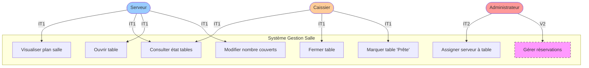

### Description des Cas d'Utilisation

| Code | Nom | Acteurs | Itération | Description |
|:-----|:----|:--------|:----------|:------------|
| **UC1.1** | Visualiser plan salle | Serveur, Caissier | IT1 | Afficher disposition 20 tables (12×4p + 8×6p) |
| **UC1.2** | Consulter état tables | Serveur, Caissier | IT1 | Voir statut : Libre / Occupée / Sale / Réservée |
| **UC1.3** | Ouvrir table | Serveur | IT1 | Passer table de "Libre" à "Occupée" + timestamp |
| **UC1.4** | Fermer table | Caissier | IT1 | Après paiement → "Sale" (attente nettoyage) |
| **UC1.5** | Assigner serveur | Admin | IT2 | Affecter serveur responsable à une table |
| **UC1.6** | Modifier couverts | Serveur | IT1 | Ajuster nombre personnes (initial 4 ou 6) |
| **UC1.7** | Marquer 'Prête' | Caissier | IT1 | Après nettoyage → retour "Libre" |
| **UC1.8** | Gérer réservations | Admin | V2 | Créer/modifier/annuler réservations |

---

## UC2 : Menu & Recommandations Vin

### Diagramme de Cas d'Utilisation

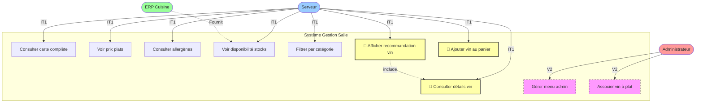

### Description des Cas d'Utilisation

| Code | Nom | Acteurs | Itération | Description |
|:-----|:----|:--------|:----------|:------------|
| **UC2.1** | Consulter carte | Serveur | IT1 | Afficher menu quotidien (3 entrées, 2 plats, 5 desserts) |
| **UC2.2** | Voir prix | Serveur | IT1 | Prix TTC par plat/boisson |
| **UC2.3** | Consulter allergènes | Serveur | IT1 | Affichage conforme INCO (gluten, lactose...) |
| **UC2.4** | Voir disponibilité | Serveur | IT1 | Stocks temps réel ERP (vert/orange/rouge) |
| **UC2.5** | Filtrer catégorie | Serveur | IT1 | Entrées / Plats / Desserts / Végétarien |
| **UC2.6** | 🍷 Recommandation vin | Serveur | IT1 | **1 suggestion unique** par plat principal |
| **UC2.7** | 🍷 Détails vin | Serveur | IT1 | Nom, cépage, prix au verre |
| **UC2.8** | 🍷 Ajouter vin | Serveur | IT1 | Ajout direct au panier (service au verre) |
| **UC2.9** | Gérer menu | Admin | V2 | CRUD plats/vins (upload photos, descriptions) |
| **UC2.10** | Associer vin | Admin | V2 | Définir pairings plat-vin |

---

## UC3 : Gestion Commandes

### Diagramme de Cas d'Utilisation

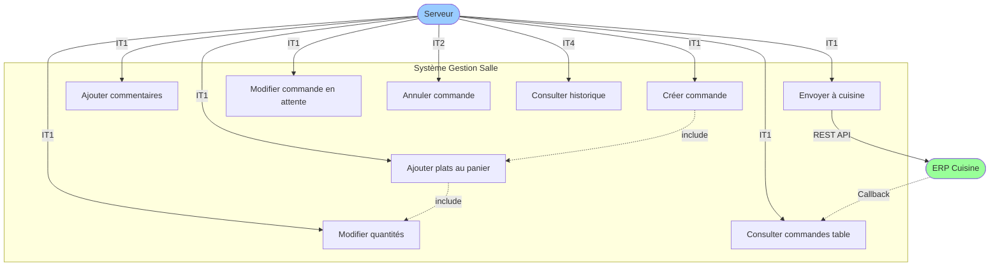

### Description des Cas d'Utilisation

| Code | Nom | Acteurs | Itération | Description |
|:-----|:----|:--------|:----------|:------------|
| **UC3.1** | Créer commande | Serveur | IT1 | Nouvelle commande liée à une table |
| **UC3.2** | Ajouter plats | Serveur | IT1 | Sélection menu (entrée, plat, dessert, vin) |
| **UC3.3** | Modifier quantités | Serveur | IT1 | Ajuster qty avant envoi |
| **UC3.4** | Commentaires | Serveur | IT1 | "Sans sauce", "Bien cuit", allergies |
| **UC3.5** | Envoyer cuisine | Serveur | IT1 | POST vers ERP + validation réception |
| **UC3.6** | Consulter commandes | Serveur | IT1 | Liste commandes table active |
| **UC3.7** | Modifier en attente | Serveur | IT1 | Si statut "pending" (non préparée) |
| **UC3.8** | Annuler | Serveur | IT2 | Justification requise (RBAC Admin only) |
| **UC3.9** | Historique | Serveur | IT4 | Logs toutes commandes passées |

---

## UC4 : Paiements & Split Bill

### Diagramme de Cas d'Utilisation

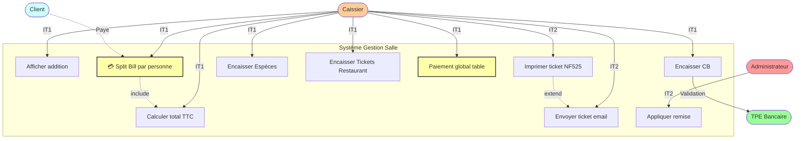

### Description des Cas d'Utilisation

| Code | Nom | Acteurs | Itération | Description |
|:-----|:----|:--------|:----------|:------------|
| **UC4.1** | Afficher addition | Caissier | IT1 | Détail plats + total table |
| **UC4.2** | Calculer TTC | Caissier | IT1 | Somme TTC (TVA 10% resto, 20% boissons) |
| **UC4.3** | 💳 Split Bill | Caissier, Client | IT1 | **Paiement individuel** : chaque personne paye sa consommation |
| **UC4.4** | Encaisser CB | Caissier | IT1 | Intégration TPE (VLAN sécurisé PCI DSS) |
| **UC4.5** | Encaisser Espèces | Caissier | IT1 | Saisie montant reçu + calcul monnaie |
| **UC4.6** | Tickets Restaurant | Caissier | IT1 | Chèques-Déjeuner / Titres-Restaurant |
| **UC4.7** | Paiement global | Caissier | IT1 | 1 personne paye pour plusieurs couverts |
| **UC4.8** | Imprimer NF525 | Caissier | IT2 | Ticket certifié (hash, signature) |
| **UC4.9** | Envoyer email | Caissier | IT2 | Si client fournit adresse |
| **UC4.10** | Remise manuelle | Admin | IT2 | Réduction % ou € (justification obligatoire) |

---

## UC5 : Conformité NF525 (Certification Fiscale)

### Diagramme de Cas d'Utilisation

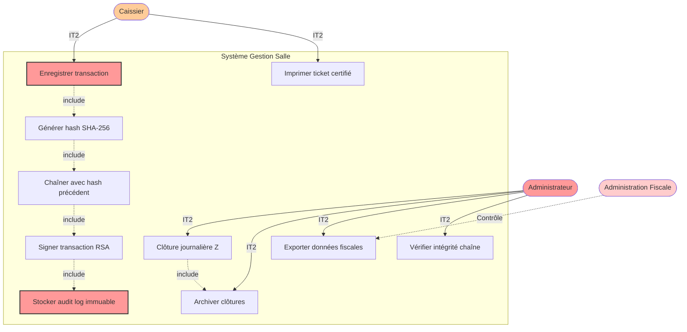

### Description des Cas d'Utilisation

| Code | Nom | Acteurs | Itération | Description |
|:-----|:----|:--------|:----------|:------------|
| **UC5.1** | Enregistrer TX | Caissier | IT2 | Capture transaction paiement |
| **UC5.2** | Hash SHA-256 | Système | IT2 | Hash(montant + timestamp + order_id + prev_hash) |
| **UC5.3** | Chaînage | Système | IT2 | Liaison cryptographique avec TX précédente |
| **UC5.4** | Signature RSA | Système | IT2 | Signature clé privée (certifiée AFNOR) |
| **UC5.5** | Audit log | Système | IT2 | Insertion table `audit_logs` (append-only) |
| **UC5.6** | Clôture Z | Admin | IT2 | Clôture journalière (fin service) |
| **UC5.7** | Archivage | Admin | IT2 | Conservation 6 ans (obligation légale) |
| **UC5.8** | Export fiscal | Admin | IT2 | XML/JSON pour administration fiscale |
| **UC5.9** | Vérifier intégrité | Admin | IT2 | Contrôle chaîne hashes (cron quotidien) |
| **UC5.10** | Ticket certifié | Caissier | IT2 | Impression avec hash + mention NF525 |

---

## UC6 : Authentification & RBAC (Sécurité)

### Diagramme de Cas d'Utilisation

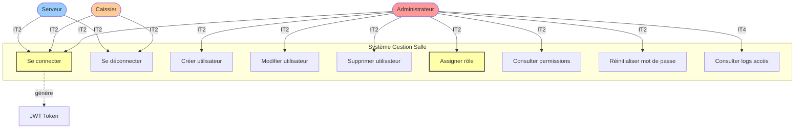

### Description des Cas d'Utilisation

| Code | Nom | Acteurs | Itération | Description |
|:-----|:----|:--------|:----------|:------------|
| **UC6.1** | Connexion | Tous | IT2 | Login (username/password) → JWT token |
| **UC6.2** | Déconnexion | Tous | IT2 | Invalidation token + retour écran login |
| **UC6.3** | Créer utilisateur | Admin | IT2 | Nouveau Serveur/Caissier/Admin |
| **UC6.4** | Modifier utilisateur | Admin | IT2 | Changement nom, email, rôle |
| **UC6.5** | Supprimer utilisateur | Admin | IT2 | Désactivation compte (soft delete) |
| **UC6.6** | Assigner rôle | Admin | IT2 | RBAC : Serveur / Caissier / Admin |
| **UC6.7** | Consulter permissions | Admin | IT2 | Matrice rôles-endpoints |
| **UC6.8** | Reset password | Admin | IT2 | Réinitialisation par admin |
| **UC6.9** | Logs accès | Admin | IT4 | Audit connexions (tentatives échouées) |

---

## UC7 : Mode Offline (Résilience Mobile)

### Diagramme de Cas d'Utilisation

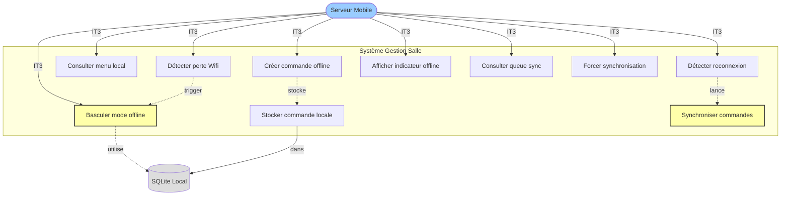

### Description des Cas d'Utilisation

| Code | Nom | Acteurs | Itération | Description |
|:-----|:----|:--------|:----------|:------------|
| **UC7.1** | Détecter perte Wifi | Système | IT3 | NetInfo listener (événement réseau) |
| **UC7.2** | Mode offline | Système | IT3 | Basculement automatique SQLite |
| **UC7.3** | Menu local | Serveur | IT3 | Lecture cache SQLite (dernière synchro) |
| **UC7.4** | Commande offline | Serveur | IT3 | Prise commande malgré absence réseau |
| **UC7.5** | Stockage local | Système | IT3 | INSERT `pending_orders` SQLite |
| **UC7.6** | Reconnexion | Système | IT3 | Détection retour Wifi |
| **UC7.7** | Synchronisation | Système | IT3 | Upload commandes locales → API |
| **UC7.8** | Indicateur offline | Serveur | IT3 | Badge visuel "Hors Ligne" |
| **UC7.9** | Queue sync | Serveur | IT3 | Liste commandes en attente envoi |
| **UC7.10** | Forcer sync | Serveur | IT3 | Bouton manuel si auto-sync échoue |

---

## UC8 : Notifications Temps Réel (WebSocket)

### Diagramme de Cas d'Utilisation

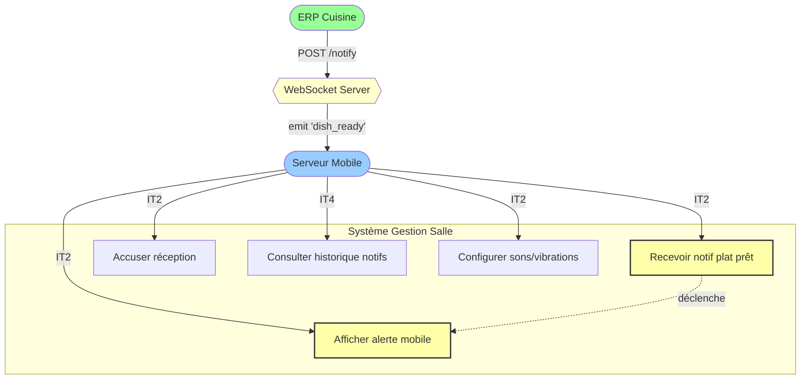

### Description des Cas d'Utilisation

| Code | Nom | Acteurs | Itération | Description |
|:-----|:----|:--------|:----------|:------------|
| **UC8.1** | Recevoir notif | Serveur | IT2 | WebSocket événement "dish_ready" |
| **UC8.2** | Alerte mobile | Serveur | IT2 | Notification push locale (son + vibration) |
| **UC8.3** | Accuser réception | Serveur | IT2 | Clic notification → marquer "vu" |
| **UC8.4** | Historique notifs | Serveur | IT4 | Liste toutes notifications reçues (log) |
| **UC8.5** | Config sons | Serveur | IT2 | Personnalisation alerte (volume, son) |

---

## UC9 : Rapports & Statistiques (Admin Dashboard)

### Diagramme de Cas d'Utilisation

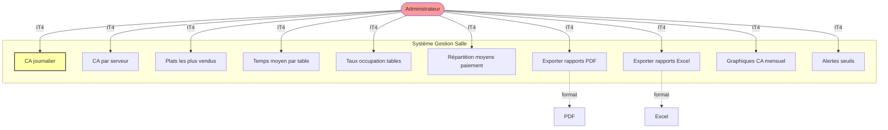

### Description des Cas d'Utilisation

| Code | Nom | Acteurs | Itération | Description |
|:-----|:----|:--------|:----------|:------------|
| **UC9.1** | CA journalier | Admin | IT4 | Chiffre affaires total du jour |
| **UC9.2** | CA par serveur | Admin | IT4 | Performance individuelle serveurs |
| **UC9.3** | Plats + vendus | Admin | IT4 | Top 10 plats (données ERP) |
| **UC9.4** | Temps moyen | Admin | IT4 | Durée moyenne service par table |
| **UC9.5** | Taux occupation | Admin | IT4 | % tables occupées (heure/jour) |
| **UC9.6** | Moyens paiement | Admin | IT4 | Répartition CB / Espèces / TR |
| **UC9.7** | Export PDF | Admin | IT4 | Rapports imprimables (fiscaux) |
| **UC9.8** | Export Excel | Admin | IT4 | Analyse données (pivot tables) |
| **UC9.9** | Graphiques | Admin | IT4 | Courbes CA, tendances (Grafana) |
| **UC9.10** | Alertes seuils | Admin | IT4 | Email si CA < objectif, stock critique |

---

## UC10 : Intégration ERP Cuisine

### Diagramme de Cas d'Utilisation

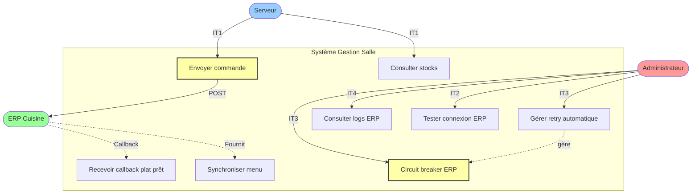

### Description des Cas d'Utilisation

| Code | Nom | Acteurs | Itération | Description |
|:-----|:----|:--------|:----------|:------------|
| **UC10.1** | Envoyer commande | Serveur | IT1 | POST /kitchen/orders vers ERP |
| **UC10.2** | Consulter stocks | Serveur | IT1 | GET stocks temps réel (API ERP) |
| **UC10.3** | Callback plat prêt | ERP | IT2 | ERP notifie plat terminé (WebSocket) |
| **UC10.4** | Sync menu | Système | IT1 | Import carte depuis ERP (quotidien) |
| **UC10.5** | Retry auto | Système | IT3 | Exponential backoff si ERP timeout |
| **UC10.6** | Circuit breaker | Système | IT3 | Isolation pannes ERP (pattern Opossum) |
| **UC10.7** | Logs ERP | Admin | IT4 | Historique appels API (debug) |
| **UC10.8** | Test connexion | Admin | IT2 | Ping ERP (health check) |

---

## UC11 : Administration Système

### Diagramme de Cas d'Utilisation

```mermaid
graph TB
    subgraph Système["Système Gestion Salle"]
        UC11.1["Gérer utilisateurs"]
        UC11.2["Configurer menu/vins"]
        UC11.3["Gérer tables"]
        UC11.4["Consulter logs système"]
        UC11.5["Exporter données RGPD"]
        UC11.6["Supprimer données client"]
        UC11.7["Configurer alertes"]
        UC11.8["Gérer sauvegardes BDD"]
        UC11.9["Consulter métriques"]
        UC11.10["Redémarrer services"]
    end
    
    Admin([Administrateur])
    
    Admin -->|IT2| UC11.1
    Admin -->|V2| UC11.2
    Admin -->|IT2| UC11.3
    Admin -->|IT4| UC11.4
    Admin -->|IT2| UC11.5
    Admin -->|IT2| UC11.6
    Admin -->|IT4| UC11.7
    Admin -->|IT3| UC11.8
    Admin -->|IT4| UC11.9
    Admin -->|IT4| UC11.10
    
    style UC11.5 fill:#f99,stroke:#333,stroke-width:2px
    style UC11.6 fill:#f99,stroke:#333,stroke-width:2px
    style Admin fill:#f99
```

### Description des Cas d'Utilisation

| Code | Nom | Acteurs | Itération | Description |
|:-----|:----|:--------|:----------|:------------|
| **UC11.1** | Gérer utilisateurs | Admin | IT2 | CRUD Serveur/Caissier/Admin |
| **UC11.2** | Config menu/vins | Admin | V2 | Gestion carte + pairings |
| **UC11.3** | Gérer tables | Admin | IT2 | Configuration plan salle (capacités) |
| **UC11.4** | Logs système | Admin | IT4 | ELK Stack (Kibana dashboards) |
| **UC11.5** | Export RGPD | Admin | IT2 | Données client (portabilité) |
| **UC11.6** | Suppression RGPD | Admin | IT2 | Droit à l'oubli (anonymisation) |
| **UC11.7** | Config alertes | Admin | IT4 | E-mail/Slack si incidents |
| **UC11.8** | Sauvegardes | Admin | IT3 | Backup PostgreSQL auto (cron) |
| **UC11.9** | Métriques | Admin | IT4 | Prometheus/Grafana (CPU, RAM) |
| **UC11.10** | Redémarrer services | Admin | IT4 | Restart API/WebSocket/Cache |

---

## 4. Vue Globale Synthétique

### Diagramme de Cas d'Utilisation Global (Simplifié)

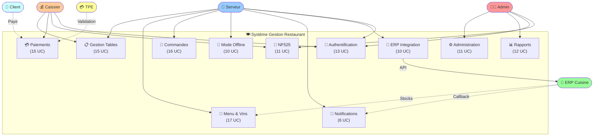

---

## 5. Tableau Récapitulatif Acteurs-Fonctionnalités

| Acteur | Domaines Fonctionnels | Nb Total UC | Itération Principale |
|:-------|:----------------------|:-----------:|:---------------------|
| **Serveur** | Tables, Menu, Commandes, Offline, Notifs, ERP | **73 UC** | IT1, IT3 |
| **Caissier** | Tables, Paiements, NF525 | **41 UC** | IT1, IT2 |
| **Administrateur** | Admin, Rapports, NF525, Auth | **47 UC** | IT2, IT4 |
| **Client** | Paiements (passif) | **5 UC** | IT1 |
| **ERP Cuisine** | Commandes, Menu (stocks), Notifs | **15 UC** | IT1, IT2 |
| **TPE Bancaire** | Paiements CB | **2 UC** | IT1 |

---

## 6. Répartition par Itération

### IT1 - MVP Fonctionnel (39 UC)
- ✅ Tables : 10 UC (ouverture, fermeture, consultation)
- ✅ Menu : 8 UC (consultation + **recommandations vin**)
- ✅ Commandes : 7 UC (création, envoi ERP)
- ✅ Paiements : 9 UC (**split bill** + CB/Espèces/TR)
- ✅ ERP : 5 UC (envoi commandes, consultation stocks)

### IT2 - Sécurité & Conformité (43 UC)
- ✅ Authentification : 9 UC (JWT, RBAC)
- ✅ NF525 : 11 UC (certification fiscale complète)
- ✅ WebSocket : 5 UC (notifications temps réel)
- ✅ RGPD : 4 UC (export, suppression données)
- ✅ Paiements : 3 UC (tickets certifiés, email)

### IT3 - Performance & Résilience (13 UC)
- ✅ Mode Offline : 10 UC (SQLite, sync différée)
- ✅ ERP : 3 UC (retry, circuit breaker)

### IT4 - Scalabilité & Observabilité (15 UC)
- ✅ Rapports : 12 UC (CA, stats, exports)
- ✅ Monitoring : 3 UC (logs, métriques, alertes)

### V2 - Extensions Futures (31 UC)
- ⏳ Réservations : 5 UC
- ⏳ Menu Admin : 8 UC (CRUD plats/vins)
- ⏳ Pourboires : 3 UC
- ⏳ Autres : 15 UC

---

## 7. Justification du Découpage en 11 Diagrammes

### Pourquoi pas un seul diagramme global ?

❌ **Un seul diagramme = 166 UC** serait **illisible** :
- Trop dense visuellement (surcharge cognitive).
- Perte de clarté des relations acteurs-UC.
- Impossible à imprimer/présenter (A4).

✅ **11 diagrammes thématiques** permettent :
- **Clarté** : Max 15-17 UC par diagramme → compréhensible.
- **Modularité** : Chaque domaine fonctionnel séparé.
- **Navigation** : Table des matières claire (UC1 → UC11).
- **Évolutivité** : Ajout V2 sans refonte totale.

**Compromis adopté** : Vue globale simplifiée (§4) + détails par domaine (§3).

---

## Conclusion

Les **166 fonctionnalités** de l'application de gestion de salle sont présentées via **11 diagrammes UML de cas d'utilisation** organisés par domaine fonctionnel. Cette approche :

✅ **Visualise clairement** les interactions acteurs-système.  
✅ **Respecte la progression itérative** (IT1 → IT4 → V2).  
✅ **Facilite la validation** avec les parties prenantes (client, serveurs, caissier).  
✅ **Prépare la conception détaillée** (C7 : diagrammes de séquence, MCD).

**Prochaines étapes C5** :
1. ⏳ Benchmark technologies (Node.js vs alternatives).
2. ⏳ Sélection finale stack technique justifiée.
3. ⏳ Validation critères de qualité (ISO 25010).
