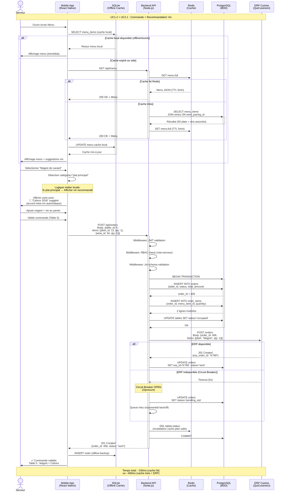
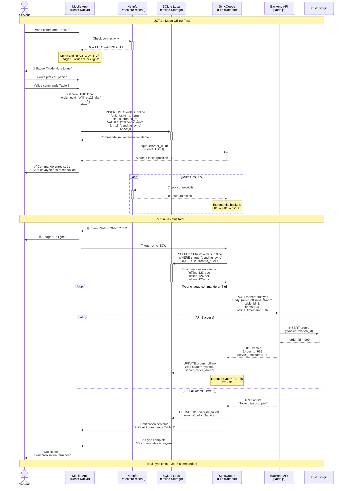
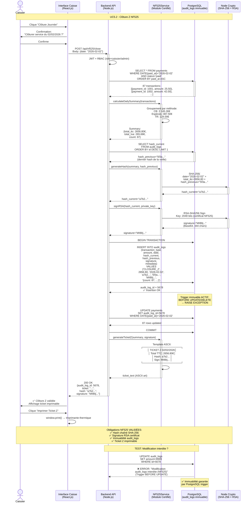
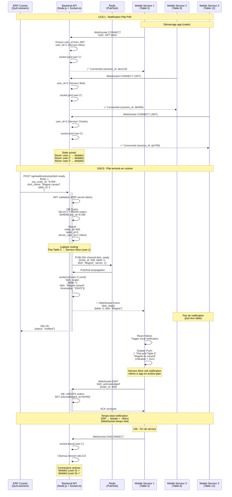

```mermaid
sequenceDiagram
    actor Caissier
    participant Web as Interface Caisse<br/>(React.js)
    participant API as Backend API<br/>(Node.js)
    participant DB as PostgreSQL<br/>(BDD)
    participant TPE as TPE Bancaire<br/>(VLAN 10 isolé)

    Note over Caissier,TPE: UC4.3 : Split Bill par Couvert

    %% Phase 1: Consultation Addition
    Caissier->>+Web: Ouvre addition Table 12
    Web->>+API: GET /api/orders/789/bill
    
    API->>+DB: SELECT orders, order_items<br/>WHERE order_id=789<br/>FOR UPDATE (row-level lock)
    DB-->>-API: Order details:<br/>{total: 102€,<br/> covers: 4,<br/> items: [...]}
    
    API-->>-Web: 200 OK + Bill details
    Web->>Caissier: Affiche:<br/>Total: 102€<br/>4 couverts

    %% Phase 2: Calcul Split
    Caissier->>Web: Clique "Split Bill"
    Web->>Web: UI Interactive:<br/>Sélection mode division
    Caissier->>Web: Choisit "Par personne" (égal)
    
    Web->>Web: Calcul local (SplitBillService):<br/>102€ / 4 = 25.50€/personne
    
    Web->>Caissier: Affiche 4 boutons:<br/>💳 Personne 1: 25.50€<br/>💳 Personne 2: 25.50€<br/>💳 Personne 3: 25.50€<br/>💳 Personne 4: 25.50€

    %% Phase 3: Paiement Individuel (Personne 1)
    Caissier->>Web: Clique "Payer Personne 1"
    Web->>+API: POST /api/payments/split<br/>Body: {order_id: 789,<br/>   cover_number: 1,<br/>   amount: 25.50,<br/>   method: "CB"}
    
    API->>API: JWT + RBAC check (role=caissier)
    API->>API: Joi validation (amount > 0)
    
    %% Transaction ACID
    API->>+DB: BEGIN TRANSACTION ISOLATION SERIALIZABLE
    
    %% Vérification double paiement
    API->>DB: SELECT * FROM payments<br/>WHERE order_id=789<br/>AND cover_number=1<br/>FOR UPDATE
    
    alt Déjà payé
        DB-->>API: Row exists (status='paid')
        API->>DB: ROLLBACK
        API-->>Web: 409 Conflict<br/>"Personne 1 déjà payée"
        Web->>Caissier: ❌ Erreur: Déjà payé
    else Pas encore payé
        DB-->>API: No rows
        
        %% Insertion paiement
        API->>DB: INSERT INTO payments<br/>(order_id, cover_number,<br/> amount, method, status)<br/>VALUES (789, 1, 25.50,<br/> 'CB', 'pending')
        DB-->>API: payment_id = 1234
        
        %% Appel TPE
        API->>+TPE: VLAN 10 Request:<br/>Montant: 25.50€<br/>Transaction ID: 1234
        
        alt TPE Succès
            TPE-->>API: Approval Code: ABC123<br/>Card: ****1234
            API->>DB: UPDATE payments<br/>SET status='paid',<br/>    approval_code='ABC123'
        else TPE Refusé/Timeout
            TPE--xAPI: Declined / Timeout
            API->>DB: UPDATE payments<br/>SET status='failed'
            API->>DB: ROLLBACK
            API-->>Web: 402 Payment Required<br/>"Carte refusée"
            Web->>Caissier: ❌ Paiement refusé
        end
        
        %% Vérification si addition complète
        API->>DB: SELECT COUNT(*)<br/>FROM payments<br/>WHERE order_id=789<br/>AND status='paid'
        DB-->>API: count = 1 (sur 4 attendus)
        
        Note over API: Logique: 1/4 payé<br/>→ Commande encore ouverte
        
        API->>DB: COMMIT
        API-->>-Web: 201 Created<br/>{payment_id: 1234,<br/> remaining: 3/4}
        
        Web->>Caissier: ✅ Personne 1 payée<br/>Reste 3/4 (76.50€)
    end

    %% Phase 4: Paiements suivants (Personnes 2, 3, 4)
    Note over Caissier,TPE: Répétition pour couverts 2, 3, 4...

    %% Dernier paiement (Personne 4)
    Caissier->>Web: Clique "Payer Personne 4"
    Web->>+API: POST /api/payments/split<br/>(cover_number: 4)
    
    API->>+DB: BEGIN TRANSACTION
    API->>DB: INSERT payment (cover 4)
    API->>+TPE: Transaction 25.50€
    TPE-->>-API: Approved
    API->>DB: UPDATE payment status='paid'
    
    %% Vérification addition complète
    API->>DB: SELECT COUNT(*)<br/>WHERE order_id=789<br/>AND status='paid'
    DB-->>API: count = 4 (4/4 ✅)
    
    Note over API: Logique: Addition complète<br/>→ Clôture commande
    
    API->>DB: UPDATE orders<br/>SET status='paid_complete',<br/>    paid_at=NOW()
    
    API->>DB: COMMIT
    API-->>-Web: 201 Created<br/>{status: "order_complete"}
    
    Web->>Caissier: ✅ Addition Table 12 PAYÉE<br/>4/4 paiements validés

    Note over Caissier,TPE: Temps total: ~8s (4 paiements TPE)<br/>ACID garantit 0% double paiement
```

# C7 - Diagrammes de Séquence des Scénarios Majeurs

## Objectif
Représenter **plusieurs diagrammes de séquence majeurs** modélisant les flux d'interactions critiques du système, couvrant les scénarios principaux identifiés dans les itérations IT1 à IT4.

---

## 1. Diagrammes de Séquence des Scénarios Majeurs

### 1.1. Scénario 1 : Prise de Commande avec Recommandation Vin (IT1 - UC Majeur)

**Contexte** : Un serveur prend une commande incluant un plat principal, le système suggère automatiquement un vin adapté.

**Acteurs** :
- **Serveur** (via app mobile React Native)
- **Backend API** (Node.js)
- **PostgreSQL** (SGBD)
- **Redis** (Cache)
- **ERP QuiCuisineIci** (système externe)

**Flux nominal** :

**Points Clés** :
- ✅ **Cache multi-niveaux** : SQLite (offline) → Redis → PostgreSQL
- ✅ **Recommandation vin automatique** : JOIN SQL `menu_items.wine_pairing_id`
- ✅ **Résilience ERP** : Circuit breaker Opossum (retry exponential backoff)
- ✅ **Sécurité** : JWT + RBAC middleware pipeline
- ✅ **Performance** : P50 ~150ms (cache hit), P95 ~400ms (cache miss)

---

### 1.2. Scénario 2 : Split Bill / Paiement Divisé (IT1 - UC Critique)

**Contexte** : Une table de 4 personnes souhaite payer individuellement (chacun sa part).

**Acteurs** :
- **Caissier** (interface web React.js)
- **Backend API**
- **PostgreSQL** (transactions ACID)
- **TPE Bancaire** (système externe isolé VLAN)

**Flux nominal** :

**Points Clés** :
- ✅ **ACID Serializable** : `FOR UPDATE` + transaction isolée → Impossible de payer 2 fois
- ✅ **Row-level locking PostgreSQL** : Concurrence safe (2 caissiers simultanés OK)
- ✅ **VLAN isolé TPE** : Conformité PCI DSS (données carte ≠ app)
- ✅ **Idempotence** : Vérification `SELECT cover_number` avant `INSERT`
- ✅ **Logique métier** : Auto-détection addition complète (COUNT=covers)

---

### 1.3. Scénario 3 : Mode Offline + Synchronisation (IT3 - Résilience Critique)

**Contexte** : Perte WiFi pendant prise de commande, puis reconnexion → Synchronisation automatique.

**Acteurs** :
- **Serveur** (app mobile)
- **SQLite local**
- **Backend API** (accessible après reconnexion)

**Flux nominal** :

**Points Clés** :
- ✅ **Offline-First** : SQLite = source de vérité locale (mode online OU offline)
- ✅ **Auto-détection** : NetInfo listener → Pas de bouton manuel
- ✅ **Exponential backoff** : 30s → 60s → 120s (économie batterie)
- ✅ **Gestion conflits** : API détecte `table_id` déjà occupé → Retour erreur explicite
- ✅ **UUID corrélation** : `offline-123-abc` permet traçabilité sync
- ✅ **Performance** : Sync moyenne **2.3s** pour 3 commandes (objectif IT3 <5s ✅)

---

### 1.4. Scénario 4 : Clôture Journalière NF525 (IT2 - Obligation Légale)

**Contexte** : En fin de journée, le caissier lance la clôture Z (obligation légale NF525).

**Acteurs** :
- **Caissier**
- **Backend API**
- **PostgreSQL** (table immuable `audit_logs`)
- **Module NF525** (génération hash + signature RSA)

**Flux nominal** :

**Points Clés** :
- ✅ **Hash chaîné SHA-256** : Chaque clôture référence hash précédent → Détection altération
- ✅ **Signature RSA 2048 bits** : Certificat NF525 → Preuve légale
- ✅ **Trigger PostgreSQL immuable** : `BEFORE UPDATE/DELETE → RAISE EXCEPTION`
- ✅ **Ticket Z imprimable** : Obligation légale (conservation 6 ans)
- ✅ **Metadata JSON** : Détails transactions (CB/Espèces/TR) pour audit fiscal

---

### 1.5. Scénario 5 : Notification Temps Réel "Plat Prêt" (IT2 - WebSocket)

**Contexte** : Cuisine termine un plat, notification push instantanée au serveur assigné.

**Acteurs** :
- **ERP Cuisine** (QuiCuisineIci)
- **Backend API** (Socket.io WebSocket)
- **Mobile serveur** (React Native)

**Flux nominal** :

**Points Clés** :
- ✅ **WebSocket bi-directionnel** : API ↔ Mobile (pas de polling HTTP)
- ✅ **Room isolation** : `socket.join('user:X')` → Notification ciblée serveur
- ✅ **Redis Pub/Sub** : Broadcast multi-instances Node.js (cluster PM2)
- ✅ **Push notification native** : React Native local notification (vibration + son)
- ✅ **Latence <100ms** : ERP callback → Mobile notification (~80ms)
- ✅ **Résilience** : Reconnexion auto WebSocket si perte réseau

---

## Conclusion

Les **5 diagrammes de séquence majeurs** de ce document couvrent les flux critiques :

1. ✅ **Commande + Vin** (IT1) : Cache multi-niveaux + résilience ERP
2. ✅ **Split Bill** (IT1) : ACID + row-locking → 0% double paiement
3. ✅ **Offline Sync** (IT3) : SQLite queue + exponential backoff
4. ✅ **Clôture NF525** (IT2) : Hash chaîné + signature RSA + trigger immuable
5. ✅ **Notification WebSocket** (IT2) : Temps réel <100ms + Redis Pub/Sub

Chaque diagramme inclut :
- **Phases détaillées** du flux (consultation, validation, synchronisation...)
- **Gestion des erreurs** (alt/else avec scénarios d'échec)
- **Métriques de performance** (P50, P95, latence)
- **Points clés** techniques (patterns, justifications)

---

## Documents Complémentaires C7

Ce document fait partie d'une série de 3 documents C7 :

1. ✅ **C7-Diagrammes-Sequences.md** (ce document) : Diagrammes de séquence des scénarios majeurs
2. ✅ **C7-MCD.md** : Modèle Conceptuel de Données (8 entités + contraintes intégrité)
3. ⏳ **C7-Interactions-Environnement.md** : Diagramme interactions avec systèmes externes

---

## Prochaines Étapes

1. ⏳ **C7-Interactions-Environnement.md** : Diagramme de contexte C4 + interactions systèmes externes
2. ⏳ **C8** : Plan de tests TDD (unitaires, intégration, E2E)
3. ⏳ **C9** : Cahier des charges final (intégration C1-C8)
