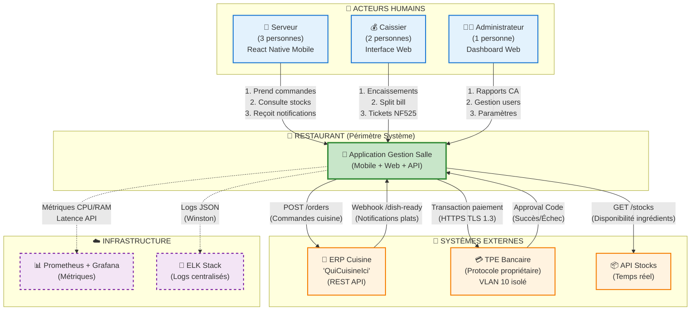

# C7 - Interactions avec l'Environnement

## Objectif
Représenter à l'aide d'un diagramme adapté les **relations et interactions nécessaires avec l'environnement immédiat** de l'application à concevoir, incluant les acteurs humains, les systèmes externes et l'infrastructure d'observabilité.

---

## 1. Diagramme de Contexte (C4 Level 0)

### 1.1. Vue d'Ensemble du Système

Le diagramme de contexte illustre le périmètre du système et ses interactions avec :
- **3 acteurs humains** (Serveur, Caissier, Administrateur)
- **3 systèmes externes métier** (ERP Cuisine, TPE Bancaire, API Stocks)
- **2 systèmes infrastructure** (Monitoring Prometheus, Logs ELK)



---

## 2. Acteurs Humains

### 2.1. Serveur (3 personnes)

**Rôle** : Prise de commandes, gestion des tables, service client

**Interface** : Application mobile React Native (Android, iOS à venir V2)

**Cas d'usage principaux** :
- **UC1** : Consulter menu + stocks temps réel
- **UC2** : Prendre commande (plats + vins recommandés)
- **UC3** : Assigner/libérer tables du plan de salle
- **UC8** : Recevoir notifications "plat prêt" (WebSocket push)
- **UC7** : Mode offline (SQLite local + synchronisation auto)

**Authentification** : JWT + RBAC (`role='serveur'`)

**Fréquence d'utilisation** :
- **~180 commandes/jour** (60 services midi + 120 services soir)
- **~500 requêtes menu/stocks/jour** (consultations fréquentes)
- **~60 notifications push/jour** (plats prêts)

---

### 2.2. Caissier (2 personnes)

**Rôle** : Encaissements, clôtures journalières, impressions tickets

**Interface** : Application web React.js (PC avec imprimante thermique)

**Cas d'usage principaux** :
- **UC4** : Consulter addition (détail commande)
- **UC4.3** : Split bill par couvert (paiements individuels)
- **UC4.5** : Encaissement CB/Espèces/TR (interaction TPE)
- **UC5** : Clôture journalière NF525 (hash SHA-256 + signature RSA)
- **UC6** : Impression ticket Z (obligation légale)

**Authentification** : JWT + RBAC (`role='caissier'`)

**Fréquence d'utilisation** :
- **~95 paiements/jour** (1.5 paiements/commande → split bill fréquent)
- **1 clôture Z/jour** (fin de service)
- **~30 tickets imprimés/jour** (clôture Z + remboursements)

**Contraintes matérielles** :
- PC avec imprimante thermique USB
- Liaison TPE bancaire via VLAN 10 isolé (PCI DSS)

---

### 2.3. Administrateur (1 personne)

**Rôle** : Gestion système, paramétrage, reporting

**Interface** : Dashboard web React.js (accès administrateur)

**Cas d'usage principaux** :
- **UC9** : Rapports CA (chiffre d'affaires jour/mois/an)
- **UC10** : Gestion utilisateurs (création serveurs/caissiers)
- **UC11** : Paramétrage (prix menu, TVA, vins)
- **UC12** : Consultation logs audit NF525 (historique immuable)
- **UC13** : Monitoring système (Grafana dashboards)

**Authentification** : JWT + RBAC (`role='admin'`)

**Fréquence d'utilisation** :
- **~5 accès/semaine** (gestion ponctuelle)
- **1 rapport CA/jour** (suivi activité)
- **~2 modifications menu/mois** (saisonnalité carte)

---

## 3. Systèmes Externes Métier

### 3.1. ERP Cuisine "QuiCuisineIci"

**Rôle** : Gestion production cuisine (tickets commandes, gestion stocks ingrédients)

**Protocole** : REST JSON/HTTPS

**Direction** : **Bidirectionnel**

**Périmètre IT1** : Intégration retenue (Scénario A)

#### 3.1.1. Flux sortants (App → ERP)

**Endpoint** : `POST https://erp.quicuisineici.fr/api/v2/orders`

**Authentification** : Bearer Token (API key fournie par ERP)

**Payload exemple** :
```json
{
  "order_id": 456,
  "table_number": 5,
  "server_name": "Alice Dupont",
  "items": [
    {
      "dish_name": "Magret de canard",
      "quantity": 1,
      "notes": "Cuisson rosée"
    },
    {
      "dish_name": "Tarte Tatin",
      "quantity": 2
    }
  ],
  "timestamp": "2026-02-02T19:23:15Z"
}
```

**Réponse succès** :
```json
{
  "erp_order_id": "K789",
  "status": "accepted",
  "estimated_time": 18
}
```

**Fréquence** : **~180 requêtes/jour** (1 requête par commande)

**SLA attendu** : **<500ms P95** (critique pour UX serveur)

**Résilience** : Circuit breaker Opossum (voir [C7-Diagrammes-Sequences.md](C7-Diagrammes-Sequences.md) §1.1)
- Timeout : 5s
- Threshold : 3 échecs consécutifs → OPEN
- Half-open retry : après 30s

---

#### 3.1.2. Flux entrants (ERP → App)

**Endpoint** : `POST https://app-restaurant.fr/api/webhooks/erp/dish-ready`

**Authentification** : HMAC-SHA256 signature (secret partagé)

**Payload exemple** :
```json
{
  "erp_order_id": "K789",
  "dish_name": "Magret de canard",
  "table_id": 5,
  "timestamp": "2026-02-02T19:41:22Z",
  "signature": "d5f8a3b2c1e4..."
}
```

**Réponse attendue** :
```json
{
  "status": "notified",
  "server_ack": "pending"
}
```

**Fréquence** : **~60 callbacks/jour** (pas tous les plats → groupage cuisine)

**Latence** : **<100ms** (notification WebSocket immédiate serveur)

---

### 3.2. TPE Bancaire (Terminal de Paiement Électronique)

**Rôle** : Encaissement paiements carte bancaire

**Protocole** : Propriétaire bancaire/TLS 1.3 (VLAN 10 isolé)

**Direction** : **Bidirectionnel**

**Périmètre IT1** : Intégration critique (conformité PCI DSS)

#### 3.2.1. Architecture réseau

**Isolation VLAN** :
- **VLAN 10** : TPE + API Backend (segment PCI DSS)
- **VLAN 20** : Clients mobiles/web (segment application)
- **Firewall** : Interdit communication directe VLAN 20 → VLAN 10

**Flux autorisés** :
```
Mobile/Web (VLAN 20) 
    ↓ HTTPS JWT
Backend API (bridge VLAN 10/20)
    ↓ TLS propriétaire
TPE Bancaire (VLAN 10)
```

#### 3.2.2. Flux transaction

**Endpoint API locale** : `POST http://192.168.10.50:8080/payment`

**Payload** :
```json
{
  "transaction_id": 1234,
  "amount_cents": 2550,
  "currency": "EUR",
  "payment_method": "CB"
}
```

**Réponse succès** :
```json
{
  "approval_code": "ABC123",
  "card_masked": "****1234",
  "transaction_date": "2026-02-02T20:15:33Z",
  "status": "approved"
}
```

**Réponse échec** :
```json
{
  "status": "declined",
  "reason": "insufficient_funds",
  "retry_allowed": false
}
```

**Fréquence** : **~95 transactions/jour**

**Latence moyenne** : **2-3s** (délai réseau bancaire)

**SLA critique** : **<10s timeout** (éviter blocage caisse)

---

### 3.3. API Stocks Temps Réel

**Rôle** : Vérification disponibilité ingrédients (évite commandes impossibles)

**Protocole** : REST JSON/HTTPS (lecture seule)

**Direction** : **Unidirectionnel** (App → API Stocks)

**Périmètre IT1** : Intégration optionnelle (bonus IT1)

#### 3.3.1. Endpoint consultation

**URL** : `GET https://api-stocks.restaurant.fr/v1/ingredients/{ingredient_id}/availability`

**Authentification** : API Key (header `X-API-Key`)

**Réponse exemple** :
```json
{
  "ingredient_id": 42,
  "name": "Magret de canard",
  "available_quantity": 12,
  "unit": "portions",
  "last_updated": "2026-02-02T19:00:00Z"
}
```

**Fréquence** : **~500 requêtes/jour**

**Cache** : Redis TTL **30s** (limiter latence + réduire appels)

**Performance** :
- **Cache hit** : **~5ms** (Redis local)
- **Cache miss** : **~80ms** (API Stocks externe)
- **Taux cache hit** : **~85%** (menus consultés répétitivement)

**Gestion indisponibilité** :
- Si API Stocks inaccessible → Pas bloquant (item marqué "disponibilité inconnue")
- Fallback : Affichage menu complet avec avertissement

---

## 4. Infrastructure d'Observabilité

### 4.1. Prometheus + Grafana (Métriques)

**Rôle** : Monitoring performances système (CPU, RAM, latence API)

**Architecture** :
- **Prometheus** : Scraping métriques exposées par Backend API
- **Grafana** : Dashboards visualisation temps réel

#### 4.1.1. Métriques exposées

**Endpoint** : `GET http://api-backend:9090/metrics` (format Prometheus)

**Métriques clés** :

```prometheus
# Latence API
http_request_duration_seconds_bucket{endpoint="/api/orders", method="POST", le="0.1"} 142
http_request_duration_seconds_bucket{endpoint="/api/orders", method="POST", le="0.5"} 178

# Taux succès/erreur
http_requests_total{endpoint="/api/orders", status="2xx"} 1203
http_requests_total{endpoint="/api/orders", status="5xx"} 7

# Consommation ressources
process_cpu_seconds_total 245.32
process_resident_memory_bytes 134217728

# Circuit breaker ERP
circuit_breaker_state{service="erp"} 0  # 0=CLOSED, 1=OPEN, 2=HALF_OPEN
erp_requests_failed_total 3
```

**Fréquence scraping** : **1 requête/15s** (24h retention Prometheus)

**Dashboards Grafana** :
- **Dashboard API** : Latence P50/P95/P99, taux erreurs 2xx/4xx/5xx
- **Dashboard Système** : CPU, RAM, disque, réseau
- **Dashboard Métier** : Commandes/heure, CA temps réel, split bill ratio

---

### 4.2. ELK Stack (Elasticsearch + Logstash + Kibana)

**Rôle** : Centralisation logs applicatifs (traçabilité, debug, audit)

**Architecture** :
- **Backend API** : Émission logs JSON (Winston)
- **Logstash** : Parsing + enrichissement logs
- **Elasticsearch** : Stockage indexé
- **Kibana** : Interface recherche/visualisation

#### 4.2.1. Format logs JSON

**Exemple log commande** :
```json
{
  "@timestamp": "2026-02-02T19:23:15.234Z",
  "level": "info",
  "message": "Order created successfully",
  "context": {
    "order_id": 456,
    "table_id": 5,
    "server_user_id": 1,
    "total_amount": 67.50,
    "erp_id": "K789",
    "items_count": 2
  },
  "request_id": "req-abc123",
  "duration_ms": 187,
  "ip": "192.168.1.42",
  "user_agent": "ReactNative/0.73"
}
```

**Exemple log erreur** :
```json
{
  "@timestamp": "2026-02-02T20:45:12.987Z",
  "level": "error",
  "message": "ERP timeout - circuit breaker opened",
  "context": {
    "order_id": 789,
    "erp_endpoint": "POST /orders",
    "timeout_ms": 5000,
    "retry_count": 3
  },
  "stack_trace": "Error: Timeout...",
  "request_id": "req-def456"
}
```

**Fréquence** : **~2000 logs/jour** (moyenne 1.4 logs/seconde)

**Rétention** : **90 jours** Elasticsearch (compliance légale)

**Index** : Rotation journalière `logs-restaurant-YYYY.MM.DD`

---

## 5. Tableau Récapitulatif des Interactions

| Système | Type | Protocole | Direction | Fréquence | Latence P95 | Criticité | Notes |
|:--------|:-----|:----------|:----------|:----------|:------------|:----------|:------|
| **ERP QuiCuisineIci** | Métier | REST HTTPS | ↕️ Bidirectionnel | **180 req/jour**<br/>**60 callbacks/jour** | <500ms | **HAUTE** | Circuit breaker requis |
| **TPE Bancaire** | Métier | Propriétaire TLS | ↕️ Bidirectionnel | **95 transactions/jour** | <3s | **CRITIQUE** | VLAN 10 isolé (PCI DSS) |
| **API Stocks** | Métier | REST HTTPS | → Lecture seule | **~500 req/jour** | <80ms | **MOYENNE** | Cache Redis 30s, fallback OK |
| **Prometheus** | Infra | HTTP Pull | ← Scraping | **1 req/15s** | <10ms | BASSE | Monitoring non-bloquant |
| **Elasticsearch** | Infra | HTTP JSON | → Push logs | **~2000 logs/jour** | <50ms | BASSE | Logs asynchrones (buffer) |

---

## 6. Patterns d'Intégration Identifiés

### 6.1. Patterns Utilisés par Système

| Système | Pattern | Justification |
|:--------|:--------|:--------------|
| **ERP QuiCuisineIci** | **Circuit Breaker** (Opossum) | Résilience pannes ERP (évite cascade failure) |
| **ERP QuiCuisineIci** | **Webhook + HMAC signature** | Sécurisation callbacks (authentification mutuelle) |
| **TPE Bancaire** | **Network Segmentation (VLAN)** | Isolation PCI DSS (données carte ≠ app) |
| **API Stocks** | **Cache-Aside** (Redis) | Performance reads + réduction appels externes |
| **Prometheus** | **Pull Model** (Scraping) | Standard observabilité (pas d'instrumentation push) |
| **Elasticsearch** | **Buffered Push** (Winston transport) | Logs asynchrones (pas blocage app si ELK down) |

### 6.2. Détail Pattern Circuit Breaker (ERP)

**Objectif** : Éviter blocage application si ERP indisponible

**Implémentation** : Bibliothèque Opossum (Node.js)

**États** :
- **CLOSED** : ERP OK, requêtes passent normalement
- **OPEN** : ERP KO (≥3 échecs), requêtes bloquées immédiatement → Erreur rapide
- **HALF-OPEN** : Après 30s, teste 1 requête → CLOSED si succès, OPEN si échec

**Configuration** :
```javascript
const circuitBreaker = new CircuitBreaker(erpRequest, {
  timeout: 5000,           // 5s timeout
  errorThresholdPercentage: 50,  // OPEN si >50% échecs
  resetTimeout: 30000,     // 30s avant retry HALF-OPEN
  volumeThreshold: 3       // Min 3 requêtes pour stats
});
```

**Bénéfices** :
- **Fail-fast** : Pas d'attente 5s × N requêtes si ERP down
- **Retry exponentiel** : Queue locale + resynchronisation différée
- **Monitoring** : Métriques Prometheus `circuit_breaker_state`

---

## 7. Contraintes et Prérequis d'Intégration

### 7.1. Prérequis ERP QuiCuisineIci

| Prérequis | Statut | Impact | Criticité |
|:----------|:-------|:-------|:----------|
| **Documentation API v2 complète** | ⚠️ EN ATTENTE | Bloquant développement IT1 | **CRITIQUE** |
| **Environnement test/staging fourni** | ⚠️ EN ATTENTE | Tests intégration impossibles | HAUTE |
| **Webhook IP whitelisting** | ✅ VALIDÉ | Configuration firewall requise | MOYENNE |
| **SLA <500ms P95 garanti** | ⚠️ À NÉGOCIER | Performance UX serveurs | HAUTE |

**Action requise** : Relance fournisseur ERP (deadline IT1 : J+15)

---

### 7.2. Prérequis TPE Bancaire

| Prérequis | Statut | Impact | Criticité |
|:----------|:-------|:-------|:----------|
| **Audit réseau PCI DSS (VLAN 10)** | ❌ NON FAIT | Certification obligatoire avant prod | **CRITIQUE** |
| **Certificat TLS fourni par banque** | ✅ VALIDÉ | Chiffrement liaison TPE | HAUTE |
| **Procédure test transactions (sandbox)** | ✅ VALIDÉ | Tests paiements sans débit réel | MOYENNE |
| **Formation caissiers TPE** | ⏳ PLANIFIÉE | UX encaissements | BASSE |

**Action requise** : Audit réseau externe PCI DSS (coût estimé : 2000€)

---

### 7.3. Prérequis Infrastructure

| Prérequis | Statut | Impact | Criticité |
|:----------|:-------|:-------|:----------|
| **Serveur dédié (4 CPU, 16 Go RAM)** | ✅ PROVISIONNÉ | Hébergement Backend API | HAUTE |
| **Redis cluster (3 nœuds HA)** | ✅ VALIDÉ | Cache distribué (failover) | MOYENNE |
| **Elasticsearch cluster (2 nœuds)** | ⏳ EN COURS | Stockage logs 90 jours | BASSE |
| **Certificat SSL Let's Encrypt** | ✅ AUTO-RENEW | HTTPS app-restaurant.fr | HAUTE |

---

## 8. Scénarios de Défaillance et Stratégies d'Atténuation

### 8.1. Défaillance ERP Cuisine

**Scenario** : API ERP indisponible (maintenance, panne réseau)

**Impact** :
- ❌ Commandes non transmises à la cuisine
- ❌ Notifications "plat prêt" inactives

**Stratégie** :
1. ✅ **Circuit breaker OPEN** → Erreur immédiate (pas timeout 5s)
2. ✅ **Queue locale** : Commandes stockées PostgreSQL (`status='pending_erp'`)
3. ✅ **Retry exponentiel** : Tentatives 30s, 60s, 120s, 240s...
4. ✅ **Notification serveur** : Badge UI "⚠️ ERP hors ligne - commandes en attente"
5. ✅ **Fallback manuel** : Impression ticket papier cuisine (plan B)

**SLA acceptable** : **<5min downtime ERP** (queue absorbe délai)

---

### 8.2. Défaillance TPE Bancaire

**Scenario** : TPE inaccessible (panne matérielle, réseau VLAN 10)

**Impact** :
- ❌ Paiements CB impossibles
- ✅ Paiements Espèces/TR toujours OK

**Stratégie** :
1. ✅ **Fallback Espèces** : Caissier propose paiement cash
2. ✅ **Timeout rapide** : Détection panne TPE <10s
3. ✅ **Notification caissier** : Popup "TPE indisponible"
4. ❌ **Pas de queue** : Transactions bancaires ≠ idempotent (risque double débit)
5. ✅ **Alerte SMS admin** : Panne TPE critique → Intervention urgente

**SLA acceptable** : **<30min downtime TPE** (intervention sur site)

---

### 8.3. Défaillance API Stocks

**Scenario** : API Stocks inaccessible

**Impact** :
- ⚠️ Disponibilité ingrédients inconnue
- ✅ Prise commande toujours possible

**Stratégie** :
1. ✅ **Fallback graceful** : Affichage menu complet sans stock
2. ✅ **Badge UI** : "⚠️ Stocks non vérifiés" (warning serveur)
3. ✅ **Cache stale** : Redis conserve dernières valeurs (TTL étendu 5min si erreur)
4. ✅ **Monitoring passif** : Logs Elasticsearch (pas blocage)

**SLA acceptable** : **Downtime non bloquant** (fonctionnalité bonus)

---

## Conclusion

Ce document identifie **8 interactions majeures** avec l'environnement :

### **Acteurs Humains** (3)
1. ✅ **Serveurs** (3) : Mobile React Native (180 commandes/jour)
2. ✅ **Caissiers** (2) : Web React.js (95 paiements/jour, clôture NF525)
3. ✅ **Admin** (1) : Dashboard (gestion + reporting CA)

### **Systèmes Externes Métier** (3)
4. ✅ **ERP QuiCuisineIci** : REST bidirectionnel (180 req + 60 callbacks/jour)
5. ✅ **TPE Bancaire** : Propriétaire VLAN 10 isolé (95 transactions/jour, PCI DSS)
6. ✅ **API Stocks** : REST lecture seule (~500 req/jour, cache 30s)

### **Infrastructure Observabilité** (2)
7. ✅ **Prometheus + Grafana** : Scraping métriques (1 req/15s)
8. ✅ **Elasticsearch + Kibana** : Push logs JSON (~2000 logs/jour, 90j rétention)

**Patterns clés** : Circuit Breaker, VLAN Segmentation, Cache-Aside, Webhook HMAC

**Criticité** : ERP + TPE = **HAUTE** (prérequis bloquants IT1)

---

## Documents Complémentaires C7

Ce document fait partie d'une série de 3 documents C7 :

1. ✅ [C7-Diagrammes-Sequences.md](C7-Diagrammes-Sequences.md) : Diagrammes de séquence des scénarios majeurs
2. ✅ [C7-MCD.md](C7-MCD.md) : Modèle Conceptuel de Données (8 entités + contraintes intégrité)
3. ✅ **C7-Interactions-Environnement.md** (ce document) : Interactions avec systèmes externes

---

## Prochaines Étapes

1. ⏳ **C8** : Plan de tests TDD (unitaires, intégration, E2E)
2. ⏳ **C9** : Cahier des charges final (intégration C1-C8)
