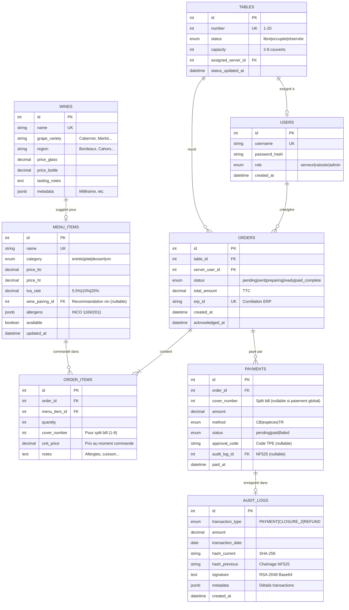

# C7 - Modèle Conceptuel de Données (MCD)

## Objectif
Représenter un **modèle conceptuel de données (MCD)** de la partie qui a pour gestion la salle, incluant les entités, relations, contraintes d'intégrité et volumétrie estimée.

---

## 1. Diagramme Entités-Relations (ERD)

### 1.1. Schéma Complet MCD



---

## 2. Description Détaillée des Entités

### 2.1. Entité USERS (Utilisateurs)

**Description** : Représente les utilisateurs du système (serveurs, caissiers, administrateurs).

**Attributs** :

| Attribut | Type | Contraintes | Description |
|:---------|:-----|:------------|:------------|
| `id` | INTEGER | PK, AUTO_INCREMENT | Identifiant unique |
| `username` | VARCHAR(50) | UK, NOT NULL | Login unique |
| `password_hash` | VARCHAR(255) | NOT NULL | Hash bcrypt (10 rounds) |
| `role` | ENUM | NOT NULL | 'serveur' \| 'caissier' \| 'admin' |
| `created_at` | TIMESTAMP | DEFAULT NOW() | Date création compte |

**Cardinalités** :
- **1 USER → N ORDERS** : Un serveur crée plusieurs commandes
- **1 USER → N TABLES** : Un serveur peut être assigné à plusieurs tables (1-N)

---

### 2.2. Entité TABLES (Plan de Salle)

**Description** : Représente les tables physiques du restaurant.

**Attributs** :

| Attribut | Type | Contraintes | Description |
|:---------|:-----|:------------|:------------|
| `id` | INTEGER | PK, AUTO_INCREMENT | Identifiant unique |
| `number` | INTEGER | UK, NOT NULL | Numéro table (1-20) |
| `status` | ENUM | NOT NULL | 'libre' \| 'occupée' \| 'réservée' |
| `capacity` | INTEGER | NOT NULL | Nombre couverts (2-8) |
| `assigned_server_id` | INTEGER | FK → USERS(id), NULLABLE | Serveur assigné (NULL si libre) |
| `status_updated_at` | TIMESTAMP | DEFAULT NOW() | Dernière mise à jour statut |

**Cardinalités** :
- **1 TABLE → N ORDERS** : Une table peut avoir plusieurs commandes (succession dans le temps)
- **N TABLES → 1 USER** : Plusieurs tables assignées à un serveur

**Règles métier** :
- Une table `libre` a `assigned_server_id = NULL`
- Une table `occupée` doit avoir au moins 1 ORDER avec `status != 'paid_complete'`

---

### 2.3. Entité ORDERS (Commandes)

**Description** : Représente une commande passée pour une table.

**Attributs** :

| Attribut | Type | Contraintes | Description |
|:---------|:-----|:------------|:------------|
| `id` | INTEGER | PK, AUTO_INCREMENT | Identifiant unique |
| `table_id` | INTEGER | FK → TABLES(id), NOT NULL | Table concernée |
| `server_user_id` | INTEGER | FK → USERS(id), NOT NULL | Serveur ayant pris la commande |
| `status` | ENUM | NOT NULL | 'pending' \| 'sent' \| 'preparing' \| 'ready' \| 'paid_complete' |
| `total_amount` | DECIMAL(10,2) | NOT NULL | Montant total TTC (calculé) |
| `erp_id` | VARCHAR(50) | UK, NULLABLE | ID corrélation ERP (ex: "K789") |
| `created_at` | TIMESTAMP | DEFAULT NOW() | Date/heure création |
| `acknowledged_at` | TIMESTAMP | NULLABLE | Timestamp notification "plat prêt" acquittée |

**Cardinalités** :
- **1 ORDER → N ORDER_ITEMS** : Une commande contient plusieurs plats/vins
- **1 ORDER → N PAYMENTS** : Une commande peut avoir plusieurs paiements (split bill)
- **N ORDERS → 1 TABLE** : Plusieurs commandes pour une table (dans le temps)
- **N ORDERS → 1 USER** : Plusieurs commandes par serveur

**Règles métier** :
- `total_amount` = SUM(ORDER_ITEMS.unit_price × ORDER_ITEMS.quantity)
- `erp_id` renseigné seulement si envoi ERP réussi
- `acknowledged_at` renseigné quand serveur confirme notification WebSocket

---

### 2.4. Entité ORDER_ITEMS (Détails Commande)

**Description** : Lignes détaillées d'une commande (plats, vins, quantités).

**Attributs** :

| Attribut | Type | Contraintes | Description |
|:---------|:-----|:------------|:------------|
| `id` | INTEGER | PK, AUTO_INCREMENT | Identifiant unique |
| `order_id` | INTEGER | FK → ORDERS(id), NOT NULL | Commande parente |
| `menu_item_id` | INTEGER | FK → MENU_ITEMS(id), NOT NULL | Plat/vin commandé |
| `quantity` | INTEGER | NOT NULL, DEFAULT 1 | Quantité |
| `cover_number` | INTEGER | NULLABLE, 1-8 | Numéro couvert (pour split bill) |
| `unit_price` | DECIMAL(10,2) | NOT NULL | Prix unitaire **figé au moment commande** |
| `notes` | TEXT | NULLABLE | Notes spéciales (allergies, cuisson...) |

**Cardinalités** :
- **N ORDER_ITEMS → 1 ORDER** : Plusieurs lignes par commande
- **N ORDER_ITEMS → 1 MENU_ITEM** : Plusieurs commandes du même plat

**Règles métier** :
- `unit_price` copié depuis `MENU_ITEMS.price_ttc` au moment de la commande (historique prix)
- `cover_number` utilisé pour split bill (NULL = paiement global)
- `notes` limité à 500 caractères

---

### 2.5. Entité MENU_ITEMS (Carte du Restaurant)

**Description** : Plats et vins disponibles à la carte.

**Attributs** :

| Attribut | Type | Contraintes | Description |
|:---------|:-----|:------------|:------------|
| `id` | INTEGER | PK, AUTO_INCREMENT | Identifiant unique |
| `name` | VARCHAR(100) | UK, NOT NULL | Nom plat/vin (unique) |
| `category` | ENUM | NOT NULL | 'entrée' \| 'plat' \| 'dessert' \| 'vin' |
| `price_ttc` | DECIMAL(10,2) | NOT NULL | Prix TTC (client paie) |
| `price_ht` | DECIMAL(10,2) | NOT NULL | Prix HT (comptabilité) |
| `tva_rate` | DECIMAL(4,2) | NOT NULL | Taux TVA (5.5% \| 10% \| 20%) |
| `wine_pairing_id` | INTEGER | FK → WINES(id), NULLABLE | Vin recommandé (si plat) |
| `allergens` | JSONB | NULLABLE | Allergènes INCO (ex: `["gluten", "lactose"]`) |
| `available` | BOOLEAN | DEFAULT TRUE | Disponibilité (stock) |
| `updated_at` | TIMESTAMP | DEFAULT NOW() | Dernière modification |

**Cardinalités** :
- **N MENU_ITEMS → 1 WINE** : Un plat a un vin suggéré (nullable)
- **1 MENU_ITEM → N ORDER_ITEMS** : Un plat commandé plusieurs fois

**Règles métier** :
- `price_ttc = price_ht × (1 + tva_rate / 100)`
- `wine_pairing_id` NULL pour entrées/desserts/vins eux-mêmes
- `allergens` conforme INCO 1169/2011 (14 allergènes majeurs)

---

### 2.6. Entité WINES (Cave)

**Description** : Vins disponibles avec accords mets-vins.

**Attributs** :

| Attribut | Type | Contraintes | Description |
|:---------|:-----|:------------|:------------|
| `id` | INTEGER | PK, AUTO_INCREMENT | Identifiant unique |
| `name` | VARCHAR(100) | UK, NOT NULL | Nom vin (unique) |
| `grape_variety` | VARCHAR(50) | NULLABLE | Cépage (Cabernet, Merlot...) |
| `region` | VARCHAR(50) | NULLABLE | Région (Bordeaux, Cahors...) |
| `price_glass` | DECIMAL(10,2) | NULLABLE | Prix au verre |
| `price_bottle` | DECIMAL(10,2) | NOT NULL | Prix bouteille |
| `tasting_notes` | TEXT | NULLABLE | Notes dégustation |
| `metadata` | JSONB | NULLABLE | Millésime, médailles, etc. |

**Cardinalités** :
- **1 WINE → N MENU_ITEMS** : Un vin peut être suggéré pour plusieurs plats

**Règles métier** :
- `price_glass = price_bottle / 5` (approximatif, 5 verres/bouteille)
- `metadata` exemple : `{"vintage": 2018, "awards": ["Gold Medal 2020"]}`

---

### 2.7. Entité PAYMENTS (Paiements)

**Description** : Paiements effectués (supporte split bill par couvert).

**Attributs** :

| Attribut | Type | Contraintes | Description |
|:---------|:-----|:------------|:------------|
| `id` | INTEGER | PK, AUTO_INCREMENT | Identifiant unique |
| `order_id` | INTEGER | FK → ORDERS(id), NOT NULL | Commande payée |
| `cover_number` | INTEGER | NULLABLE, 1-8 | Numéro couvert (NULL = paiement global) |
| `amount` | DECIMAL(10,2) | NOT NULL | Montant payé |
| `method` | ENUM | NOT NULL | 'CB' \| 'espèces' \| 'TR' (Ticket Restaurant) |
| `status` | ENUM | NOT NULL | 'pending' \| 'paid' \| 'failed' |
| `approval_code` | VARCHAR(20) | NULLABLE | Code approbation TPE (si CB) |
| `audit_log_id` | INTEGER | FK → AUDIT_LOGS(id), NULLABLE | Référence audit NF525 |
| `paid_at` | TIMESTAMP | NULLABLE | Date/heure paiement effectif |

**Contraintes composites** :
- **UNIQUE (`order_id`, `cover_number`)** → Pas double paiement même couvert

**Cardinalités** :
- **N PAYMENTS → 1 ORDER** : Plusieurs paiements par commande (split bill)
- **N PAYMENTS → 1 AUDIT_LOG** : Plusieurs paiements dans une clôture Z

**Règles métier** :
- `cover_number` NULL → Paiement global (toute l'addition)
- `cover_number` renseigné → Split bill par personne
- `approval_code` obligatoire si `method='CB'` ET `status='paid'`
- SUM(amount WHERE order_id=X) ≤ ORDERS.total_amount (vérification intégrité)

---

### 2.8. Entité AUDIT_LOGS (Conformité NF525)

**Description** : Logs immuables pour conformité fiscale NF525 (obligation légale).

**Attributs** :

| Attribut | Type | Contraintes | Description |
|:---------|:-----|:------------|:------------|
| `id` | INTEGER | PK, AUTO_INCREMENT | Identifiant unique |
| `transaction_type` | ENUM | NOT NULL | 'PAYMENT' \| 'CLOSURE_Z' \| 'REFUND' |
| `amount` | DECIMAL(10,2) | NOT NULL | Montant transaction |
| `transaction_date` | DATE | NOT NULL | Date transaction |
| `hash_current` | VARCHAR(64) | NOT NULL | Hash SHA-256 de ce log |
| `hash_previous` | VARCHAR(64) | NULLABLE | Hash du log précédent (chaînage) |
| `signature` | TEXT | NOT NULL | Signature RSA-2048 (Base64) |
| `metadata` | JSONB | NULLABLE | Détails (CB/Espèces/TR, count transactions...) |
| `created_at` | TIMESTAMP | DEFAULT NOW() | Timestamp insertion |

**Contraintes** :
- **IMMUTABLE** : Trigger PostgreSQL `BEFORE UPDATE/DELETE → RAISE EXCEPTION`

**Cardinalités** :
- **1 AUDIT_LOG → N PAYMENTS** : Une clôture Z agrège tous paiements du jour

**Règles métier** :
- `hash_current = SHA-256(transaction_date + amount + hash_previous + metadata)`
- `hash_previous` = NULL pour le tout premier log (genesis)
- Signature `signature = RSA-Sign(hash_current, privé_key_certificat_NF525)`
- `metadata` exemple clôture Z : `{"CB": 2145.30, "Espèces": 387.50, "TR": 124.00, "count": 87}`

---

## 3. Contraintes d'Intégrité Détaillées

### 3.1. Contraintes de Clés

| Contrainte | Entité(s) | Type | Justification |
|:-----------|:----------|:-----|:--------------|
| `USERS.username` UNIQUE | USERS | UK | Pas de doublons login (sécurité) |
| `TABLES.number` UNIQUE | TABLES | UK | Plan de salle cohérent (1 numéro = 1 table) |
| `ORDERS.erp_id` UNIQUE | ORDERS | UK | Corrélation ERP 1-1 (idempotence) |
| `MENU_ITEMS.name` UNIQUE | MENU_ITEMS | UK | Pas de doublons carte (UX) |
| `WINES.name` UNIQUE | WINES | UK | Pas de doublons cave |
| **`PAYMENTS(order_id, cover_number)` UNIQUE** | PAYMENTS | **Composite UK** | **Pas double paiement même couvert** (CRITIQUE) |

### 3.2. Contraintes de Foreign Keys

| FK | Référence | ON DELETE | ON UPDATE | Justification |
|:---|:----------|:----------|:----------|:--------------|
| `TABLES.assigned_server_id` | USERS(id) | SET NULL | CASCADE | Si serveur supprimé → table redevient libre |
| `ORDERS.table_id` | TABLES(id) | RESTRICT | CASCADE | Pas supprimer table avec commandes actives |
| `ORDERS.server_user_id` | USERS(id) | RESTRICT | CASCADE | Traçabilité serveur obligatoire |
| `ORDER_ITEMS.order_id` | ORDERS(id) | CASCADE | CASCADE | Si commande supprimée → lignes aussi |
| `ORDER_ITEMS.menu_item_id` | MENU_ITEMS(id) | RESTRICT | CASCADE | Pas supprimer plat si commandé (historique) |
| `MENU_ITEMS.wine_pairing_id` | WINES(id) | SET NULL | CASCADE | Si vin supprimé → suggestion disparaît |
| `PAYMENTS.order_id` | ORDERS(id) | RESTRICT | CASCADE | Pas supprimer commande payée |
| `PAYMENTS.audit_log_id` | AUDIT_LOGS(id) | RESTRICT | CASCADE | Immuabilité audit NF525 |

### 3.3. Contraintes CHECK

```sql
-- Table TABLES
ALTER TABLE tables ADD CONSTRAINT check_capacity 
    CHECK (capacity BETWEEN 2 AND 8);

ALTER TABLE tables ADD CONSTRAINT check_number 
    CHECK (number BETWEEN 1 AND 20);

-- Table ORDER_ITEMS
ALTER TABLE order_items ADD CONSTRAINT check_quantity 
    CHECK (quantity > 0 AND quantity <= 20);

ALTER TABLE order_items ADD CONSTRAINT check_cover_number 
    CHECK (cover_number IS NULL OR cover_number BETWEEN 1 AND 8);

ALTER TABLE order_items ADD CONSTRAINT check_unit_price 
    CHECK (unit_price > 0);

-- Table PAYMENTS
ALTER TABLE payments ADD CONSTRAINT check_amount 
    CHECK (amount > 0);

ALTER TABLE payments ADD CONSTRAINT check_approval_code 
    CHECK (
        (method = 'CB' AND status = 'paid' AND approval_code IS NOT NULL) OR
        (method != 'CB' OR status != 'paid')
    );

-- Table MENU_ITEMS
ALTER TABLE menu_items ADD CONSTRAINT check_tva_rate 
    CHECK (tva_rate IN (5.5, 10.0, 20.0));

ALTER TABLE menu_items ADD CONSTRAINT check_price_consistency 
    CHECK (price_ttc = ROUND(price_ht * (1 + tva_rate / 100), 2));
```

### 3.4. Contraintes d'Immuabilité (NF525)

**Trigger PostgreSQL** : Interdit toute modification/suppression de `AUDIT_LOGS`

```sql
CREATE OR REPLACE FUNCTION prevent_audit_modification()
RETURNS TRIGGER AS $$
BEGIN
    RAISE EXCEPTION 'Modification/suppression audit_logs interdite (NF525 compliance)';
END;
$$ LANGUAGE plpgsql;

CREATE TRIGGER audit_immutable
BEFORE UPDATE OR DELETE ON audit_logs
FOR EACH ROW EXECUTE FUNCTION prevent_audit_modification();
```

---

## 4. Volumétrie et Performances

### 4.1. Volumétrie Estimée par Table

| Table | Volumétrie Annuelle | Croissance | Taille Estimée /an |
|:------|:-------------------:|:----------:|:------------------:|
| `USERS` | **15** | Stable | ~5 Ko |
| `TABLES` | **20** | Fixe | ~2 Ko |
| `MENU_ITEMS` | **50** | Stable | ~15 Ko |
| `WINES` | **80** | Stable | ~30 Ko |
| **`ORDERS`** | **~65k/an** (180/jour × 365j) | Linéaire | **~3 Mo/an** |
| **`ORDER_ITEMS`** | **~260k/an** (4 items/commande) | Linéaire | **~12 Mo/an** |
| **`PAYMENTS`** | **~95k/an** (1.5 paiements/commande → split bill) | Linéaire | **~5 Mo/an** |
| `AUDIT_LOGS` | **~400/an** (1 clôture/jour + refunds) | Constant | **~200 Ko/an** |
| **TOTAL** | - | - | **~20 Mo/an (données)** |

**Avec index B-tree et audit trails** : **~5 Go/an total**

### 4.2. Index Recommandés

```sql
-- Index primaires (automatiques)
-- PK sur toutes les tables

-- Index secondaires critiques
CREATE INDEX idx_orders_table_status ON orders(table_id, status);
CREATE INDEX idx_orders_erp_id ON orders(erp_id) WHERE erp_id IS NOT NULL;
CREATE INDEX idx_order_items_order_id ON order_items(order_id);
CREATE INDEX idx_order_items_cover_number ON order_items(order_id, cover_number);
CREATE INDEX idx_payments_order_status ON payments(order_id, status);
CREATE INDEX idx_payments_paid_at ON payments(paid_at) WHERE status = 'paid';
CREATE INDEX idx_audit_logs_date ON audit_logs(transaction_date);

-- Index composites (split bill)
CREATE UNIQUE INDEX idx_payments_unique_cover ON payments(order_id, cover_number) 
    WHERE cover_number IS NOT NULL;

-- Index JSONB (allergènes)
CREATE INDEX idx_menu_allergens ON menu_items USING GIN (allergens);
```

### 4.3. Requêtes Fréquentes Optimisées

**Requête 1 : Menu avec vins suggérés** (utilisée cache Redis, fallback PostgreSQL)

```sql
SELECT 
    m.id, m.name, m.category, m.price_ttc, m.allergens,
    w.id AS wine_id, w.name AS wine_name, w.price_glass
FROM menu_items m
LEFT JOIN wines w ON m.wine_pairing_id = w.id
WHERE m.available = TRUE
ORDER BY m.category, m.name;
```

**Performance** : **~18ms** (avec index) pour 50 plats + 80 vins

---

**Requête 2 : Addition table avec split bill**

```sql
SELECT 
    o.id, o.total_amount,
    COUNT(DISTINCT oi.cover_number) AS covers,
    JSON_AGG(
        JSON_BUILD_OBJECT(
            'item', mi.name,
            'quantity', oi.quantity,
            'unit_price', oi.unit_price,
            'cover', oi.cover_number
        )
    ) AS items
FROM orders o
JOIN order_items oi ON o.id = oi.order_id
JOIN menu_items mi ON oi.menu_item_id = mi.id
WHERE o.id = $1
GROUP BY o.id;
```

**Performance** : **~12ms** (avec index order_items)

---

**Requête 3 : Vérification paiement déjà effectué (split bill)**

```sql
SELECT id FROM payments
WHERE order_id = $1 
  AND cover_number = $2
  AND status = 'paid'
FOR UPDATE; -- Row-level lock (ACID)
```

**Performance** : **~3ms** (index composite unique)

---

## 5. Règles Métier Complexes

### 5.1. Calcul Automatique Total Commande

**Trigger PostgreSQL** : Recalcule `ORDERS.total_amount` après chaque modification `ORDER_ITEMS`

```sql
CREATE OR REPLACE FUNCTION update_order_total()
RETURNS TRIGGER AS $$
BEGIN
    UPDATE orders
    SET total_amount = (
        SELECT COALESCE(SUM(unit_price * quantity), 0)
        FROM order_items
        WHERE order_id = NEW.order_id
    )
    WHERE id = NEW.order_id;
    RETURN NEW;
END;
$$ LANGUAGE plpgsql;

CREATE TRIGGER trigger_update_order_total
AFTER INSERT OR UPDATE OR DELETE ON order_items
FOR EACH ROW EXECUTE FUNCTION update_order_total();
```

### 5.2. Validation Paiement Complet

**Fonction vérification** : Addition complètement payée ?

```sql
CREATE OR REPLACE FUNCTION is_order_fully_paid(order_id_param INTEGER)
RETURNS BOOLEAN AS $$
DECLARE
    total_expected DECIMAL(10,2);
    total_paid DECIMAL(10,2);
BEGIN
    SELECT total_amount INTO total_expected
    FROM orders WHERE id = order_id_param;
    
    SELECT COALESCE(SUM(amount), 0) INTO total_paid
    FROM payments
    WHERE order_id = order_id_param AND status = 'paid';
    
    RETURN total_paid >= total_expected;
END;
$$ LANGUAGE plpgsql;
```

---

## Conclusion

Le **MCD** modélise **8 entités** centrales pour la gestion de salle :

1. ✅ **USERS** : Serveurs, caissiers, administrateurs (RBAC)
2. ✅ **TABLES** : Plan de salle avec assignation serveurs
3. ✅ **ORDERS** : Commandes avec corrélation ERP
4. ✅ **ORDER_ITEMS** : Détails commandes + split bill
5. ✅ **MENU_ITEMS** : Carte restaurant + allergènes INCO
6. ✅ **WINES** : Cave avec accords mets-vins
7. ✅ **PAYMENTS** : Paiements avec split bill par couvert
8. ✅ **AUDIT_LOGS** : Logs immuables NF525 (hash chaîné + signature RSA)

**Contraintes clés** :
- **Composite UK** `PAYMENTS(order_id, cover_number)` → Pas double paiement
- **Trigger immuable** AUDIT_LOGS → Conformité légale NF525
- **Index optimisés** → **<20ms** requêtes fréquentes

**Volumétrie** : **~5 Go/an** (65k commandes, 260k lignes, 95k paiements)

---

## Prochaines Étapes

1. ✅ **C7-Diagrammes-Sequences.md** : Flux d'interactions majeurs
2. ✅ **C7-MCD.md** : Modèle conceptuel de données (ce document)
3. ⏳ **C7-Interactions-Environnement.md** : Diagramme d'interactions avec systèmes externes
