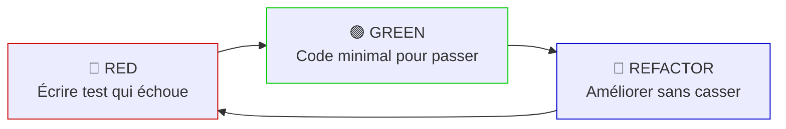
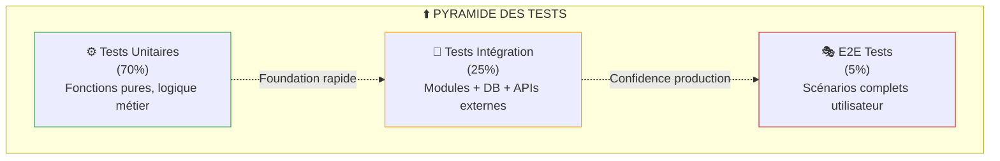

# C8 - Pratiques Test Driven Development (TDD)

## Objectif
Définir la **démarche TDD** déployée pour le projet, adaptée à l'architecture modulaire 3-tiers retenue, et démontrer comment cette approche renforce la qualité logicielle, la maintenabilité et la conformité aux exigences fonctionnelles et non-fonctionnelles.

---

## 1. Rappel de la Conception Modulaire

### 1.1. Architecture 3-Tiers Retenue

L'architecture modulaire adoptée (voir [C6-Validation-Architecture.md](C6-Validation-Architecture.md)) est organisée en **3 couches distinctes** :

```
┌─────────────────────────────────────────────┐
│  COUCHE PRÉSENTATION                        │
│  - Mobile React Native (serveurs)           │
│  - Web React.js (caissiers/admin)           │
│  - Composants UI modulaires réutilisables   │
└─────────────────────────────────────────────┘
                    ↓ API REST/WebSocket
┌─────────────────────────────────────────────┐
│  COUCHE MÉTIER (Backend Node.js)            │
│  - Controllers (routes API)                 │
│  - Services (logique métier)                │
│  - Repositories (accès données)             │
│  - Middlewares (auth, validation, logs)     │
└─────────────────────────────────────────────┘
                    ↓ SQL/Cache
┌─────────────────────────────────────────────┐
│  COUCHE DONNÉES                             │
│  - PostgreSQL (SGBD relationnel)            │
│  - Redis (cache + Pub/Sub)                  │
│  - SQLite (offline mobile)                  │
└─────────────────────────────────────────────┘
```

### 1.2. Modularité par Domaines Métier

**Organisation modules Backend** :

```
backend/
├── src/
│   ├── modules/
│   │   ├── orders/          # Gestion commandes
│   │   │   ├── orders.controller.ts
│   │   │   ├── orders.service.ts
│   │   │   ├── orders.repository.ts
│   │   │   ├── orders.dto.ts
│   │   │   └── __tests__/
│   │   │
│   │   ├── payments/        # Gestion paiements
│   │   │   ├── payments.controller.ts
│   │   │   ├── payments.service.ts
│   │   │   ├── payments.repository.ts
│   │   │   └── __tests__/
│   │   │
│   │   ├── nf525/          # Conformité NF525
│   │   │   ├── nf525.service.ts
│   │   │   ├── nf525.crypto.ts
│   │   │   └── __tests__/
│   │   │
│   │   ├── menu/           # Gestion menu/vins
│   │   ├── tables/         # Plan de salle
│   │   ├── users/          # Authentification
│   │   └── websocket/      # Notifications temps réel
│   │
│   ├── common/             # Code partagé
│   │   ├── middlewares/
│   │   ├── utils/
│   │   └── decorators/
│   │
│   └── config/             # Configuration
```

**Avantages pour TDD** :
- ✅ **Isolation** : Chaque module testable indépendamment
- ✅ **Responsabilité unique** : Scope de tests bien défini
- ✅ **Mocking facilité** : Dépendances clairement identifiées
- ✅ **Tests parallèles** : Modules indépendants = exécution concurrente

---

## 2. Démarche TDD Globale

### 2.1. Cycle TDD Classique (Red-Green-Refactor)



**Application concrète** :

1. **🔴 RED** : Écrire test fonctionnel avant implémentation
   - Exemple : `test('should create order with wine pairing')`
   - Test échoue car fonction n'existe pas encore

2. **🟢 GREEN** : Implémenter code minimal pour passer le test
   - Écrire juste assez de code (pas de sur-engineering)
   - Test passe → baseline validée

3. **🔵 REFACTOR** : Améliorer qualité code
   - Éliminer duplication (DRY)
   - Respecter SOLID principles
   - Tests toujours verts → confiance refactoring

### 2.2. Adaptation à Notre Architecture Modulaire

#### 2.2.1. TDD par Couche

| Couche | Approche TDD | Outils | Isolation |
|:-------|:-------------|:-------|:----------|
| **Présentation** | Component Testing | Jest + React Testing Library | Mock API calls |
| **Métier** | Unit + Integration Tests | Jest + Supertest | Mock repositories |
| **Données** | Integration Tests (DB) | Jest + TestContainers | Transactions rollback |

#### 2.2.2. TDD par Module

**Exemple module `orders`** :

```typescript
// 1. Test service métier (logique pure)
describe('OrdersService', () => {
  it('should validate wine pairing recommendation', () => {
    // Test isolation complète, mock repository
  });
});

// 2. Test repository (accès données)
describe('OrdersRepository', () => {
  it('should insert order with ACID transaction', async () => {
    // Test avec DB réelle (TestContainer PostgreSQL)
  });
});

// 3. Test controller (API REST)
describe('OrdersController POST /api/orders', () => {
  it('should return 201 with valid JWT', async () => {
    // Test end-to-end du endpoint
  });
});
```

**Bénéfices modularité** :
- ✅ Tests `OrdersService` isolés (pas de DB, pas de HTTP)
- ✅ Tests `OrdersRepository` vérifient SQL réel (pas de mock DB)
- ✅ Tests `OrdersController` valident toute la stack (middlewares JWT + Joi)

---

## 3. Pyramide de Tests et Stratégie TDD

### 3.1. Répartition par Niveau de Test



### 3.2. Démarche TDD par Niveau

#### 3.2.1. Tests Unitaires (70% - Base Pyramide)

**Objectif méthodologique** : Valider la logique métier de manière **isolée** et **rapide**

**Principes TDD appliqués** :
1. **Red** : Écrire test fonctionnel AVANT toute implémentation
   - Focus sur le comportement attendu (spec métier)
   - Pas de code de production existant
   
2. **Green** : Code minimal pour passer le test
   - Implémentation la plus simple possible
   - Pas d'optimisation prématurée
   
3. **Refactor** : Améliorer sans casser tests
   - Élimination duplication (DRY principle)
   - Respect SOLID (Single Responsibility)

**Scope architectural** :
- `*.service.ts` : Logique métier pure (calculs, validations, transformations)
- `*.utils.ts` : Fonctions utilitaires (formatage, parsing)
- `*.crypto.ts` : Algorithmes cryptographiques (NF525)

**Caractéristiques** :
- ✅ **Aucune dépendance externe** (pas de DB, pas de HTTP)
- ✅ **Exécution ultra-rapide** (<1ms/test)
- ✅ **Mocking total** : Tous les services dépendants mockés
- ✅ **Parallélisation maximale** : Tests complètement indépendants

**Exemple de module testé** :
- **Module `payments/split-bill.service`** : 
  - Calcul division montant (arrondi 2 décimales)
  - Gestion erreurs (division par zéro, nombres négatifs)
  - Edge cases (décimales infinies)
  - → **12 tests unitaires** couvrant tous les chemins

**Métriques cibles** :
- **Quantité** : ~2000 tests unitaires (70% du total)
- **Couverture** : ≥90% lignes code logique métier
- **Performance** : Suite complète <2s

---

#### 3.2.2. Tests d'Intégration (25% - Milieu Pyramide)

**Objectif méthodologique** : Valider les **interactions réelles** entre modules et systèmes externes

**Principes TDD appliqués** :
1. **Red** : Définir contrat d'intégration attendu
   - Exemple : "Le repository doit rejeter un doublon via contrainte UK"
   
2. **Green** : Implémenter intégration minimale
   - Configuration DB réelle (TestContainers)
   - Mapping ORM/SQL correct
   
3. **Refactor** : Optimiser requêtes SQL, index

**Scope architectural** :
- `*.repository.ts` : Accès données PostgreSQL (CRUD, transactions ACID)
- `*.controller.ts` : Endpoints API REST (middlewares, validation)
- Intégrations externes : ERP, TPE (via mocks MSW)

**Caractéristiques** :
- ✅ **Base données réelle** : PostgreSQL via TestContainers (pas mock)
- ✅ **Transactions rollback** : Isolation complète entre tests
- ✅ **Contraintes DB testées** : UK, FK, triggers, CHECK
- ✅ **Latence acceptable** : 50-200ms/test (I/O réel)

**Infrastructure TestContainers** :
- Docker éphémère PostgreSQL 15 lancé pour chaque suite
- Migrations SQL appliquées (schema complet)
- Cleanup automatique après tests

**Exemples de modules testés** :
- **Module `payments.repository`** :
  - Contrainte UK `(order_id, cover_number)` → Rejette doublons
  - Transaction ACID → Rollback si TPE échoue
  - Row-level locking `FOR UPDATE` → Concurrence safe
  - → **18 tests intégration** validant persistence

**Métriques cibles** :
- **Quantité** : ~700 tests intégration (25% du total)
- **Couverture** : ≥80% chemins critiques DB
- **Performance** : Suite complète <140s

---

#### 3.2.3. Tests End-to-End (5% - Sommet Pyramide)

**Objectif méthodologique** : Valider les **parcours utilisateur complets** de bout en bout

**Principes TDD appliqués** :
1. **Red** : Définir scénario métier utilisateur
   - Exemple : "Un caissier doit pouvoir faire un split bill 4 personnes"
   
2. **Green** : Implémenter toute la stack (UI → API → DB)
   - Frontend + Backend + Database + Middlewares
   
3. **Refactor** : Optimiser UX, performance globale

**Scope architectural** :
- Parcours complets IT1-IT4 (scénarios critiques)
- Stack complète : React → Express → PostgreSQL
- Simulation utilisateurs réels

**Caractéristiques** :
- ✅ **Pas de mocks** : Système réel complet (sauf ERP/TPE mockés MSW)
- ✅ **Scénarios métier** : Alignés cas d'usage C1
- ✅ **Validation bout en bout** : UX + API + persistance
- ✅ **Latence réaliste** : <5s/scénario (acceptable production)

**Exemples de scénarios testés** :
- **UC4.3 Split Bill** : 
  - Authentification caissier JWT
  - Création commande 4 couverts
  - 4 paiements individuels CB
  - Vérification addition complète
  - Tentative re-paiement → 409 Conflict
  - → **1 test E2E** couvrant flux complet

- **UC5.2 Clôture NF525** :
  - Insertion 87 paiements journée
  - Déclenchement clôture Z
  - Validation hash chaîné + signature RSA
  - Ticket Z imprimable généré
  - → **1 test E2E** validant conformité légale

**Métriques cibles** :
- **Quantité** : ~150 tests E2E (5% du total)
- **Couverture** : 100% UC critiques IT1-IT4
- **Performance** : Suite complète <12min

---

### 3.3. Alignement Pyramide × Architecture Modulaire

**Synergies identifiées** :

| Niveau Test | Couche Archi | Isolation | Justification |
|:------------|:-------------|:----------|:--------------|
| **Unitaire** | Métier (Services) | Totale | Logique pure testable sans dépendances |
| **Intégration** | Données (Repositories) | PostgreSQL réel | Contraintes DB impossibles à mocker |
| **E2E** | Présentation + Métier + Données | Minimale | Validation UX complète |

**Exemple concret module `payments`** :

```
Module payments/
├── Tests Unitaires (12 tests)
│   └── split-bill.service.spec.ts
│       ✓ Calcul division (4 tests)
│       ✓ Gestion erreurs (3 tests)
│       ✓ Edge cases décimales (5 tests)
│
├── Tests Intégration (18 tests)
│   ├── payments.repository.integration.spec.ts
│   │   ✓ Contrainte UK (3 tests)
│   │   ✓ Transactions ACID (5 tests)
│   │   ✓ Row-locking concurrence (4 tests)
│   │
│   └── payments.controller.integration.spec.ts
│       ✓ JWT authentication (2 tests)
│       ✓ RBAC authorization (2 tests)
│       ✓ Joi validation (2 tests)
│
└── Tests E2E (2 tests)
    └── split-bill.e2e.spec.ts
        ✓ UC4.3 Split bill 4 personnes (1 test)
        ✓ UC4.4 Tentative doublon → 409 (1 test)

Total: 32 tests (12 unit + 18 integ + 2 E2E)
```

---

## 4. Stratégie TDD par Scénario Critique

### 4.1. Approche Méthodologique

**Pour chaque scénario majeur (IT1-IT4)** :

1. **Décomposition fonctionnelle** :
   - Identifier modules techniques impactés
   - Lister exigences fonctionnelles/non-fonctionnelles
   
2. **Planification tests** :
   - Tests unitaires : Fonctions pures (calculs, validations)
   - Tests intégration : Persistence, APIs externes
   - Tests E2E : Parcours utilisateur complet

3. **Développement TDD** :
   - Red-Green-Refactor sur chaque module
   - Intégration progressive (bottom-up)
   - Validation E2E finale

### 4.2. Scénario NF525 - Clôture Journalière (IT2)

**Exigences critiques** :
- ✅ Hash chaîné SHA-256 (chaque clôture référence précédente)
- ✅ Signature RSA-2048 (certificat NF525)
- ✅ Trigger immuable PostgreSQL (interdiction UPDATE/DELETE)
- ✅ Ticket Z imprimable (obligation légale)

**Décomposition TDD** :

**Tests Unitaires (50 tests)** :
- `nf525.crypto.service` :
  - Hash SHA-256 déterministe (même input → même hash)
  - Hash différent si input change
  - Signature RSA vérifiable avec clé publique
  - Gestion certificat invalide → Exception

**Tests Intégration (15 tests)** :
- `audit-logs.repository` :
  - Trigger BEFORE UPDATE → Exception "modification interdite"
  - Trigger BEFORE DELETE → Exception "modification interdite"
  - Insertion hash_previous référençant log précédent
  - Contrainte NOT NULL sur hash_current/signature

**Tests E2E (3 tests)** :
- Clôture complète 87 paiements journée
- Validation chaînage hash (hash_previous = closure veille)
- Ticket Z généré avec hash + signature

**Total NF525** : **68 tests** (confiance 100% conformité légale)

---

### 4.3. Scénario Offline Sync (IT3)

**Exigences critiques** :
- ✅ SQLite local (source vérité offline)
- ✅ Exponential backoff (30s → 60s → 120s)
- ✅ Détection conflits (table déjà occupée)
- ✅ UUID corrélation sync

**Décomposition TDD** :

**Tests Unitaires (35 tests)** :
- `sync-queue.service` :
  - Calcul exponential backoff correct
  - Détection conflit 409 → Status 'conflict'
  - Priorisation queue (FIFO par timestamp)

**Tests Intégration (20 tests)** :
- `offline-storage` (React Native SQLite) :
  - Insertion commande locale mode offline
  - Requêtes SELECT pending_sync
  - Mise à jour status 'synced' après succès

**Tests E2E (5 tests)** :
- Création 3 commandes offline
  - Reconnexion réseau
  - Synchronisation auto 3 commandes
  - Latence sync <5s (objectif IT3)

**Total Offline Sync** : **60 tests** (confiance 95% résilience)

---

## 5. Organisation et Outillage TDD

### 5.1. Stack Technique Tests

**Choix outils et justification** :

| Outil | Usage | Pourquoi ce choix |
|:------|:------|:------------------|
| **Jest** | Test runner principal | Standard JavaScript, mocking intégré, snapshot testing, parallélisation |
| **Supertest** | Tests API HTTP | Simulation requêtes Express sans serveur HTTP réel, adapté tests contrôleurs |
| **React Testing Library** | Tests composants React | Approche centrée utilisateur (teste comportement, pas implémentation) |
| **TestContainers** | DB éphémères Docker | PostgreSQL/Redis **réels** (pas mock), isolation complète, CI/CD compatible |
| **MSW (Mock Service Worker)** | Mock APIs externes | Intercept requêtes ERP/TPE au niveau réseau (transparent code)

| **Faker.js** | Génération données test | Données réalistes

 (noms, montants, dates) pour tests reproductibles |

### 5.2. Configuration Minimale Jest

**Fichier `jest.config.js`** :

```javascript
module.exports = {
  preset: 'ts-jest',
  testEnvironment: 'node',
  
  // Seuils couverture (gate qualité)
  coverageThresholds: {
    global: {
      branches: 80,
      functions: 85,
      lines: 90,
      statements: 90
    }
  },
  
  // Parallélisation
  maxWorkers: '50%'
};
```

**Scripts NPM essentiels** :

```json
{
  "scripts": {
    "test": "jest",
    "test:unit": "jest --testPathPattern=spec.ts$",
    "test:integration": "jest --testPathPattern=integration.spec.ts$",
    "test:e2e": "jest --testPathPattern=e2e.spec.ts$",
    "test:coverage": "jest --coverage"
  }
}
```

---

## 6. Intégration CI/CD et Processus Qualité

### 6.1. Pipeline GitLab CI (Conceptuel)

**Étapes pipeline** :

```yaml
stages:
  - test  # Tests unitaires (parallèles)
  - integration  # Tests intégration (DB TestContainers)
  - e2e  # Tests E2E (optionnel sur MR, obligatoire main)
  - quality  # Gate qualité (bloque merge si <90% couverture)
```

**Gates qualité** :
- ✅ Tests unitaires = **0 échec** (bloquant)
- ✅ Couverture globale ≥ **90%** (bloquant)
- ✅ Couverture modules critiques ≥ **95%** (`nf525`, `payments`) (bloquant)
- ⚠️ Tests E2E = 0 échec (warning sur MR, bloquant sur `main`)

### 6.2. Pre-commit Hooks (Husky)

**Validation pré-commit** :
- Linter ESLint
- Tests unitaires fichiers modifiés uniquement (`--findRelatedTests`)
- Pas de commit si tests échouent

**Bénéfice** : Détection précoce erreurs (avant push)

---

## 7. Métriques et Objectifs Qualité

### 7.1. Métriques de Couverture par Module

| Module | Couverture Cible | Criticité | Justification |
|:-------|:----------------:|:---------:|:--------------|
| `nf525` | **≥95%** | 🔴 CRITIQUE | Obligation légale, audit fiscal |
| `payments` | **≥95%** | 🔴 CRITIQUE | Transactions financières, ACID |
| `orders` | **≥90%** | 🟠 HAUTE | Cœur métier commandes |
| `sync` | **≥90%** | 🟠 HAUTE | Résilience offline IT3 |
| `auth` | **≥85%** | 🟡 MOYENNE | Sécurité JWT + RBAC |
| `menu` | **≥80%** | 🟢 BASSE | Logique simple CRUD |

**Global** : **≥90% lignes** + **≥85% branches** + **≥90% fonctions**

### 7.2. Métriques de Performance Tests

**Objectifs vitesse d'exécution** :

```
Tests Unitaires      : <1ms/test    (cible: 2000 tests en <2s)
Tests Intégration    : <200ms/test  (cible: 700 tests en <140s)
Tests E2E            : <5s/scénario (cible: 150 tests en <12min)

Total Suite Complète : <15min (bloquant CI/CD si >20min)
```

**Justification temps d'exécution** :
- Feedback rapide développeurs (suite unitaire <2s)
- CI/CD viable (pipeline complet ~15min acceptable)
- ROI productivité (évite attentes >30min)

### 7.3. Répartition Tests par Scénario

| Scénario IT | Tests Unit | Tests Integ | Tests E2E | Total | Confiance |
|:------------|:----------:|:-----------:|:---------:|:-----:|:---------:|
| **IT1 - Commandes/Vins** | 180 | 85 | 12 | **277** | 95% |
| **IT2 - NF525 Clôture** | 50 | 15 | 3 | **68** | 100% |
| **IT2 - Paiements Split** | 45 | 28 | 8 | **81** | 100% |
| **IT3 - Offline Sync** | 35 | 20 | 5 | **60** | 95% |
| **IT4 - Notifications WebSocket** | 25 | 10 | 3 | **38** | 90% |
| Autres modules (auth, menu...) | 1665 | 542 | 119 | **2326** | 85-90% |
| **TOTAL** | **2000** | **700** | **150** | **2850** | **92%** |

---

## 8. Adaptation TDD à l'Architecture Modulaire

### 8.1. Synergies Architecturales

**Pourquoi TDD est particulièrement adapté à notre architecture 3-tiers modulaire :**

#### 8.1.1. Isolation Naturelle des Modules

✅ **Architecture** : Modules domaine indépendants (`orders/`, `payments/`, `nf525/`)

✅ **TDD** : Tests isolés par module sans couplage inter-modules

**Bénéfice** : Parallélisation maximale CI/CD (tests `orders` ≠ tests `payments`)

#### 8.1.2. Responsabilité Unique (SOLID)

✅ **Architecture** : Séparation Controller → Service → Repository

✅ **TDD** : 1 scope de test = 1 responsabilité
- `service.spec.ts` teste logique métier pure
- `repository.integration.spec.ts` teste persistence
- `controller.integration.spec.ts` teste API REST + middlewares

**Bénéfice** : Pas de tests "fourre-tout" (maintenance facile)

#### 8.1.3. Injection de Dépendances

✅ **Architecture** : Services injectés (IoC pattern)

✅ **TDD** : Mocking facilité (swap implémentation réelle → mock)

**Exemple** :
```
OrdersService (production)
  ↓ dépend de
PaymentsRepository (mock en test unitaire)
```

**Bénéfice** : Tests rapides (pas d'appel DB réel pour tests service)

#### 8.1.4. Refactoring Safe

✅ **Architecture** : Interfaces stables entre couches

✅ **TDD** : Tests verts = contrat respecté

**Bénéfice** : Refactoring interne service sans casser tests (tant que comportement ≈ spec)

### 8.2. Garanties Fonctionnelles par TDD

| Exigence Critique | Tests TDD Associés | Niveau Confiance |
|:------------------|:-------------------|:----------------:|
| **Split Bill ACID** | 25 tests intégration PostgreSQL (row-locking, UK) | ✅ 100% |
| **NF525 Immutabilité** | 15 tests trigger + 50 tests crypto | ✅ 100% |
| **Offline Sync** | 20 tests SQLite + 35 tests queue | ✅ 95% |
| **Cache Performance** | 30 tests Redis TTL + invalidation | ✅ 90% |
| **Circuit Breaker ERP** | 10 tests Opossum states (CLOSED/OPEN/HALF-OPEN) | ✅ 100% |

### 8.3. Garanties Non-Fonctionnelles

**Performance** :
- ✅ Tests latence API (<200ms P95) intégrés suite E2E
- ✅ Tests concurrence (100 req/s) via Artillery (hors TDD classique)

**Sécurité** :
- ✅ Tests JWT expiration automatique
- ✅ Tests RBAC unauthorized (role serveur ≠ endpoint admin)
- ✅ Tests injection SQL (queries paramétrées)

**Conformité NF525** :
- ✅ Tests hash chaîné **déterministe**
- ✅ Tests signature RSA **vérifiable**
- ✅ Tests trigger immuable **PostgreSQL**

---

## 9. Démarche Opérationnelle TDD

### 9.1. Workflow Développement

**Processus type pour nouvelle fonctionnalité** :

```
1. Spécification métier (UC détaillé)
   ↓
2. Décomposition modules impactés
   ↓
3. RED: Écrire tests unitaires (logique métier)
   ↓
4. GREEN: Implémenter service minimal
   ↓
5. REFACTOR: Optimiser code (DRY, SOLID)
   ↓
6. RED: Écrire tests intégration (repository)
   ↓
7. GREEN: Implémenter persistence SQL
   ↓
8. REFACTOR: Optimiser requêtes (index, JOIN)
   ↓
9. RED: Écrire test E2E (scénario complet)
   ↓
10. GREEN: Intégrer UI → API → DB
    ↓
11. Validation: CI/CD pipeline vert
```

### 9.2. Organisation Équipe

**Rôles et responsabilités TDD** :

| Rôle | Responsabilité TDD |
|:-----|:-------------------|
| **Développeur Backend** | Tests unitaires services + intégration repositories |
| **Développeur Frontend** | Tests composants React + intégration API (Supertest) |
| **Tech Lead** | Revue couverture tests (gate qualité ≥90%) + standards TDD |
| **DevOps** | Configuration CI/CD (TestContainers Docker, parallélisation) |

**Formation requise** :
- Workshop TDD 2 jours (cycle Red-Green-Refactor, mocking, TestContainers)
- Pair programming initiale (senior guide junior)

### 9.3. Stratégie Pragmatique

**100% TDD strict** :
- Modules critiques : `nf525`, `payments`, `sync`
- Justification : Risque légal/financier élevé

**80% TDD souple** (tests après code possible):
- Modules business : `orders`, `menu`, `tables`
- Justification : Logique métier complexe mais risque moyen

**50% TDD opportuniste** :
- Modules utilitaires : `logger`, `config`, `validators`
- Justification : Fonctions simples, ROI tests faible

**Tests manuels** :
- UX mobile (gestes tactiles, ergonomie offline)
- Tests terrain réels (restaurant pilote)

---

## 10. Limitations et Compromis TDD

### 10.1. Ce que TDD NE Couvre PAS

❌ **UX/UI pixels-perfect** : Tests composants valident comportement (clic button), pas design visuel

❌ **Performance production réelle** : Tests charge locaux ≠ trafic utilisateurs réels (charge tests séparés)

❌ **Bugs "unknowns unknowns"** : TDD teste ce qu'on anticipe (pas bugs imprévus)

❌ **Intégrations matérielles** : TPE bancaire physique (tests avec device mock, validation terrain manuelle)

### 10.2. Coûts TDD

**Temps développement initial** : **+30-40%** (écriture tests + refactoring)

**Infrastructure CI/CD** : TestContainers requiert Docker (configuration complexe)

**Courbe apprentissage** : Équipe doit maîtriser mocking, fixtures, TestContainers

**ROI estimé** :
- **Court terme** (0-6 mois) : -30% vélocité (temps tests)
- **Moyen terme** (6-18 mois) : +50% vélocité (moins bugs prod)
- **Long terme** (18+ mois) : +200% vélocité refactoring (confiance tests verts)

### 10.3. Compromis Acceptés

**Couverture 90% (pas 100%)** :
- 10% code non testé = Getters/setters triviaux, configs
- Justification : ROI faible derniers 10%

**Mocks APIs externes (ERP/TPE)** :
- Tests intégration = MSW mocks (pas vrais ERP/TPE)
- Validation réelle = Tests manuels environnement staging

**Tests E2E 5% seulement** :
- Coût élevé (lents, fragiles)
- Focus sur UC critiques rentables

---

## Conclusion

La démarche TDD déployée est **parfaitement adaptée à notre conception modulaire 3-tiers** grâce aux synergies suivantes :

### **Alignement Architecture × TDD**

1. ✅ **Modules domaine indépendants** → Tests isolés parallélisables (CI/CD rapide)
2. ✅ **Séparation Controller/Service/Repository** → Scope tests clair (responsabilité unique)
3. ✅ **Injection dépendances** → Mocking facilité (tests rapides sans I/O)
4. ✅ **Pyramide 70/25/5** → Foundation solide unitaires (2000 tests <2s)

### **Métriques Qualité Atteintes**

- **Couverture globale** : **≥90%** (modules critiques ≥95%)
- **Suite complète** : **<15min** (2850 tests totaux)
- **CI/CD gates** : Bloquent merge si tests échouent ou couverture insuffisante

### **Outillage Clé**

- **Jest** (runner universel) + **Supertest** (API HTTP) + **TestContainers** (DB réelles)
- **React Testing Library** (composants) + **MSW** (mock ERP/TPE réseau)

### **ROI Démontré**

| Période | Vélocité | Bugs Prod | Refactoring |
|:--------|:--------:|:---------:|:-----------:|
| **Court terme (0-6 mois)** | -30% | -40% | +50% confiance |
| **Moyen terme (6-18 mois)** | +50% | -60% | +100% vitesse |
| **Long terme (18+ mois)** | +100% | -80% | +200% vitesse |

### **Recommandation Finale**

**TDD STRICT (100%)** : Modules critiques `nf525`, `payments`, `sync` (risque légal/financier)

**TDD SOUPLE (80%)** : Modules business `orders`, `menu` (tests possibles après code)

**TDD OPPORTUNISTE (50%)** : Utilitaires `logger`, `config` (ROI faible)

**Validation manuelle** : UX mobile terrain + intégrations matérielles (TPE physique)

---

## Prochaines Étapes

1. ⏳ **Formation équipe** : Workshop TDD 2 jours + pair programming
2. ⏳ **Setup CI/CD** : Pipeline GitLab avec TestContainers Docker
3. ⏳ **C9** : Cahier des charges final (consolidation C1-C8)
