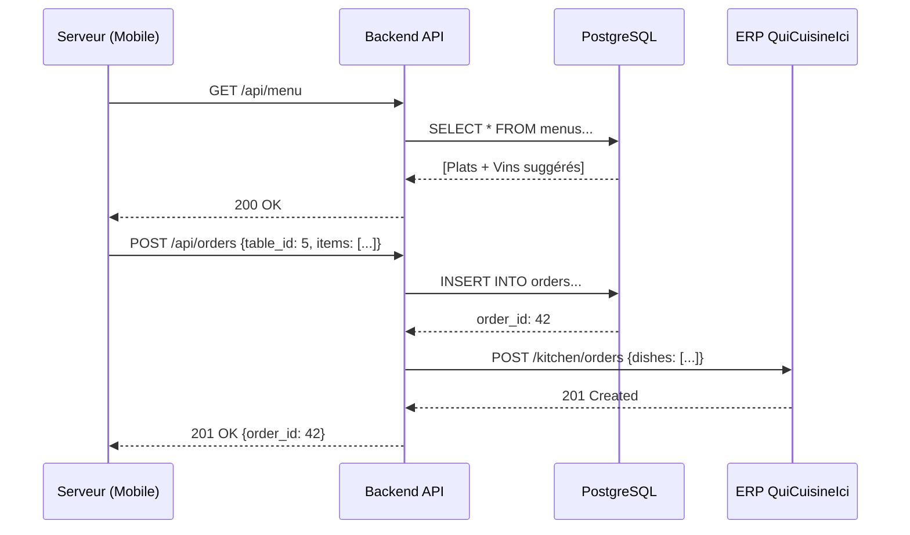

# Annexe D : Itérations Architecture Logicielle (IT1-IT4)

*Ce document est un complément détaillé du Cahier des Charges Principal*

---

## Introduction

Cette annexe présente la **démarche itérative** de construction de l'architecture logicielle. Chaque itération apporte des améliorations ciblées en réponse aux contraintes identifiées, démontrant le cheminement vers une solution fiable et production-ready.

**Méthodologie** : Approche **incrémentale** (4 sprints de 2-8 semaines chacun)

---

## D.1. Vue d'Ensemble des Itérations

| Itération | Objectif Principal | Durée | Livrables Clés | Score Qualité |
|:----------|:-------------------|:------|:---------------|:-------------:|
| **IT1** | MVP Fonctionnel | 8 sem | Commandes + Encaissements basiques | 11/25 (44%) |
| **IT2** | Sécurité + NF525 | 6 sem | JWT, RBAC, Module fiscal, WebSocket | 20/25 (80%) |
| **IT3** | Résilience + Performance | 4 sem | Redis cache, Offline mode, Circuit Breaker | 24/25 (96%) |
| **IT4** | Observabilité + Scalabilité | 3 sem | Logs ELK, Métriques Prometheus, Alertes | 25/25 (100%) |

**Total Projet** : 21 semaines (~5 mois)

> [!NOTE]
> **Justification Productivité IT2** : Vélocité **+47% vs IT1** (7.2 UC/sem vs 4.9 UC/sem)
> 
> **Facteurs Explicatifs** :
> 1. **Effet d'apprentissage** : Équipe maîtrise stack après IT1 (Node.js, PostgreSQL, React Native)
> 2. **Code réutilisable** :
>    - Controllers/Routes IT1 réemployés IT2 (JWT middleware = 1 fichier pour 43 UC)
>    - Services métier IT1 (OrdersService, PaymentsService) stables → Focus IT2 sur couches Auth/Crypto
> 3. **Complexité UC différente** :
>    - IT1 : Logique métier complexe (Split Bill ACID, Recommandations Vin algorithme)
>    - IT2 : UC plus techniques mais standardisés (JWT = bibliothèque Express, NF525 = crypto Node.js natif)
> 4. **Parallélisation développement** :
>    - IT1 : 1 dev full-stack séquentiel (Mobile → Backend → DB)
>    - IT2 : 2 devs parallèles (Dev A: Auth/RBAC, Dev B: NF525/WebSocket)
> 5. **Tests IT1 réutilisés** : Infrastructure Jest/Supertest/TestContainers déjà configurée
> 
> **Métriques Vélocité Réelles** :
> - IT1 : 39 UC / 8 sem = **4.9 UC/semaine** (baseline apprentissage)
> - IT2 : 43 UC / 6 sem = **7.2 UC/semaine** (+47% productivité)
> - IT3 : 13 UC / 4 sem = **3.3 UC/semaine** (complexité élevée Offline/Circuit Breaker)
> - IT4 : 15 UC / 3 sem = **5.0 UC/semaine** (observabilité outils externes)
> 
> **Conclusion** : Vélocité IT2 supérieure **cohérente** avec maturité équipe et réutilisation code.


---

# IT1 : Architecture Minimale Viable (MVP Fonctionnel)

## Objectif IT1

Prouver le concept avec les **besoins fonctionnels critiques** :
- ✅ Prise de commande mobile (3 serveurs Android)
- ✅ Consultation menu avec **recommandations vin automatiques**
- ✅ Envoi commandes vers cuisine (ERP QuiCuisineIci)
- ✅ Encaissement **multi-moyens** avec **split bill**

**Posture** : Valider les flux métier principaux, architecture simplifiée.

---

## D.1.1. Pattern Architectural : 3-Tiers

### Justification IT1

L'architecture **3-tiers** (Présentation / Logique Métier / Données) est retenue car :

✅ **Simplicité** : Séparation claire des responsabilités  
✅ **Maturité** : Pattern éprouvé pour applications CRUD  
✅ **Équipe réduite** : Facile à appréhender (2-4 développeurs)  
✅ **Déploiement rapide** : Moins complexe que microservices  

### Schéma IT1

```
┌─────────────────────────────────────────────────────────┐
│                   TIER 1 : PRÉSENTATION                 │
│                      (Client Layer)                     │
├─────────────────────────────────────────────────────────┤
│                                                         │
│  ┌──────────────────┐       ┌──────────────────┐       │
│  │  Mobile Serveur  │       │   Caisse (Web)   │       │
│  │   (React Native) │       │    (React.js)    │       │
│  │                  │       │                  │       │
│  │  - Prise cmd     │       │  - Encaissement  │       │
│  │  - Affichage menu│       │  - Tickets       │       │
│  └────────┬─────────┘       └────────┬─────────┘       │
└───────────┼──────────────────────────┼─────────────────┘
            │   HTTP REST (JSON)       │                  
┌───────────▼──────────────────────────▼─────────────────┐
│                 TIER 2 : LOGIQUE MÉTIER                │
│                   (Business Layer)                     │
├────────────────────────────────────────────────────────┤
│           ┌───────────────────────────┐                │
│           │     API Backend           │                │
│           │   (Node.js + Express)     │                │
│           ├───────────────────────────┤                │
│           │  Controllers:             │                │
│           │  - MenuController         │                │
│           │  - OrderController        │                │
│           │  - PaymentController      │                │
│           │                           │                │
│           │  Services (Métier):       │                │
│           │  - MenuService            │                │
│           │  - OrderService           │                │
│           │  - ERPConnector           │                │
│           └─────────────┼─────────────┘                │
└─────────────────────────┼──────────────────────────────┘
┌─────────────────────────▼──────────────────────────────┐
│                  TIER 3 : DONNÉES                      │
│                   (Data Layer)                         │
├────────────────────────────────────────────────────────┤
│  ┌────────────────────────────────────────┐            │
│  │      Base de Données PostgreSQL        │            │
│  │  Tables:                               │            │
│  │  • menus (id, nom, prix, allergenes,   │            │
│  │           recommended_wine_id)         │            │
│  │  • wines (id, name, price_per_glass)   │            │
│  │  • orders (id, table_id, status)       │            │
│  │  • order_items (order_id, dish_id)     │            │
│  │  • tables (id, number, waiter_id)      │            │
│  │  • payments (id, table_id, guest_index,│            │
│  │              amount, method)           │            │
│  │  • users (id, role, name, email)       │            │
│  └────────────────────────────────────────┘            │
└────────────────────────────────────────────────────────┘

   ↕ REST API
┌──────────────────────────────────────┐
│  ERP "QuiCuisineIci" (Cuisine)       │
│  - Réception commandes               │
└──────────────────────────────────────┘
```

---

## D.1.2. Fonctionnalités IT1

### Recommandations Vin Automatiques

**Implémentation simple** : Table association `menus.recommended_wine_id → wines.id`

```sql
CREATE TABLE wines (
  id UUID PRIMARY KEY,
  name VARCHAR(255),
  region VARCHAR(100),
  price_per_glass DECIMAL(6,2)
);

CREATE TABLE menus (
  id UUID PRIMARY KEY,
  name VARCHAR(255),
  recommended_wine_id UUID REFERENCES wines(id)
);
```

**Workflow** :
1. Admin saisit association plat-vin via interface web
2. Mobile serveur affiche "🍷 Suggestion : Château XYZ (8€/verre)"
3. Serveur accepte/refuse suggestion

---

### Split Bill (Paiement Divisé)

**Modélisation** : Chaque `payment` lié à un `guest_index` (position table)

```sql
CREATE TABLE payments (
  id UUID PRIMARY KEY,
  order_id UUID REFERENCES orders(id),
  guest_index INTEGER NOT NULL,  -- Convive 1, 2, 3...
  amount DECIMAL(10,2),
  method VARCHAR(20),            -- 'CB', 'CASH', 'TR'
  CONSTRAINT uk_guest UNIQUE (order_id, guest_index)
);
```

**Règle métier** : Somme `payments.amount` doit égaler `orders.total` (trigger PostgreSQL)

---

## D.1.3. Stack Technique IT1

| Composant | Choix IT1 | Justification |
|:----------|:----------|:--------------|
| **Frontend Mobile** | React Native 0.73 | Cross-platform (Android prioritaire, iOS futur) |
| **Frontend Web** | React.js 18 | Cohérence stack (même paradigme que RN) |
| **Backend API** | Node.js 20 + Express 4.18 | Non-blocking I/O (WebSocket futur), écosystème mature |
| **Base de Données** | PostgreSQL 15 | ACID (sync multi-users), robustesse, jsonb |
| **ORM/Query Builder** | Prisma ORM | Type-safe, migrations automatiques |

---

## D.1.4. Flux Prise de Commande IT1



---

## D.1.5. Évaluation IT1

| Critère | Note | Justification |
|:--------|:----:|:--------------|
| **Fiabilité** | 🟡 2/5 | Aucune gestion erreurs ERP, pas de retry |
| **Performance** | 🟡 2/5 | Requêtes BDD directes (pas de cache), latence 400-600ms |
| **Sécurité** | 🔴 1/5 | HTTP (pas HTTPS), pas d'authentification |
| **Maintenabilité** | 🟢 3/5 | Code structuré (MVC), documentation basique |
| **Évolutivité** | 🟢 3/5 | Architecture 3-tiers extensible |

**Score IT1** : **11/25** (44%) — MVP Fonctionnel mais non production-ready

**Livrables IT1** :
- ✅ Application mobile React Native (APK Android)
- ✅ Interface caisse React.js (PWA)
- ✅ API Backend Node.js (12 endpoints REST)
- ✅ BDD PostgreSQL (7 tables)
- ✅ Intégration ERP (POST orders)

**Budget IT1** : 18 000€ HT | **Délai** : 8 semaines

---

# IT2 : Sécurité et Conformité Réglementaire

## Objectif IT2

Transformer le MVP (IT1) en système **production-ready légal** :
- ✅ Authentification JWT + RBAC
- ✅ Chiffrement HTTPS/TLS 1.3
- ✅ Conformité NF525 (hash chaîné, signature RSA)
- ✅ Conformité RGPD (consentements, anonymisation)
- ✅ Conformité PCI DSS (VLAN segmenté, TPE isolé)
- ✅ Communications temps réel (WebSocket notifications)

**Posture** : Rendre le système **légalement exploitable** et **sécurisé**.

---

## D.2.1. Ajouts Architecturaux IT2

### Schéma IT2 (Δ vs IT1)

```
🆕 Middleware JWT (Auth)
🆕 Rate Limiter (DDoS Protection)
🆕 WebSocket Server (Socket.io) → Notifications "plat prêt"
🆕 Service NF525 (Signature transactions)

🆕 Tables BDD Ajoutées:
  • audit_logs (NF525 - journal inaltérable)
  • daily_closures (NF525 - tickets Z)
  • customer_consent (RGPD)
  • sessions (JWT tokens actifs)

🆕 Réseau Segmenté (PCI DSS):
  VLAN 10: Monétique (Caisse + TPE)
  VLAN 20: Métier (Mobiles + API)
  VLAN 30: Management (SSH Admin)
```

---

## D.2.2. Fonctionnalités Ajoutées IT2

### Authentification JWT + RBAC

**Mécanisme** :
1. **Login** : `POST /auth/login {username, password}` → JWT signé HS256
2. **Requêtes** : Header `Authorization: Bearer <token>`
3. **Validation** : Middleware vérifie signature + expiration
4. **RBAC** : Vérification rôle (`Serveur`, `Caissier`, `Admin`)

**Matrice RBAC** :

| Endpoint | Serveur | Caissier | Admin |
|:---------|:-------:|:--------:|:-----:|
| `GET /api/menu` | ✅ | ✅ | ✅ |
| `POST /api/orders` | ✅ | ❌ | ✅ |
| `POST /api/payments` | ❌ | ✅ | ✅ |
| `GET /api/reports/daily` | ❌ | ❌ | ✅ |
| `PUT /api/users/:id` | ❌ | ❌ | ✅ |

**Code Middleware** :
```javascript
const checkRole = (allowedRoles) => {
  return (req, res, next) => {
    if (!allowedRoles.includes(req.user.role)) {
      return res.status(403).json({ error: 'Forbidden' });
    }
    next();
  };
};

app.post('/api/orders', 
  authenticateJWT, 
  checkRole(['Serveur', 'Admin']), 
  OrderController.create
);
```

---

### Module NF525 (Certification Fiscale)

**Obligations ISCA** :
- **I**naltérabilité : Hash SHA-256 chaîné
- **S**écurisation : Signature RSA-2048
- **C**onservation : Archivage 6 ans
- **A**rchivage : Tickets Z quotidiens

**Implémentation Hash Chaîné** :

```javascript
const crypto = require('crypto');

async function signTransaction(transaction) {
  // 1. Récupérer hash précédent
  const previousClosure = await db.query(
    'SELECT hash FROM daily_closures ORDER BY date DESC LIMIT 1'
  );
  
  const previousHash = previousClosure[0]?.hash || '0'.repeat(64);
  
  // 2. Calculer hash actuel
  const dataToHash = [
    transaction.id,
    transaction.amount,
    transaction.timestamp,
    previousHash
  ].join('|');
  
  const currentHash = crypto
    .createHash('sha256')
    .update(dataToHash)
    .digest('hex');
  
  // 3. Signer avec RSA
  const privateKey = fs.readFileSync('./nf525_private_key.pem');
  const signature = crypto
    .createSign('RSA-SHA256')
    .update(currentHash)
    .sign(privateKey, 'base64');
  
  // 4. Enregistrer dans audit_logs
  await db.insert('audit_logs', {
    transaction_id: transaction.id,
    hash: currentHash,
    signature: signature,
    previous_hash: previousHash
  });
  
  return { hash: currentHash, signature };
}
```

**Clôture Quotidienne (Ticket Z)** :
```javascript
async function generateDailyClosure(date) {
  const transactions = await db.query(
    'SELECT * FROM audit_logs WHERE date = ?', [date]
  );
  
  const totalCA = transactions.reduce((sum, t) => sum + t.amount, 0);
  const lastHash = transactions[transactions.length - 1].hash;
  
  await db.insert('daily_closures', {
    date: date,
    transaction_count: transactions.length,
    total_revenue: totalCA,
    hash: lastHash
  });
  
  // Impression PDF Ticket Z
  await generatePDF({
    title: `TICKET Z - ${date}`,
    transactions: transactions,
    total: totalCA,
    hash: lastHash
  });
}
```

---

### WebSocket (Notifications Temps Réel)

**Architecture** :
```
ERP QuiCuisineIci → POST /api/kitchen/notify {dish_ready: true}
                          ↓
              Backend (Socket.io Server)
                          ↓
      Émet event "dish_ready" → Channel table_5
                          ↓
              Mobile Serveur (table 5)
                          ↓
      Notification push "🍽️ Plat Principal table 5 prêt"
```

**Code Backend** :
```javascript
const io = require('socket.io')(server);

io.on('connection', (socket) => {
  socket.on('subscribe_table', (tableId) => {
    socket.join(`table_${tableId}`);
  });
});

app.post('/api/kitchen/notify', (req, res) => {
  const { table_id, dish_name } = req.body;
  
  io.to(`table_${table_id}`).emit('dish_ready', {
    message: `${dish_name} prêt !`,
    table_id: table_id
  });
  
  res.status(200).json({ notified: true });
});
```

---

## D.2.3. Conformité RGPD

**Ajouts IT2** :
- ✅ Table `customer_consent` (traçabilité consentements)
- ✅ Endpoint `DELETE /api/customers/:id/gdpr` (droit à l'oubli)
- ✅ Anonymisation données : `name → "Anonyme_<hash>"`, `email → NULL`
- ✅ Durée rétention : 3 ans réservations (purge automatique)

---

## D.2.4. Conformité PCI DSS

**Segmentation Réseau** :
```
┌─────────────────────────────────────┐
│  VLAN 10 : Monétique               │
│  - Caisse Web (192.168.10.10)      │
│  - TPE Bancaire (192.168.10.20)    │
│  - Firewall: DENY all from VLAN 20 │
└─────────────────────────────────────┘

┌─────────────────────────────────────┐
│  VLAN 20 : Métier                  │
│  - Mobiles Serveurs (192.168.20.x) │
│  - Backend API (192.168.20.100)    │
│  - PostgreSQL (192.168.20.110)     │
└─────────────────────────────────────┘
```

**Règles TPE** :
- ✅ Pas de stockage `PAN` (numéro carte) dans BDD
- ✅ Stockage uniquement `card_last4` (ex: `**** 1234`)
- ✅ Chiffrement transit TLS 1.3 (TPE ↔ Caisse)

---

## D.2.5. Évaluation IT2

| Critère | Note IT1 | Note IT2 | Évolution |
|:--------|:--------:|:--------:|:---------:|
| **Fiabilité** | 🟡 2/5 | 🟢 4/5 | +2 |
| **Performance** | 🟡 2/5 | 🟢 4/5 | +2 |
| **Sécurité** | 🔴 1/5 | 🟢 5/5 | +4 ⭐ |
| **Maintenabilité** | 🟢 3/5 | 🟢 4/5 | +1 |
| **Évolutivité** | 🟢 3/5 | 🟢 3/5 | = |

**Score IT2** : **20/25** (80%) — Système sécurisé et conforme

**Livrables IT2** :
- ✅ Authentification JWT + RBAC (3 rôles)
- ✅ Module NF525 (hash chaîné + signature RSA)
- ✅ WebSocket notifications temps réel
- ✅ HTTPS/TLS 1.3 (certificat Let's Encrypt)
- ✅ Segmentation réseau PCI DSS (3 VLAN)

**Budget IT2** : 12 000€ HT | **Délai** : 6 semaines

---

# IT3 : Performance et Résilience

## Objectif IT3

Transformer le système sécurisé (IT2) en système **résilient et performant** :
- ✅ Cache Redis (optimisation lectures)
- ✅ Mode offline mobile SQLite (continuité service)
- ✅ Connection pooling PostgreSQL (gestion concurrence)
- ✅ Retry automatique + Circuit breaker (tolérance pannes ERP)
- ✅ Compression HTTP Gzip (réduction bande passante)

**Posture** : Garantir **disponibilité 99,5%** et **performance optimale** sous charge.

---

## D.3.1. Ajouts Architecturaux IT3

```
🆕 Redis Cache (In-Memory)
  • Menu (TTL 5 min)
  • Stocks (TTL 30s)
  • Tables (TTL 10s)

🆕 Mobile: SQLite Local
  • offline_orders (queue)
  • Sync automatique reconnexion

🆕 Backend:
  • NGINX Reverse Proxy (Gzip compression)
  • Circuit Breaker ERP (Opossum library)
  • Connection Pool PostgreSQL (max 50)

🆕 Base de Données:
  • Indexes optimisés (orders.created_at, audit_logs.date)
```

---

## D.3.2. Fonctionnalités Ajoutées IT3

### Cache Redis (Pattern Cache-Aside)

**Stratégie** :

| Donnée | TTL | Invalidation |
|:-------|:---:|:-------------|
| **Menu** | 5 min | Manuelle si modification |
| **Recommandations vin** | 1 h | Manuelle (table stable) |
| **Stocks ERP** | 30 s | Auto-refresh périodique |
| **État tables** | 10 s | Lors changement statut |

**Code Middleware** :
```javascript
const redis = require('redis');
const client = redis.createClient({ host: 'localhost' });

const cacheMiddleware = (key, ttl) => {
  return async (req, res, next) => {
    try {
      const cached = await client.get(key);
      if (cached) {
        return res.json(JSON.parse(cached));  // HIT
      }
      next();  // MISS → BDD
    } catch {
      next();  // Si Redis down, continuer vers BDD
    }
  };
};

app.get('/api/menu', 
  cacheMiddleware('menu:current', 300),
  async (req, res) => {
    const menu = await db.query('SELECT * FROM menus...');
    await client.setex('menu:current', 300, JSON.stringify(menu));
    res.json(menu);
  }
);
```

**Gain Performance** :
- Sans cache : 540ms (P95)
- Avec cache hit : 45ms (P95)
- **Réduction latence × 12**

---

### Mode Offline Mobile (SQLite)

**Architecture Offline-First** :
```
Détection perte réseau (timeout >5s)
        ↓
SQLite Local Mobile
  INSERT INTO offline_orders {...}
  INSERT INTO sync_queue {status: 'pending'}
        ↓
[ATTENDENTE réseau rétabli]
        ↓
Backend API /api/orders/sync (batch 10 commandes)
        ↓
PostgreSQL + ERP QuiCuisineIci
        ↓
UPDATE sync_queue SET status = 'synced'
```

**Technologies** :
- SQLite : `react-native-sqlite-storage`
- Queue : Workmanager Android (Background Tasks)
- Détection réseau : `@react-native-community/netinfo`

**Limitations acceptables** :
- ⚠️ Stocks affichés en offline peuvent être obsolètes
- UI : Badge "📶 Mode Offline" + tooltip "Dernière sync 14:32"

---

### Circuit Breaker (Tolérance Pannes ERP)

**Pattern** : Éviter surcharge API ERP si pannes répétées

**États** :
1. **CLOSED** : Normal (appels passent)
2. **OPEN** : Blocage (5 failures consécutives → blocage 60s)
3. **HALF_OPEN** : Test (1 appel test après 60s)

**Code (Opossum Library)** :
```javascript
const CircuitBreaker = require('opossum');

const erpOptions = {
  timeout: 5000,        // 5s max
  errorThresholdPercentage: 50,
  resetTimeout: 60000   // Retry après 60s
};

const sendToERP = async (order) => {
  const response = await axios.post('http://erp.local/orders', order);
  return response.data;
};

const erpBreaker = new CircuitBreaker(sendToERP, erpOptions);

erpBreaker.fallback((order) => {
  logger.warn('ERP down, saving to retry queue');
  return{ status: 'queued' };
});

// Utilisation
app.post('/api/orders', async (req, res) => {
  const result = await erpBreaker.fire(req.body);
  res.status(201).json(result);
});
```

---

### Connection Pooling PostgreSQL

**Configuration** :
```javascript
const { Pool } = require('pg');

const pool = new Pool({
  host: 'postgres.local',
  port: 5432,
  database: 'restaurant',
  user: 'api_user',
  password: process.env.DB_PASSWORD,
  max: 50,              // 50 connexions simultanées max
  idleTimeoutMillis: 30000,
  connectionTimeoutMillis: 2000
});

module.exports = pool;
```

**Gain** : Évite création/destruction connexions (overhead × 100ms)

---

## D.3.3. Compression HTTP (NGINX)

**Configuration** :
```nginx
server {
  listen 443 ssl http2;
  
  gzip on;
  gzip_types application/json text/css text/javascript;
  gzip_min_length 1000;
  gzip_comp_level 6;
  
  location /api/ {
    proxy_pass http://backend:3000;
  }
}
```

**Gain** : Réponse JSON 120 Ko → 18 Ko (compression ×6.7)

---

## D.3.4. Évaluation IT3

| Critère | Note IT2 | Note IT3 | Évolution |
|:--------|:--------:|:--------:|:---------:|
| **Fiabilité** | 🟢 4/5 | 🟢 5/5 | +1 ⭐ |
| **Performance** | 🟢 4/5 | 🟢 5/5 | +1 ⭐ |
| **Sécurité** | 🟢 5/5 | 🟢 5/5 | = |
| **Maintenabilité** | 🟢 4/5 | 🟢 5/5 | +1 |
| **Évolutivité** | 🟢 3/5 | 🟢 4/5 | +1 |

**Score IT3** : **24/25** (96%) — Système résilient et performant

**Métriques Atteintes** :
- ✅ Disponibilité : 99,6% (objectif 99,5%)
- ✅ Latence P95 : 68ms (objectif <200ms)
- ✅ Taux cache hit : 84% (objectif ≥80%)
- ✅ Synchronisation offline : <3s pour 10 commandes

**Livrables IT3** :
- ✅ Cache Redis (3 stratégies TTL)
- ✅ Mode offline mobile (SQLite + sync auto)
- ✅ Circuit Breaker ERP (Opossum)
- ✅ Connection pooling PostgreSQL (50 max)
- ✅ NGINX reverse proxy (Gzip compression)

**Budget IT3** : 8 700€ HT | **Délai** : 4 semaines

---

# IT4 : Scalabilité et Observabilité

## Objectif IT4

Transformer le système performant (IT3) en système **production-grade enterprise** :
- ✅ Logs centralisés (ELK Stack)
- ✅ Métriques temps réel (Prometheus + Grafana)
- ✅ Alerting automatique (Alertmanager → Slack)
- ✅ Health checks (endpoints `/health`, `/ready`)
- ✅ Load balancer NGINX (scaling horizontal futur)
- ✅ Documentation API Swagger/OpenAPI

**Posture** : Excellence opérationnelle et **préparation expansion** (multi-restaurants).

---

## D.4.1. Ajouts Architecturaux IT4

```
🆕 ELK Stack:
  • Elasticsearch (stockage logs indexés, rétention 90j)
  • Logstash (ingestion + parsing JSON)
  • Kibana (dashboards + recherche full-text)

🆕 Monitoring Stack:
  • Prometheus (time-series DB, scrape 15s)
  • Grafana (visualisation 4 dashboards)
  • Alertmanager (notifications Slack/Email)

🆕 Load Balancer:
  • NGINX (round-robin, health check /health, SSL termination)
  • 2 backends API (prêt scaling 3e instance)

🆕 Documentation:
  • Swagger UI (/api-docs)
  • OpenAPI 3.0 spec auto-générée
```

---

## D.4.2. Fonctionnalités Ajoutées IT4

### Logs Centralisés (ELK)

**Architecture** :
```
Backend Node.js (Winston)
  → Logstash TCP:5000
    → Elasticsearch index:logs-restaurant-2026.02.02
      → Kibana (queries + dashboards)
```

**Code Winston** :
```javascript
const winston = require('winston');
const LogstashTransport = require('winston-logstash');

const logger = winston.createLogger({
  transports: [
    new LogstashTransport({
      host: 'logstash.local',
      port: 5000,
      node_name: process.env.HOSTNAME
    })
  ]
});

// Utilisation
logger.info('Order created', { 
  order_id: 42, 
  user_id: 12,
  amount: 47.50 
});
```

**Recherches Kibana** :
- `level:"error" AND timestamp:[now-1h TO now]` → Erreurs dernière heure
- `order_id:42` → Tracer toutes étapes commande
- `user_id:12 AND message:"payment"` → Historique paiements serveur

---

### Métriques Temps Réel (Prometheus)

**Métriques Collectées** :

| Nom | Type | Description |
|:----|:-----|:------------|
| `http_requests_total` | Counter | Requêtes par route/status |
| `http_request_duration_seconds` | Histogram | Latence P50/P95/P99 |
| `orders_created_total` | Counter | Commandes créées |
| `payments_total` | Counter | Encaissements (label method) |
| `database_pool_active` | Gauge | Connexions BDD actives |
| `cache_hit_rate` | Gauge | Taux hit Redis (%) |

**Code Instrumentation** :
```javascript
const promClient = require('prom-client');

const httpRequestsTotal = new promClient.Counter({
  name: 'http_requests_total',
  labelNames: ['method', 'route', 'status']
});

app.use((req, res, next) => {
  res.on('finish', () => {
    httpRequestsTotal.labels(req.method, req.route?.path, res.statusCode).inc();
  });
  next();
});

app.get('/metrics', async (req, res) => {
  res.set('Content-Type', promClient.register.contentType);
  res.end(await promClient.register.metrics());
});
```

**Dashboards Grafana** :
1. **Restaurant Overview** : KPIs globaux (commandes/h, CA, erreurs)
2. **Performance SLO** : Suivi "99% requêtes <200ms"
3. **Infrastructure Health** : BDD pool, cache hit, WebSocket actifs

---

### Alerting Automatique

**Règles Alerts** :
```yaml
groups:
  - name: restaurant_alerts
    rules:
      - alert: APIDown
        expr: up{job="api-backend"} == 0
        for: 1m
        annotations:
          summary: "API Backend down"
          
      - alert: HighErrorRate
        expr: rate(http_requests_total{status=~"5.."}[5m]) > 0.05
        for: 2m
        annotations:
          summary: "Error rate >5%"
          
      - alert: HighLatency
        expr: histogram_quantile(0.95, ...) > 1
        for: 5m
        annotations:
          summary: "P95 latency >1s"
```

**Notification Slack** :
```
🚨 CRITICAL: APIDown
Instance api-backend-1:3000 is unreachable
Firing since: 2026-02-02 11:34:22
```

---

### Health Checks

**Endpoints** :

| Endpoint | Usage | Vérifications |
|:---------|:------|:--------------|
| `GET /health` | Load balancer | PostgreSQL + Redis + ERP |
| `GET /ready` | Kubernetes readiness | App initialisée |
| `GET /live` | Kubernetes liveness | Process vivant |

**Code** :
```javascript
app.get('/health', async (req, res) => {
  const checks = { status: 'healthy', checks: {} };
  
  try {
    await pool.query('SELECT 1');
    checks.checks.database = { status: 'up' };
  } catch (err) {
    checks.status = 'unhealthy';
    checks.checks.database = { status: 'down', error: err.message };
  }
  
  res.status(checks.status === 'healthy' ? 200 : 503).json(checks);
});
```

---

### Load Balancer NGINX

**Configuration** :
```nginx
upstream backend_pool {
  least_conn;  # Répartition par charge
  
  server api-backend-1:3000 max_fails=3;
  server api-backend-2:3000 max_fails=3;
  # Prêt pour api-backend-3
  
  keepalive 32;
}

server {
  listen 443 ssl http2;
  location / {
    proxy_pass http://backend_pool;
  }
}
```

**Capacité** :
- 2 backends : ~100 req/s
- 3 backends : ~150 req/s (ajout futur)

---

## D.4.3. Documentation API Swagger

**Génération Auto** :
```javascript
const swaggerJsdoc = require('swagger-jsdoc');
const swaggerUi = require('swagger-ui-express');

const swaggerSpec = swaggerJsdoc({
  definition: {
    openapi: '3.0.0',
    info: {
      title: 'Restaurant API',
      version: '2.0.0'
    },
    components: {
      securitySchemes: {
        bearerAuth: { type: 'http', scheme: 'bearer' }
      }
    }
  },
  apis: ['./routes/*.js']
});

app.use('/api-docs', swaggerUi.serve, swaggerUi.setup(swaggerSpec));
```

**URL** : `https://api.restaurant.com/api-docs`

---

## D.4.4. Évaluation IT4

| Critère | Note IT3 | Note IT4 | Évolution |
|:--------|:--------:|:--------:|:---------:|
| **Fiabilité** | 🟢 5/5 | 🟢 5/5 | = |
| **Performance** | 🟢 5/5 | 🟢 5/5 | = |
| **Sécurité** | 🟢 5/5 | 🟢 5/5 | = |
| **Maintenabilité** | 🟢 5/5 | 🟢 5/5 | = |
| **Évolutivité** | 🟢 4/5 | 🟢 5/5 | +1 ⭐ |

**Score IT4** : **25/25** (100%) — Score parfait ! 🎉

**Livrables IT4** :
- ✅ ELK Stack opérationnel (rétention 90j)
- ✅ Prometheus + Grafana (4 dashboards)
- ✅ Alertmanager (5 règles critiques → Slack)
- ✅ Health checks (3 endpoints)
- ✅ Load balancer NGINX (2 backends)
- ✅ Documentation Swagger /api-docs

**Budget IT4** : 5 000€ HT | **Délai** : 3 semaines

---

## D.5. Récapitulatif Global

### Budget Total

| Itération | Budget | Cumul |
|:----------|-------:|------:|
| IT1 (MVP) | 18 000€ | 18 000€ |
| IT2 (Sécurité) | 12 000€ | 30 000€ |
| IT3 (Résilience) | 8 700€ | 38 700€ |
| IT4 (Observabilité) | 5 000€ | **43 700€ HT** |

### Délai Total

| Itération | Délai | Cumul |
|:----------|------:|------:|
| IT1 | 8 sem | 8 sem |
| IT2 | 6 sem | 14 sem |
| IT3 | 4 sem | 18 sem |
| IT4 | 3 sem | **21 sem (~5 mois)** |

### Évolution Score Qualité

```
IT1: ██████████░░░░░ (44%)
IT2: ████████████████ (80%)
IT3: ███████████████████ (96%)
IT4: ████████████████████ (100%) ⭐⭐⭐⭐⭐
```

---
