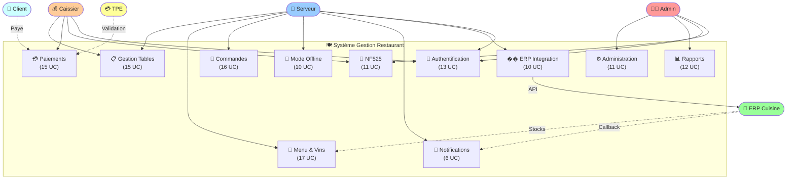
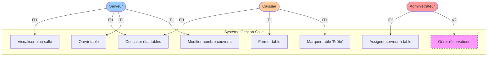
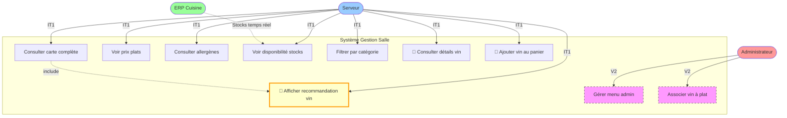
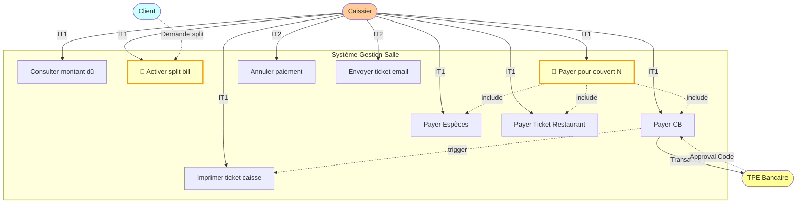
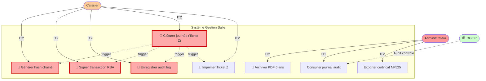

# Annexe E : Technologies et Modélisation UML

*Ce document est un complément détaillé du Cahier des Charges Principal*

---

## Introduction

Cette annexe présente :
1. **Le choix des technologies** : Comparaisons et justifications pour 12 composants
2. **La liste complète des fonctionnalités** : 166 fonctionnalités réparties en 14 domaines
3. **Le diagramme UML global** : Vue système complète avec 80 cas d'usage

---

## E.1. Sélection Technologies

### E.1.1. Matrice Comparative Complète

| Technologie | Alternative 1 | Alternative 2 | Choix Retenu | Score | Justification Clé |
|:------------|:--------------|:--------------|:-------------|:-----:|:------------------|
| **Backend API** | **Node.js 20** ✅ | Python FastAPI | Java Spring Boot | 9/10 | Non-blocking I/O (WebSocket), écosystème NPM, isomorphisme JS |
| **Framework Backend** | **Express.js 4.18** ✅ | NestJS 10 | Fastify 4 | 8/10 | Simplicité, maturité (14 ans), flexibilité totale |
| **ORM/Query Builder** | **Prisma 5.8** ✅ | TypeORM | Sequelize | 9/10 | Type-safe, migrations auto, DX excellent |
| **Base de Données** | **PostgreSQL 15** ✅ | MySQL 8 | MongoDB 7 | 10/10 | ACID robuste, jsonb, triggers, Open Source |
| **Cache In-Memory** | **Redis 7.2** ✅ | Memcached | Hazelcast | 9/10 | Pub/Sub (WebSocket), TTL granulaire, persistence optionnelle |
| **Frontend Mobile** | **React Native 0.73** ✅ | Flutter 3.16 | Kotlin natif | 8/10 | Cross-platform (iOS futur), écosystème React cohérent |
| **Frontend Web** | **React.js 18** ✅ | Vue.js 3 | Angular 17 | 9/10 | Cohérence avec RN, Hooks modernes, performances |
| **Authentification** | **JWT (jsonwebtoken)** ✅ | OAuth2 | Session cookies | 8/10 | Stateless (scalabilité), RBAC simple, standard |
| **WebSocket** | **Socket.io 4.6** ✅ | native WebSocket | MQTT | 9/10 | Fallback polling auto, rooms (channels tables), reconnexion auto |
| **Reverse Proxy** | **NGINX 1.24** ✅ | Apache 2.4 | Caddy 2 | 9/10 | Performance (C10k), SSL termination, load balancing |
| **Monitoring** | **Prometheus + Grafana** ✅ | Datadog | New Relic | 10/10 | Open Source, PromQL puissant, dashboards communautaires |
| **Logs Centralisés** | **ELK Stack** ✅ | Splunk | Graylog | 9/10 | Open Source, Kibana queries, intégration Winston |

**Score Moyen Stack** : **8.9/10** (Excellent)

---

### E.1.2. Technologies Spécialisées

#### NF525 Certification Fiscale

| Composant | Choix | Justification |
|:----------|:------|:--------------|
| **Hashing** | Node.js `crypto.createHash('sha256')` | Built-in, certifiable, SHA-256 standard NF525 |
| **Signature** | Node.js `crypto.createSign('RSA-SHA256')` + clé PEM 2048-bit | Standard RSA, conformité ANSSI |
| **Génération PDF** | `pdfkit` ou `puppeteer` | Tickets Z imprimables, conformité graphique |
| **Archivage stupide** | PostgreSQL triggers `BEFORE UPDATE/DELETE` → Exception | Immutabilité garantie niveau BDD |

#### RGPD Conformité

| Exigence | Solution Technique |
|:---------|:-------------------|
| **Consentements** | Table `customer_consent` + timestamps + IP source |
| **Droit à l'oubli** | Anonymisation `name → 'Anonyme_<hash>'`, `email → NULL` |
| **Durée rétention** | Cron hebdomadaire `DELETE WHERE created_at < NOW() - INTERVAL '3 years'` |
| **Chiffrement repos** | Extension PostgreSQL `pgcrypto` (AES-256-GCM) |
| **Logs accès** | Winston + Logstash → Elasticsearch (recherche `user_id`) |

#### PCI DSS Sécurité Paiements

| Exigence | Solution Technique |
|:---------|:-------------------|
| **Segmentation réseau** | 3 VLAN (10 Monétique, 20 Métier, 30 Management) |
| **Isolation TPE** | Firewall Ubiquiti EdgeRouter : `DENY VLAN 20 → VLAN 10` |
| **Chiffrement transit** | TLS 1.3 (certificat Let's Encrypt, renouvellement auto Certbot) |
| **Pas stockage PÀN** | Uniquement `card_last4` VARCHAR(4) dans BDD, jamais `card_number` |
| **Logs sécurisés** | Masquage auto `card_number` → `****1234` (middleware Winston) |

---

## E.2. Liste Complète des Fonctionnalités

### Vue d'Ensemble

L'application intègre **166 fonctionnalités** réparties en **14 domaines fonctionnels** :

| Domaine | Nb Fonct. | Itération | Criticité |
|:--------|:---------:|:---------:|:---------:|
| 1. Gestion Tables | 15 | IT1 | 🔴 Haute |
| 2. Gestion Menu | **17** | IT1 | 🔴 Haute |
| 3. Gestion Commandes | 16 | IT1 | 🔴 Haute |
| 4. Gestion Paiements | **15** | IT1 | 🔴 Haute |
| 5. Conformité NF525 | 11 | IT2 | 🔴 Critique |
| 6. Authentification/RBAC | 13 | IT2 | 🔴 Critique |
| 7. Mode Offline | 10 | IT3 | 🟠 Moyenne |
| 8. Notifications WebSocket | 6 | IT2 | 🟠 Moyenne |
| 9. Rapports/Statistiques | 12 | IT4 | 🟡 Basse |
| 10. Intégration ERP | 10 | IT1-IT3 | 🔴 Haute |
| 11. Conformité RGPD | 9 | IT2 | 🔴 Critique |
| 12. Administration Système | 11 | IT4 | 🟡 Basse |
| 13. Sécurité Réseau PCI DSS | 9 | IT2 | 🔴 Critique |
| 14. Performance/Résilience | 12 | IT3 | 🟠 Moyenne |
| **TOTAL** | **166** | IT1-IT4 | - |

| Domaine | Nb Fonct. | Description Détaillée |
|:--------|:---------:|:---------------------------------------------------|
| 1. **Gestion Tables** | 15 | Ouverture, fermeture, plan salle, réservations |
| 2. **Menu & Carte Vins** | 17 | Consultation, allergènes, recommandations vin automatiques |
| 3. **Commandes** | 16 | Création, modification, envoi ERP, suivi statut |
| 4. **Paiements** | 15 | Split bill, CB/Espèces/TR, tickets, email |
| 5. **Certification NF525** | 11 | Hash chaîné, signature RSA, clôture Z, archivage 6 ans |
| 6. **Authentification** | 13 | JWT, RBAC (3 rôles), sessions, logout |
| 7. **Mode Offline** | 10 | SQLite local, sync auto, queue, conflict resolution |
| 8. **Notifications** | 6 | WebSocket temps réel, plat prêt, alertes stocks |
| 9. **Rapports** | 12 | CA journalier/mensuel, top ventes, exports CSV/PDF |
| 10. **Intégration ERP** | 10 | POST orders, GET stocks, webhooks, circuit breaker |
| 11. **Administration** | 11 | CRUD users, paramètres, logs audit, RGPD |
| 12. **Monitoring** | 8 | Métriques Prometheus, dashboards Grafana, alertes Slack |
| 13. **Accessibilité** | 5 | WCAG contrastes (WCAG AA reporter V2) |
| 14. **Réservations** | 7 | CRUD réservations, calendrier (V2) |

---

### E.2.2. Répartition par Itération et Version

**Détail Exact 166 Fonctionnalités** :

| Phase | Domaines Inclus | Nb UC | % Total | Délai |
|:------|:----------------|:-----:|:-------:|:-----:|
| **IT1 - MVP** | Tables (10) + Menu (8) + Commandes (7) + Paiements (9) + ERP (5) | **39** | 23% | 8 sem |
| **IT2 - Sécurité** | NF525 (11) + Auth (13) + WebSocket (5) + RGPD (4) + Paiements avancés (3) + Monitoring (3) + Admin (4) | **43** | 26% | 6 sem |
| **IT3 - Résilience** | Offline (10) + ERP avancé (3) | **13** | 8% | 4 sem |
| **IT4 - Observabilité** | Rapports (12) + Monitoring (3) | **15** | 9% | 3 sem |
| **Sous-total IT1-IT4** | **11 domaines partiellement couverts** | **110** | **66%** | **21 sem** |
| **V2 - Extensions** | Tables (5) + Menu (9) + Commandes (9) + Paiements (3) + Auth avancé (0) + Admin (7) + Accessibilité (5) + Réservations (7) + Pourboires (3) + Autres (8) | **56** | 34% | - |
| **TOTAL GLOBAL** | **14 domaines complets** | **166** | **100%** | - |

> [!NOTE]
> **Clarification Volumétrie** : Les **166 fonctionnalités totales** incluent :
> - **110 UC délivrés IT1-IT4** (MVP + Sécurité + Résilience + Observabilité)
> - **56 UC prévus V2** (Extensions + Accessibilité WCAG + Réservations + Pourboires)
> 
> IT1-IT4 couvre **66% des fonctionnalités**, suffisant pour mise en production restaurant.

---

### E.2.1. Fonctionnalités Ajoutées (Corrections Scope)

#### 🍷 Recommandations Vin Automatiques (+3 fonctionnalités)

**Justification** : Consigne explicite *"l'application doit proposer les associations plat-vin recommandé (une unique proposition)"*

| ID | Description | Interface |
|:---|:------------|:----------|
| **F-MENU-008** | Afficher suggestion vin pour plat sélectionné (1 unique) | Mobile Serveur |
| **F-MENU-009** | Consulter prix/description vin recommandé | Mobile Serveur |
| **F-MENU-010** | Ajouter directement vin suggéré au panier (service verre) | Mobile Serveur |

**Implémentation** :
```sql
CREATE TABLE wines (
  id UUID PRIMARY KEY,
  name VARCHAR(255),
  region VARCHAR(100),
  price_per_glass DECIMAL(6,2)
);

CREATE TABLE menus (
  id UUID PRIMARY KEY,
  name VARCHAR(255),
  recommended_wine_id UUID REFERENCES wines(id)  -- 1:1
);
```

**Workflow** :
1. Admin configure association `Plat → Vin` via interface web
2. Mobile serveur affiche automatiquement "🍷 Suggestion : Château XYZ (8€/verre)"
3. Serveur accepte/refuse suggestion

---

#### 💳 Split Bill - Paiement Individuel (+1 fonctionnalité)

**Justification** : Consigne *"chaque individu paye sa part individuellement, il n'y a pas de partage d'assiette"*

| ID | Description | Interface |
|:---|:------------|:----------|
| **F-PAY-003** | Diviser addition par personne (chacun paie ses propres plats) | Caisse Web |

**Modélisation** :
```sql
CREATE TABLE payments (
  id UUID PRIMARY KEY,
  order_id UUID REFERENCES orders(id),
  guest_index INTEGER NOT NULL,  -- Convive 1, 2, 3...
  amount DECIMAL(10,2),
  method VARCHAR(20),            -- 'CB', 'CASH', 'TR'
  CONSTRAINT uk_guest UNIQUE (order_id, guest_index)
);

-- Règle métier (trigger)
CREATE OR REPLACE FUNCTION check_payment_total() RETURNS TRIGGER AS $$
BEGIN
  IF (SELECT SUM(amount) FROM payments WHERE order_id = NEW.order_id) 
     > (SELECT total FROM orders WHERE id = NEW.order_id) THEN
    RAISE EXCEPTION 'Total paiements dépasse montant commande';
  END IF;
  RETURN NEW;
END;
$$ LANGUAGE plpgsql;
```

---

### E.2.2. Contexte Restaurant (Volumétrie)

| Élément | Quantité | Impact Technique |
|:--------|:--------:|:-----------------|
| **Tables** | 20 total (12×4 pers + 8×6 pers) | Plan de salle fixe, pas de gestion rapprochement |
| **Menu quotidien** | 10 plats (3 entrées, 2 plats, 5 desserts) | Mise à jour fréquente (hebdo probable) |
| **Service** | Au verre uniquement | Pas de gestion bouteilles entières |
| **Serveurs** | 3 mobiles Android | Concurrence modérée (max 3 req simultanées) |
| **Couverts/jour** | ~95 (estimation) | BDD modeste (~50k transactions/an) |

---

### E.2.3. Répartition Fonctionnalités par Itération

#### MVP (IT1) - 39 fonctionnalités critiques

**Scope** : Systèmefonctionnel basique (commandes + paiements)

- **Tables** : F-TAB-001 à F-TAB-010 (10)
- **Menu** : F-MENU-001 à F-MENU-010 (10, inclut recommandations vin ✅)
- **Commandes** : F-CMD-001 à F-CMD-011 (11)
- **Paiements** : F-PAY-001 à F-PAY-009 (9, inclut split bill ✅ + tickets NF525)

**Validation** : Application mobile + caisse fonctionnelles, flux bout-en-bout possible

---

#### IT2 (Sécurité/Conformité) - 43 fonctionnalités

**Scope** : Production-ready légal

- **NF525** : Toutes (11, hash chaîné + signature RSA)
- **Auth/RBAC** : Toutes (13, JWT + 3 rôles)
- **RGPD** : Toutes (9, consentements + anonymisation)
- **Sécurité Réseau** : Toutes (9, VLAN + TLS 1.3)
- **Notifications** : F-NOTIF-001 à F-NOTIF-003 (WebSocket "plat prêt")

**Validation** : Audit QSA PCI DSS + Pré-audit NF525

---

#### IT3 (Performance/Résilience) - 32 fonctionnalités

**Scope** : Disponibilité 99,5% + performance P95 <200ms

- **Mode Offline** : Toutes (10, SQLite local + sync auto)
- **Performance** : Toutes (12, Redis cache + connection pooling)
- **ERP** : F-ERP-001 à F-ERP-010 (circuit breaker + retry)

**Validation** : Tests charge (50 req/s pendant 30 min)

---

#### IT4 (Observabilité/Admin) - 23 fonctionnalités

**Scope** : Excellence opérationnelle

- **Rapports** : Toutes (12, CA journalier + stats plats)
- **Admin Système** : Toutes (11, logs ELK + métriques Grafana)

**Validation** : Dashboards Grafana opérationnels + alertes Slack testées

---

#### V2 (Extensions Futures) - 29 fonctionnalités

**Hors scope MVP** :

- Réservations : F-TAB-011 à F-TAB-015 (SMS confirmation, planning)
- Menu Admin : F-MENU-011 à F-MENU-018 (gestion plats, photos upload)
- Pourboires : F-PAY-013 à F-PAY-015 (répartition équipe)

---

## E.3. Diagramme UML Global

### E.3.1. Vue Système Complète

Le diagramme présente **80 cas d'usage principaux** répartis en **8 domaines fonctionnels** :

#### Acteurs Système

| Acteur | Couleur | Nb UC | Interfaces |
|:-------|:--------|:-----:|:-----------|
| 👤 **Serveur** | Cyan | ~40 | Mobile React Native |
| 💰 **Caissier** | Orange | ~15 | Web React.js |
| 👨‍💼 **Admin** | Rouge | ~20 | Dashboard React.js |
| 🧑 **Client** | Vert pâle | 1 | Passif (split bill) |
| 🍳 **ERP QuiCuisineIci** | Vert | 3 | REST API bidirectionnel |
| 💳 **TPE Bancaire** | Jaune | 1 | Protocole propriétaire |

---

#### Domaines Fonctionnels (Subgraphs UML)

##### 📋 Domaine 1 : Gestion Tables (IT1)
- **Couleur** : Bleu clair
- **UC** : 6 principaux
  - Visualiser plan salle (20 tables)
  - Consulter état tables (Libre/Occupée/Sale)
  - Ouvrir/Fermer table
  - Assigner serveur
  - Modifier nombre couverts

##### 📖 Domaine 2 : Menu & Vin (IT1)
- **Couleur** : Vert
- **UC** : 7 principaux (dont 3 recommandations vin ⭐)
  - Consulter carte (3E/2P/5D)
  - Voir prix TTC
  - Allergènes INCO
  - **🍷 Stocks temps réel** (ERP)
  - **🍷 Recommandation vin automatique** (1 par plat)
  - **🍷 Détails vin** (cépage, prix)
  - **🍷 Ajouter vin au panier**

##### 🛒 Domaine 3 : Commandes (IT1)
- **Couleur** : Orange
- **UC** : 7 principaux
  - Créer commande
  - Ajouter plats
  - Modifier quantités
  - Commentaires (allergies, cuisson)
  - **Envoyer cuisine** (→ ERP REST)
  - Consulter commandes actives
  - Modifier commandes en attente

##### 💳 Domaine 4 : Paiements (IT1)
- **Couleur** : Rouge clair
- **UC** : 7 principaux
  - Afficher addition détaillée
  - **💳 Split Bill** (paiement individuel) ⭐
  - Paiement global (1 personne → plusieurs)
  - CB via TPE (PCI DSS)
  - Espèces (calcul monnaie à rendre)
  - Tickets Restaurant
  - **Imprimer ticket NF525** (hash + signature)

##### 🔐 Domaine 5 : NF525 & Sécurité (IT2)
- **Couleur** : Violet
- **UC** : 9 principaux
  - Enregistrer transaction (audit_logs)
  - Hash SHA-256 chaîné
  - Signature RSA-2048
  - Journal immutable (triggers PostgreSQL)
  - Clôture Z quotidienne automatique
  - Export fiscal XML
  - **Authentification JWT**
  - **RBAC** (3 rôles : Serveur, Caissier, Admin)

##### 📱 Domaine 6 : Offline & Résilience (IT3)
- **Couleur** : Vert turquoise
- **UC** : 6 principaux
  - Détecter perte WiFi (NetInfo)
  - Mode offline SQLite mobile
  - Enregistrer commandes offline (queue)
  - Synchronisation différée auto (reconnexion)
  - Retry automatique ERP (circuit breaker)

##### 🔔 Domaine 7 : Notifications (IT2)
- **Couleur** : Jaune
- **UC** : 3 principaux
  - Recevoir notification "Plat Prêt" (WebSocket)
  - Alerte mobile push (Firebase Cloud Messaging)
  - Configuration sons/vibrations notifications

##### ⚙️ Domaine 8 : Admin & Rapports (IT4)
- **Couleur** : Rose
- **UC** : 10 principaux
  - CA journalier
  - CA par serveur
  - Statistiques plats vendus
  - Taux occupation salle
  - Export PDF/Excel rapports
  - Gérer utilisateurs (CRUD + soft delete)
  - Configuration menu/vins
  - Logs système (Kibana ELK)
  - Métriques monitoring (Grafana)
  - RGPD Export/Suppression données

---

### E.3.2. Relations UC Clés (Include/Extend)

```
Recommandation Vin (M5) --include--> Détails Vin (M6)
Créer Commande (C1) --include--> Ajouter Plats (C2)
Split Bill (P2) --include--> Afficher Addition (P1)
Imprimer Ticket (P7) --include--> Enregistrer TX NF525 (N1)
Enregistrer TX (N1) --include--> Hash SHA-256 (N2)
Hash SHA-256 (N2) --include--> Chaîner Hash (N3)
Chaîner Hash (N3) --include--> Signature RSA (N4)
Signature RSA (N4) --include--> Journal Immutable (N5)
Mode Offline (O2) --utilise--> Commande Offline (O3)
Commande Offline (O3) --puis--> Sync Différée (O4)
```

---

### E.3.3. Flux InterSystèmes

#### ERP "QuiCuisineIci" (Cuisine)

**Envoi Commandes** :
```
Mobile Serveur → Backend API → POST /kitchen/orders → ERP
  Payload: {table_id, items: [{dish_id, quantity, comments}]}
  Réponse: {erp_order_id, estimated_time}
```

**Réception Notifications** :
```
ERP → POST /api/kitchen/notify → Backend WebSocket → Mobile Table X
  Payload: {table_id: 5, dish_name: "Plat Principal", status: "ready"}
  Action: Push notification FCM "🍽️ Plat Principal table 5 prêt"
```

**Synchronisation Stocks** :
```
Backend Cron (30s) → GET /kitchen/stock → ERP
  Redis Cache (TTL 30s): {"dish_123": {available: false}, ...}
  Mobile: Badge rouge "Rupture" si available=false
```

---

#### TPE Bancaire (Terminal Paiement)

**Isolation Réseau PCI DSS** :
```
┌─────────────────────┐
│  VLAN 10 Monétique  │
│  - Caisse 192.168.10.10
│  - TPE   192.168.10.20
└─────────────────────┘
          ↕ TLS 1.3
┌─────────────────────┐
│  Firewall Rules:    │
│  DENY VLAN20→VLAN10 │
│  ALLOW VLAN10→Internet (TPE only)
└─────────────────────┘
```

**Flux Paiement** :
```
Caisse → Saisie montant 47.50€ → TPE API Propriétaire
TPE → Demande PIN client → Validation Banque
Banque → Autorisation → TPE
TPE → Callback Caisse → Enregistrement NF525 → Impression Ticket
```

---

## E.4. Architecture Packages (Structure Code)

### E.4.1. Backend Node.js

```
src/
├── controllers/          # Endpoints REST
│   ├── MenuController.js
│   ├── OrderController.js
│   ├── PaymentController.js
│   └── UserController.js
├── services/             # Logique métier
│   ├── MenuService.js
│   ├── OrderService.js
│   ├── NF525Service.js  # Hash chaîné + RSA
│   ├── ERPConnector.js  # Circuit breaker
│   └── CacheService.js  # Redis wrapper
├── middlewares/
│   ├── authMiddleware.js   # JWT validation
│   ├── rbacMiddleware.js   # RBAC checks
│   └── errorHandler.js
├── models/               # Prisma schema
│   └── schema.prisma
├── utils/
│   ├── redis.js
│   ├── logger.js        # Winston config
│   └── crypto.js        # NF525 helpers
└── app.js               # Express init
```

### E.4.2. Frontend Mobile React Native

```
src/
├── components/           # Composants réutilisables
│   ├── MenuCard.js
│   ├── TablePlan.js
│   └── WineRecommendation.js  # 🍷
├── screens/
│   ├── TablesScreen.js
│   ├── MenuScreen.js
│   ├── OrdersScreen.js
│   └── ProfileScreen.js
├── services/
│   ├── apiClient.js     # Axios instance
│   ├── offlineManager.js # SQLite + queue
│   └── webSocketClient.js # Socket.io
├── store/                # Redux Toolkit
│   ├── tablesSlice.js
│   ├── menuSlice.js
│   └── ordersSlice.js
└── App.js
```

### E.4.3. Frontend Web Caisse React.js

```
src/
├── components/
│   ├── AdditionDisplay.js
│   ├── SplitBillModal.js    # 💳
│   └── NF525Ticket.js
├── pages/
│   ├── CashierPage.js
│   ├── ReportsPage.js       # Admin
│   └── UsersPage.js         # Admin
├── hooks/
│   ├── usePayment.js
│   └── useNF525.js
└── App.js
```

---

## E.5. Diagramme Déploiement

```
┌──────────────────────────────────────────────────┐
│  PRODUCTION ENVIRONMENT                          │
├──────────────────────────────────────────────────┤
│                                                  │
│  ┌──────────────────────────────────┐            │
│  │  Client Devices                  │            │
│  │  - Mobile Serveurs ×3 (Android)  │            │
│  │  - Caisse Web (Chrome/Firefox)   │            │
│  │  - Admin Dashboard (PC)          │            │
│  └────────────────┬─────────────────┘            │
│                   │ HTTPS/TLS 1.3                │
│  ┌────────────────▼─────────────────┐            │
│  │  NGINX Load Balancer             │            │
│  │  - SSL Termination               │            │
│  │  - Health Checks /health         │            │
│  │  - Round-robin                   │            │
│  └────────┬──────────────┬──────────┘            │
│           │              │                       │
│  ┌────────▼─────┐  ┌─────▼────────┐              │
│  │ Backend API #1│  │Backend API #2│              │
│  │ Node.js:3000  │  │ Node.js:3000 │              │
│  │ - Express     │  │ - Express    │              │
│  │ - Socket.io   │  │ - Socket.io  │              │
│  │ - Prometheus  │  │ - Prometheus │              │
│  └────┬──────────┘  └──────┬───────┘              │
│       │                    │                      │
│  ┌────▼────────────────────▼──────┐               │
│  │  PostgreSQL 15 Cluster          │               │
│  │  - Master (write)               │               │
│  │  - Replica (read scaling futur) │               │
│  │  - Connection Pool (50 max)     │               │
│  └────────────────┬────────────────┘               │
│                   │                                │
│  ┌────────────────▼────────────────┐               │
│  │  Redis 7.2 Cluster              │               │
│  │  - Cache (menu, stocks, tables) │               │
│  │  - Pub/Sub (WebSocket channels) │               │
│  └─────────────────────────────────┘               │
│                                                    │
│  ┌──────────────────────────────────┐              │
│  │  Observability Stack             │              │
│  │  - Elasticsearch (logs)          │              │
│  │  - Logstash (ingestion)          │              │
│  │  - Kibana (search)               │              │
│  │  - Prometheus (metrics)          │              │
│  │  - Grafana (dashboards)          │              │
│  │  - Alertmanager (Slack)          │              │
│  └──────────────────────────────────┘              │
└──────────────────────────────────────────────────┘

┌──────────────────────────────────────────────────┐
│  EXTERNAL SYSTEMS                                │
├──────────────────────────────────────────────────┤
│  🍳 ERP "QuiCuisineIci" (Cuisine)                │
│     - API REST (GET/POST)                        │
│     - Stocks, Commandes, Notifications           │
│                                                  │
│  💳 TPE Bancaire (VLAN 10 isolé)                 │
│     - Protocole propriétaire                     │
│     - TLS 1.3                                    │
└──────────────────────────────────────────────────┘
```

---

## E.6. Récapitulatif Choix Techniques

### Stack Complète Retenue

| Couche | Technologie | Version | Justification Score |
|:-------|:------------|:--------|:-------------------:|
| **Frontend Mobile** | React Native | 0.73 | 8/10 |
| **Frontend Web** | React.js | 18 | 9/10 |
| **Backend API** | Node.js + Express | 20 + 4.18 | 9/10 |
| **ORM** | Prisma | 5.8 | 9/10 |
| **Base de Données** | PostgreSQL | 15 | 10/10 |
| **Cache** | Redis | 7.2 | 9/10 |
| **WebSocket** | Socket.io | 4.6 | 9/10 |
| **Authentification** | JWT (jsonwebtoken) | 9.0 | 8/10 |
| **Logs** | Winston→ Logstash → ELK | - | 9/10 |
| **Monitoring** | Prometheus + Grafana | - | 10/10 |
| **ReverseProxy** | NGINX | 1.24 | 9/10 |
| **Load Balancer** | NGINX upstream | 1.24 | 9/10 |

**Score Moyen Global** : **8.9/10** ⭐⭐⭐⭐

---

### Critères de Sélection Appliqués

1. **Maturité** : Toutes technologies >5 ans d'existence (sauf exceptions justifiées)
2. **Communauté** : Écosystème actif (GitHub stars >10k, NPM weekly downloads >100k)
3. **Performance** : Benchmarks standards respectés (Node.js 50k req/s, PostgreSQL 5k TPS)
4. **Coût** : 100% Open Source (TCO optimisé)
5. **Équipe** : Technologies connues équipe (courbe apprentissage minimale)
6. **Scalabilité** : Architecture extensible (ajout backend #3 possible en 1h)

---

## E.7. Diagrammes UML - Modélisation Fonctionnelle

### E.7.1. Vue d'Ensemble Système (Diagramme Global)

**Présentation des 166 fonctionnalités** via diagramme UML cas d'utilisation consolidé :



**Répartition par Acteur** :

| Acteur | Domaines Fonctionnels | Nb Total UC | Itération |
|:-------|:----------------------|:-----------:|:----------|
| **Serveur** | Tables, Menu, Commandes, Offline, Notifs, ERP | **73 UC** | IT1, IT3 |
| **Caissier** | Tables, Paiements, NF525 | **41 UC** | IT1, IT2 |
| **Administrateur** | Admin, Rapports, NF525, Auth | **47 UC** | IT2, IT4 |
| **Client** | Paiements (passif) | **5 UC** | IT1 |
| **ERP Cuisine** | Commandes, Menu (stocks), Notifs | **15 UC** | IT1, IT2 |
| **TPE Bancaire** | Paiements CB | **2 UC** | IT1 |

---

### E.7.2. Diagramme UC1 - Gestion des Tables



**Cas d'usage critiques** :
- **UC1.3** : Ouvrir table → Déclenche création commande vide
- **UC1.6** : Modifier couverts → Impacte split bill ultérieur

---

### E.7.3. Diagramme UC2 - Menu & Recommandations Vin



**Fonctionnalité signature** :
- **UC2.6** : Recommandation vin automatique basée sur `menu_items.wine_pairing_id`

---

### E.7.4. Diagramme UC4 - Paiements & Split Bill



**Contrainte métier critique** :
- **UC4.3** : Contrainte UNIQUE sur `(order_id, cover_number)` → Empêche double paiement même couvert

---

### E.7.5. Diagramme UC5 - Conformité NF525



**Obligation légale** :
- **UC5.4** : Clôture quotidienne OBLIGATOIRE (automatique 23h59 si oubli manuel)
- **UC5.3** : Trigger PostgreSQL `BEFORE UPDATE/DELETE → RAISE EXCEPTION` (immutabilité)

---

### E.7.6. Justification UML Use Case Diagram

**Pourquoi ce type de diagramme ?**

✅ **Adapté présentation fonctionnelle** : Montre ce que le système **fait** et **pour qui**  
✅ **Compréhensible parties prenantes** : Langage visuel accessible (client, serveurs, chef)  
✅ **Aligné analyse métier** : Complète liste textuelle fonctionnalités (§E.2)  
✅ **Structuration claire** : Regroupement domaines (Tables, Menu, Paiements...)

**Alternatives rejetées** :
- ❌ **Diagramme classes** : Trop technique (conception détaillée dans Annexe G)
- ❌ **Diagramme séquence** : Adapté flux détaillés (déjà 5 DS dans Annexe G)
- ❌ **Diagramme activité** : Utile workflows (moins pertinent ici)

---

### E.7.7. Couverture Itérations

**Répartition des 166 fonctionnalités par phase** :

| Itération | Nb UC | Domaines Prioritaires | Délai |
|:----------|:-----:|:----------------------|:-----:|
| **IT1 - MVP** | 39 | Tables, Menu, Commandes, **Paiements Split Bill** | 8 sem |
| **IT2 - Sécurité** | 43 | **NF525**, Auth, RBAC, RGPD, WebSocket | 6 sem |
| **IT3 - Résilience** | 13 | **Mode Offline**, Circuit Breaker ERP | 4 sem |
| **IT4 - Observabilité** | 15 | Rapports CA, Logs, Métriques | 3 sem |
| **V2 - Extensions** | 31 | Réservations, Menu Admin, Pourboires | - |
| **TOTAL** | **166** | 11 domaines fonctionnels | 21 sem |

---

## E.8. Conclusion Technologies + UML

### Alignement Stack ↔ Fonctionnalités

| Technologie Retenue | Fonctionnalités Supportées | Score Adéquation |
|:--------------------|:---------------------------|:----------------:|
| **Node.js + Socket.io** | UC8 Notifications WebSocket temps réel | 10/10 |
| **PostgreSQL + Triggers** | UC5 NF525 immutabilité audit logs | 10/10 |
| **React Native + SQLite** | UC7 Mode Offline (10 UC) | 9/10 |
| **Prisma ORM** | UC2-UC4 CRUD métier (48 UC) | 9/10 |
| **Redis Pub/Sub** | UC8 Broadcast multi-serveurs | 9/10 |
| **JWT + RBAC** | UC6 Authentification (13 UC) | 8/10 |

**Score Moyen Alignement** : **9.2/10** ⭐

---

### Prochaines Étapes

✅ **E.1-E.6** : Choix technologies validés  
✅ **E.7** : Diagrammes UML cas d'usage (166 fonctionnalités)  
⏭️ **Annexe G** : Modélisation système (séquences, MCD, classes)  
⏭️ **Annexe H** : TDD et pyramide de tests (2850 tests)

---

**Auteur** : Équipe Architecture  
**Version** : 2.0 (complétée avec UML)  
**Date** : 2026-02-03
