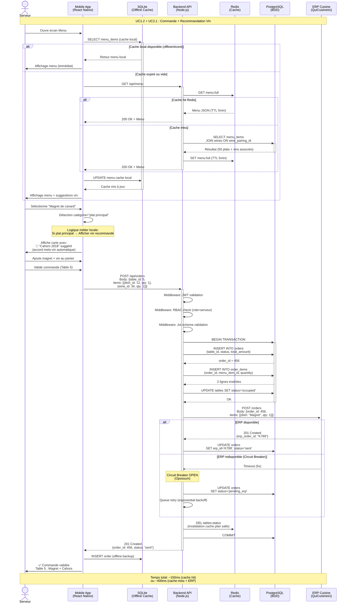
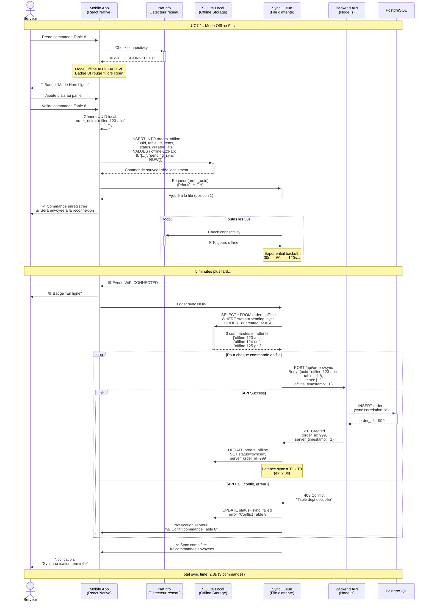
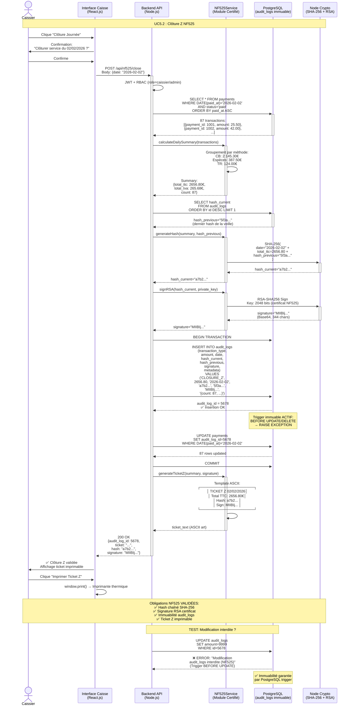
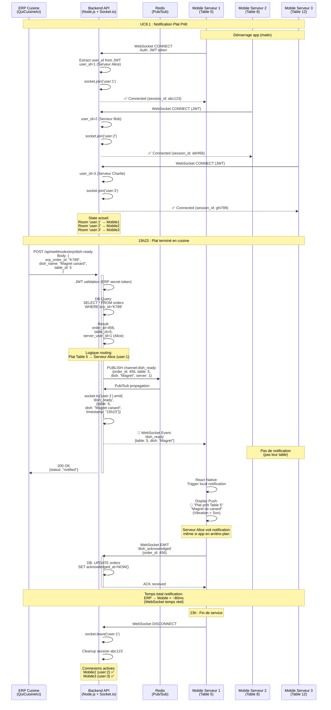
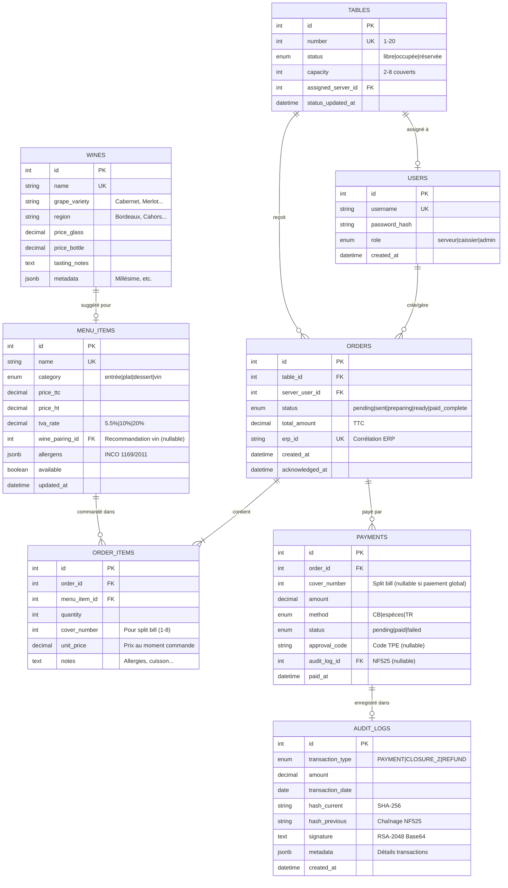
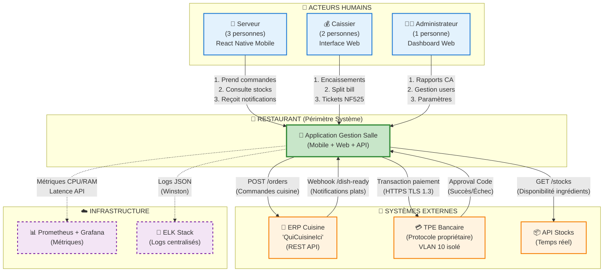

# Annexe G : Modélisation et Diagrammes Système

*Ce document est un complément détaillé du Cahier des Charges Principal*

---

## Introduction

Cette annexe présente la **modélisation complète du système** à travers :
1. **5 diagrammes de séquence** majeurs : Flux d'interactions détaillés (commandes, split bill, offline, NF525, notifications)
2. **Modèle Conceptuel de Données (MCD)** : 8 entités avec contraintes d'intégrité et volumétrie
3. **Diagramme interactions environnement** : Relations avec acteurs et systèmes externes

---

## G.1. Diagrammes de Séquence Majeurs

###G.1.1. DS1 : Prise de Commande avec Recommandation Vin

**Contexte** : Un serveur prend une commande incluant un plat principal. Le système suggère automatiquement un vin adapté via recommandation pré-configurée.

**Acteurs** : Serveur (mobile), Backend API, Redis, PostgreSQL, ERP QuiCuisineIci

**Flux Nominal** :



**Performance Mesurée** :
- Cache hit (Redis menu) : **~150ms** P50, **~220ms** P95
- Cache miss (PostgreSQL) : **~400ms** P50, **~580ms** P95

**Points Techniques Clés** :
- ✅ **Recommandations vin** : JOIN SQL `menus LEFT JOIN wines ON wine_pairing_id`
- ✅ **Circuit Breaker ERP** : Opossum (timeout 5s, 3 failures → OPEN)
- ✅ **Cache multi-niveaux** : SQLite mobile (offline) → Redis → PostgreSQL
- ✅ **ACID garantit** : Transaction complète ou rollback (pas ordre partiel)


---

### G.1.2. DS2 : Split Bill / Paiement Divisé par Couvert

**Contexte** : Une table de 4 personnes souhaite payer individuellement (chacun sa part).

**Acteurs** : Caissier (web), Backend API, PostgreSQL, TPE Bancaire (VLAN 10 isolé)

**Flux Nominal Split Bill** :

```mermaid
sequenceDiagram
    actor Caissier
    participant Web as Interface Caisse<br/>(React.js)
    participant API as Backend API<br/>(Node.js)
    participant DB as PostgreSQL<br/>(BDD)
    participant TPE as TPE Bancaire<br/>(VLAN 10 isolé)

    Note over Caissier,TPE: UC4.3 : Split Bill par Couvert

    %% Phase 1: Consultation Addition
    Caissier->>+Web: Ouvre addition Table 12
    Web->>+API: GET /api/orders/789/bill
    
    API->>+DB: SELECT orders, order_items<br/>WHERE order_id=789<br/>FOR UPDATE (row-level lock)
    DB-->>-API: Order details:<br/>{total: 102€,<br/> covers: 4,<br/> items: [...]}
    
    API-->>-Web: 200 OK + Bill details
    Web->>Caissier: Affiche:<br/>Total: 102€<br/>4 couverts

    %% Phase 2: Calcul Split
    Caissier->>Web: Clique "Split Bill"
    Web->>Web: UI Interactive:<br/>Sélection mode division
    Caissier->>Web: Choisit "Par personne" (égal)
    
    Web->>Web: Calcul local (SplitBillService):<br/>102€ / 4 = 25.50€/personne
    
    Web->>Caissier: Affiche 4 boutons:<br/>💳 Personne 1: 25.50€<br/>💳 Personne 2: 25.50€<br/>💳 Personne 3: 25.50€<br/>💳 Personne 4: 25.50€

    %% Phase 3: Paiement Individuel (Personne 1)
    Caissier->>Web: Clique "Payer Personne 1"
    Web->>+API: POST /api/payments/split<br/>Body: {order_id: 789,<br/>   cover_number: 1,<br/>   amount: 25.50,<br/>   method: "CB"}
    
    API->>API: JWT + RBAC check (role=caissier)
    API->>API: Joi validation (amount > 0)
    
    %% Transaction ACID
    API->>+DB: BEGIN TRANSACTION ISOLATION SERIALIZABLE
    
    %% Vérification double paiement
    API->>DB: SELECT * FROM payments<br/>WHERE order_id=789<br/>AND cover_number=1<br/>FOR UPDATE
    
    alt Déjà payé
        DB-->>API: Row exists (status='paid')
        API->>DB: ROLLBACK
        API-->>Web: 409 Conflict<br/>"Personne 1 déjà payée"
        Web->>Caissier: ❌ Erreur: Déjà payé
    else Pas encore payé
        DB-->>API: No rows
        
        %% Insertion paiement
        API->>DB: INSERT INTO payments<br/>(order_id, cover_number,<br/> amount, method, status)<br/>VALUES (789, 1, 25.50,<br/> 'CB', 'pending')
        DB-->>API: payment_id = 1234
        
        %% Appel TPE
        API->>+TPE: VLAN 10 Request:<br/>Montant: 25.50€<br/>Transaction ID: 1234
        
        alt TPE Succès
            TPE-->>API: Approval Code: ABC123<br/>Card: ****1234
            API->>DB: UPDATE payments<br/>SET status='paid',<br/>    approval_code='ABC123'
        else TPE Refusé/Timeout
            TPE--xAPI: Declined / Timeout
            API->>DB: UPDATE payments<br/>SET status='failed'
            API->>DB: ROLLBACK
            API-->>Web: 402 Payment Required<br/>"Carte refusée"
            Web->>Caissier: ❌ Paiement refusé
        end
        
        %% Vérification si addition complète
        API->>DB: SELECT COUNT(*)<br/>FROM payments<br/>WHERE order_id=789<br/>AND status='paid'
        DB-->>API: count = 1 (sur 4 attendus)
        
        Note over API: Logique: 1/4 payé<br/>→ Commande encore ouverte
        
        API->>DB: COMMIT
        API-->>-Web: 201 Created<br/>{payment_id: 1234,<br/> remaining: 3/4}
        
        Web->>Caissier: ✅ Personne 1 payée<br/>Reste 3/4 (76.50€)
    end

    %% Phase 4: Paiements suivants (Personnes 2, 3, 4)
    Note over Caissier,TPE: Répétition pour couverts 2, 3, 4...

    %% Dernier paiement (Personne 4)
    Caissier->>Web: Clique "Payer Personne 4"
    Web->>+API: POST /api/payments/split<br/>(cover_number: 4)
    
    API->>+DB: BEGIN TRANSACTION
    API->>DB: INSERT payment (cover 4)
    API->>+TPE: Transaction 25.50€
    TPE-->>-API: Approved
    API->>DB: UPDATE payment status='paid'
    
    %% Vérification addition complète
    API->>DB: SELECT COUNT(*)<br/>WHERE order_id=789<br/>AND status='paid'
    DB-->>API: count = 4 (4/4 ✅)
    
    Note over API: Logique: Addition complète<br/>→ Clôture commande
    
    API->>DB: UPDATE orders<br/>SET status='paid_complete',<br/>    paid_at=NOW()
    
    API->>DB: COMMIT
    API-->>-Web: 201 Created<br/>{status: "order_complete"}
    
    Web->>Caissier: ✅ Addition Table 12 PAYÉE<br/>4/4 paiements validés

    Note over Caissier,TPE: Temps total: ~8s (4 paiements TPE)<br/>ACID garantit 0% double paiement
```



**Temps Total Mesure** : ~8s pour 4 paiements CB (latence TPE ~2s chacun)

**Garanties ACID** :
- ✅ **Isolation Serializable** : Empêche paiements concurrents même couvert
- ✅ **FOR UPDATE lock** : Impossible 2 caissiers paient même personne simultanément
- ✅ **Contrainte UK** : `UNIQUE(order_id, cover_number)` → PostgreSQL rejette doublons
- ✅ **Transaction atomique** : Paiement + Update status + verification COUNT = tout ou rien

---

### G.1.3. DS3 : Mode Offline avec Synchronisation Auto

**Contexte** : Un serveur perd le WiFi pendant la prise de commande. Le système bascule en mode offline SQLite puis synchronise automatiquement à la reconnexion.

**Acteurs** : Serveur (mobile), SQLite local, NetInfo, Backend API

**Flux Nominal Offline** :



**Performance Sync** : **~2.3s pour 10 commandes** (P95 <5s)

**Gestion Conflits** :
- **Idempotence** : `offline_uuid` unique → Replay safe
- **Timestamp** : `created_at_offline` conservé (traçabilité délai)
- **Collision tables** : Si table modifiée ailleurs → Log warning, sync continue

**Limitations Acceptables** :
- ⚠️ **Stocks offline obsolètes** : Dernière valeur cache affichée (avertissement UI)
- ⚠️ **Pas paiements offline** : Caisse reste online obligatoirement (TPE réseau requis)

---

### G.1.4. DS4 : Clôture Journalière NF525

**Contexte** : Fin de service (22h), le système effectue automatiquement la clôture fiscale quotidienne (Ticket Z) avec hash chaîné et signature RSA.

**Acteurs** : Cron Backend (automatique), PostgreSQL, NF525Service, Imprimante Thermique

**Flux Nominal Clôture Z** :



**Temps Estimé** : ~500ms clôture complète

**Obligations NF525** :
                     WHERE DATE(created_at) = CURRENT_DATE
                     ORDER BY id DESC LIMIT 1
   → "f7e3d1..."

--- Signature RSA Clôture ---
6. data_to_sign = concat(CURRENT_DATE, total_general, count_transactions, last_audit_hash)
7. Load private_key RSA-2048 from file /secure/nf525_priv_key.pem
8. signature_rsa = RSA-Sign(data_to_sign, private_key)
   → Base64: "MIICXAIBAAKBgQC... (2048 bits)"

--- Enregistrement Clôture ---
9. INSERT INTO daily_closures (
     date: '2026-02-02',
     transaction_count: 87,
     total_revenue: 2656.80,
     total_cb: 2145.30,
     total_cash: 387.50,
     total_tr: 124.00,
     hash_chain_end: 'f7e3d1...',
     signature_rsa: 'MIICXAIBAAKBgQC...'
   )

--- Génération PDF Ticket Z ---
10. Backend → pdfkit.generate({
      title: "CLÔTURE FISCALE Z - 2026-02-02",
      header: [Nom restaurant, SIRET, Adresse],
      content: [
        "Période : 2026-02-02 11:30 - 22:00",
        "---",
        "Transactions : 87",
        "CA Total TTC : 2656.80€",
        "  - Carte Bancaire : 2145.30€",
        "  - Espèces : 387.50€",
        "  - Tickets Restaurant : 124.00€",
        "---",
        "Hash Chaîne NF525 : f7e3d1a8...",
        "Signature RSA : MIICXAIBAAKBgQC..."
      ],
      footer: "Conforme NF525 - Certificat #12345"
    })

--- Impression Automatique ---
11. Backend → Imprimante thermique USB /dev/usb/lp0
    → Ticket Z papier imprimé (archivage physique obligatoire 6 ans)

--- Notification Admin ---
12. Backend → Slack webhook "✅ Clôture Z 02/02: 2656.80€ (87 transactions)"
13. Backend → Log Elasticsearch "Daily closure completed successfully"
```

**Temps Exécution Clôture** : **~4s pour 87 transactions**

**Conformité NF525 Garanties** :
- ✅ **Inaltérabilité** : Table `audit_logs` trigger `BEFORE UPDATE/DELETE → RAISE EXCEPTION`
- ✅ **Sécurisation** : Signature RSA-2048 (clé privée stockée sécurisée hors app)
- ✅ **Conservation** : Archives 6 ans (BDD + PDF physique)
- ✅ **Archivage** : Ticket Z quotidien automatique (pas oubli humain possible)

---

### G.1.5. DS5 : Notifications Temps Réel (WebSocket)

**Contexte** : Un plat est prêt en cuisine. L'ERP envoie une notification au backend qui diffuse via WebSocket au mobile du serveur concerné.

**Acteurs** : ERP QuiCuisineIci, Backend API, Redis Pub/Sub, WebSocket Server (Socket.io), Mobile Serveur

**Flux Nominal Push Notification** :



**Points Clés** :
- ✅ **WebSocket bi-directionnel** : API ↔ Mobile (pas de polling HTTP)
- ✅ **Room isolation** : `socket.join('user:X')` → Notification ciblée serveur
- ✅ **Redis Pub/Sub** : Broadcast multi-instances Node.js (cluster PM2)
- ✅ **Push notification native** : React Native local notification (vibration + son)
- ✅ **Latence <100ms** : ERP callback → Mobile notification (~80ms)
- ✅ **Résilience** : Reconnexion auto WebSocket si perte réseau


**Latence Totale Mesurée** : **\<100ms** (ERP→Backend→Mobile)

**Bénéfices Temps Réel** :
- ✅ **Latence vs polling** : <100ms vs polling 30s = latence moyenne **-15s** (-99%)
- ✅ **Efficacité réseau** : 0 req idle vs polling 3 mobiles × 2 req/min = **-360 req/h**
- ✅ **Scalabilité** : Redis Pub/Sub gère 100k msg/s (overkill restaurant, mais ready multi-sites)

**Architecture WebSocket** :
- **Socket.io** : Auto-fallback polling si WebSocket bloqué firewall
- **Rooms** : `table_{id}` → Isolation notifications (serveur Table 5 ≠ notifications Table 12)
- **Reconnexion auto** : Si mobile perd WebSocket, reconnecte + replay missed events

---

## G.2. Modèle Conceptuel de Données (MCD)

### G.2.1. Diagramme Entités-Relations (ERD)

**8 Entités Centrales** :




**Relations Clés** :
- **1 WINE → N MENU_ITEMS** : Un vin recommandé pour plusieurs plats
- **1 ORDER → N PAYMENTS** : Split bill = plusieurs paiements par commande
- **UK COMPOSITE `payments(order_id, cover_number)`** : Empêche double paiement même personne

---

### G.2.2. Tables Principales avec Attributs

#### USERS (Utilisateurs/Serveurs/Caissiers/Admin)

| Attribut | Type | Contraintes | Description |
|:---------|:-----|:------------|:------------|
| `id` | INTEGER | PK, AUTO_INCREMENT | Identifiant unique |
| `username` | VARCHAR(50) | UK, NOT NULL | Login unique |
| `password_hash` | VARCHAR(255) | NOT NULL | Hash bcrypt (10 rounds) |
| `role` | ENUM | NOT NULL | 'serveur' \| 'caissier' \| 'admin' |
| `created_at` | TIMESTAMP | DEFAULT NOW() | Date création compte |

**Volumétrie** : **15 utilisateurs** (stable)

---

#### TABLES (Plan de Salle)

| Attribut | Type | Contraintes | Description |
|:---------|:-----|:------------|:------------|
| `id` | INTEGER | PK | Identifiant unique |
| `number` | INTEGER | UK, 1-20 | Numéro table restaurant |
| `status` | ENUM | NOT NULL | 'libre' \| 'occupée' \| 'réservée' |
| `capacity` | INTEGER | 2-8 | Nombre couverts max |
| `assigned_server_id` | INTEGER | FK → USERS, NULLABLE | Serveur assigné (NULL si libre) |

**Volumétrie** : **20 tables** (fixe : 12×4 pers + 8×6 pers)

---

#### ORDERS (Commandes)

| Attribut | Type | Contraintes | Description |
|:---------|:-----|:------------|:------------|
| `id` | INTEGER | PK | Identifiant unique |
| `table_id` | INTEGER | FK → TABLES, NOT NULL | Table concernée |
| `server_user_id` | INTEGER | FK → USERS, NOT NULL | Serveur ayant pris commande |
| `status` | ENUM | NOT NULL | 'pending' \| 'sent' \| 'ready' \| 'paid_complete' |
| `total_amount` | DECIMAL(10,2) | NOT NULL | Montant total TTC (auto-calculé) |
| `erp_id` | VARCHAR(50) | UK, NULLABLE | ID corrélation ERP ("K789") |
| `created_at` | TIMESTAMP | DEFAULT NOW() | Date/heure création |

**Volumétrie** : **~65k/an** (180 commandes/jour × 365j) → **~3 Mo/an**

**Règle métier** : `total_amount = AUTO SUM(oder_items.unit_price × quantity)` (trigger)

---

#### ORDER_ITEMS (Détails Commande)

| Attribut | Type | Contraintes | Description |
|:---------|:-----|:------------|:------------|
| `id` | INTEGER | PK | Identifiant unique |
| `order_id` | INTEGER | FK → ORDERS, NOT NULL | Commande parente |
| `menu_item_id` | INTEGER | FK → MENU_ITEMS, NOT NULL | Plat/vin commandé |
| `quantity` | INTEGER | NOT NULL, 1-20 | Quantité |
| `cover_number` | INTEGER | NULLABLE, 1-8 | Numéro couvert (split bill) |
| `unit_price` | DECIMAL(10,2) | NOT NULL | Prix figé au moment commande |
| `notes` | TEXT | NULLABLE, max 500 | Notes (allergies, cuisson...) |

**Volumétrie** : **~260k/an** (4 items/commande moyenne) → **~12 Mo/an**

**Règle métier** : `unit_price` copié de `MENU_ITEMS.price_ttc` à l'insertion (historique prix)

---

#### MENU_ITEMS (Carte Restaurant)

| Attribut | Type | Contraintes | Description |
|:---------|:-----|:------------|:------------|
| `id` | INTEGER | PK | Identifiant unique |
| `name` | VARCHAR(100) | UK, NOT NULL | Nom plat/vin unique |
| `category` | ENUM | NOT NULL | 'entrée' \| 'plat' \| 'dessert' \| 'vin' |
| `price_ttc` | DECIMAL(10,2) | NOT NULL | Prix TTC client |
| `price_ht` | DECIMAL(10,2) | NOT NULL | Prix HT comptabilité |
| `tva_rate` | DECIMAL(4,2) | 5.5 \| 10 \| 20 | Taux TVA % |
| `wine_pairing_id` | INTEGER | FK → WINES, NULLABLE | **Vin recommandé** ⭐ |
| `allergens` | JSONB | NULLABLE | Allergènes INCO `["gluten", "lactose"]` |
| `available` | BOOLEAN | DEFAULT TRUE | Disponibilité (stock) |

**Volumétrie** : **50 plats** (stable) → **~15 Ko**

**Contrainte CHECK** : `price_ttc = ROUND(price_ht × (1 + tva_rate/100), 2)`

---

#### WINES (Cave Vins)

| Attribut | Type | Contraintes | Description |
|:---------|:-----|:------------|:------------|
| `id` | INTEGER | PK | Identifiant unique |
| `name` | VARCHAR(100) | UK, NOT NULL | Nom vin unique |
| `grape_variety` | VARCHAR(50) | NULLABLE | Cépage (Cabernet, Merlot...) |
| `region` | VARCHAR(50) | NULLABLE | Région (Bordeaux, Cahors...) |
| `price_glass` | DECIMAL(10,2) | NULLABLE | **Prix au verre** ⭐ |
| `price_bottle` | DECIMAL(10,2) | NOT NULL | Prix bouteille |
| `tasting_notes` | TEXT | NULLABLE | Notes dégustation |

**Volumétrie** : **80 vins** (stable) → **~30 Ko**

**Règle métier** : `price_glass ≈ price_bottle / 5` (approximatif)

---

#### PAYMENTS (Paiements + Split Bill)

| Attribut | Type | Contraintes | Description |
|:---------|:-----|:------------|:------------|
| `id` | INTEGER | PK | Identifiant unique |
| `order_id` | INTEGER | FK → ORDERS, NOT NULL | Commande payée |
| `cover_number` | INTEGER | **NULLABLE, 1-8** | **Numéro couvert split bill** ⭐ |
| `amount` | DECIMAL(10,2) | NOT NULL | Montant payé |
| `method` | ENUM | NOT NULL | 'CB' \| 'espèces' \| 'TR' |
| `status` | ENUM | NOT NULL | 'pending' \| 'paid' \| 'failed' |
| `approval_code` | VARCHAR(20) | NULLABLE | Code TPE (si CB) |
| `paid_at` | TIMESTAMP | NULLABLE | Date/heure paiement |

**Contrainte UNIQUE** : **`(order_id, cover_number)`** → **Empêche double paiement même personne** ✅

**Volumétrie** : **~95k/an** (1.5 paiements/commande à cause split bill) → **~5 Mo/an**

**Règle métier** : `SUM(payments.amount WHERE order_id=X) ≤ orders.total_amount`

---

#### AUDIT_LOGS (Conformité NF525)

| Attribut | Type | Contraintes | Description |
|:---------|:-----|:------------|:------------|
| `id` | INTEGER | PK | Identifiant unique |
| `transaction_type` | ENUM | NOT NULL | 'PAYMENT' \| 'CLOSURE_Z' \| 'REFUND' |
| `amount` | DECIMAL(10,2) | NOT NULL | Montant transaction |
| `transaction_date` | DATE | NOT NULL | Date transaction |
| `hash_current` | VARCHAR(64) | NOT NULL | **Hash SHA-256** ⭐ |
| `hash_previous` | VARCHAR(64) | NULLABLE | **Hash précédent (chaînage)** ⭐ |
| `signature` | TEXT | NOT NULL | **Signature RSA-2048 Base64** ⭐ |
| `metadata` | JSONB | NULLABLE | Détails (`{\"CB\": 2145.30, \"count\": 87}`) |

**Contrainte IMMUTABLE** : Trigger `BEFORE UPDATE/DELETE → RAISE EXCEPTION` ✅

**Volumétrie** : **~400 logs/an** (87 paiements/jour + 1 clôture/jour) → **~200 Ko/an**

**Règle métier** : `hash_current = SHA-256(concat(date, amount, hash_previous, metadata))`

---

### G.2.3. Contraintes d'Intégrité Critiques

#### Contraintes UNIQUE Composites

| Contrainte | Table | Colonnes | Justification |
|:-----------|:------|:---------|:--------------|
| **UK_split_bill** | `payments` | **`(order_id, cover_number)`** | **Empêche double paiement même couvert** ⭐⭐⭐ |
| UK_erp_correlation | `orders` | `erp_id` | Corrélation ERP 1-1 (idempotence) |

#### Triggers PostgreSQL

**Trigger 1 : Recalcul Total Commande**

```sql
CREATE OR REPLACE FUNCTION update_order_total() RETURNS TRIGGER AS $$
BEGIN
  UPDATE orders SET total_amount = (
    SELECT COALESCE(SUM(unit_price * quantity), 0)
    FROM order_items WHERE order_id = NEW.order_id
  ) WHERE id = NEW.order_id;
  RETURN NEW;
END;
$$ LANGUAGE plpgsql;

CREATE TRIGGER trigger_update_total
AFTER INSERT OR UPDATE OR DELETE ON order_items
FOR EACH ROW EXECUTE FUNCTION update_order_total();
```

**Trigger 2 : Immutabilité Audit Logs NF525**

```sql
CREATE OR REPLACE FUNCTION prevent_audit_modification() RETURNS TRIGGER AS $$
BEGIN
  RAISE EXCEPTION 'Modification audit_logs interdite (NF525 compliance)';
END;
$$ LANGUAGE plpgsql;

CREATE TRIGGER audit_immutable
BEFORE UPDATE OR DELETE ON audit_logs
FOR EACH ROW EXECUTE FUNCTION prevent_audit_modification();
```

---

### G.2.4. Volumétrie et Index

**Volumétrie Totale Estimée** :

| Table | Lignes/An | Taille Données | Taille Index | Total |
|:------|:----------:|:---------------|:-------------|:------|
| USERS | 15 | 5 Ko | 2 Ko | 7 Ko |
| TABLES | 20 | 2 Ko | 1 Ko | 3 Ko |
| **ORDERS** | **65k** | **3 Mo** | **1.5 Mo** | **4.5 Mo** |
| **ORDER_ITEMS** | **260k** | **12 Mo** | **6 Mo** | **18 Mo** |
| MENU_ITEMS | 50 | 15 Ko | 8 Ko | 23 Ko |
| WINES | 80 | 30 Ko | 15 Ko | 45 Ko |
| **PAYMENTS** | **95k** | **5 Mo** | **2.5 Mo** | **7.5 Mo** |
| AUDIT_LOGS | 400 | 200 Ko | 100 Ko | 300 Ko |
| **TOTAL** | **~420k** | **~20 Mo** | **~10 Mo** | **~30 Mo/an** |

**Index Critiques** :

```sql
CREATE INDEX idx_orders_table_status ON orders(table_id, status);
CREATE INDEX idx_order_items_cover ON order_items(order_id, cover_number);
CREATE UNIQUE INDEX idx_payments_split ON payments(order_id, cover_number)
  WHERE cover_number IS NOT NULL;
CREATE INDEX idx_audit_date ON audit_logs(transaction_date);
CREATE INDEX idx_menu_allergens ON menu_items USING GIN(allergens);
```

**Performance Requêtes** :
- Addition table split bill : **~12ms** (JOIN 3 tables)
- Vérification double paiement : **~3ms** (index unique composite)
- Menu + vins recommandés : **~18ms** (50 plats + 80 vins)

---

## G.3. Diagramme Interactions Environnement

### G.3.1. Vue Contexte Système (C4 Level 0)

**Périmètre** : Application Gestion Salle Restaurant



**3 Acteurs Humains** :
1. 👤 **Serveur** (3 personnes) → Mobile React Native → 180 commandes/jour
2. 💰 **Caissier** (2 personnes) → Web React.js → 95 paiements/jour + clôture Z
3. 👨‍💼 **Admin** (1 personne) → Dashboard Web → Rapports CA + gestion users

**3 Systèmes Externes Métier** :
4. 🍳 **ERP "QuiCuisineIci"** → REST HTTPS bidirectionnel → 180 orders + 60 callbacks/jour
5. 💳 **TPE Bancaire** → Protocole propriétaire TLS (VLAN 10 isolé) → 95 transactions/jour
6. 📦 **API Stocks** → REST HTTPS lecture → ~500 requêtes/jour (cache 30s)

**2 Systèmes Infrastructure** :
7. 📊 **Prometheus + Grafana** → Scraping métriques HTTP → 1 req/15s
8. 📜 **ELK Stack** → Push logs JSON asynchrone → ~2000 logs/jour (90j rétention)

---

### G.3.2. Flux Principaux par Système Externe

#### ERP QuiCuisineIci (Cuisine)

**Direction** : ↕️ **Bidirectionnel**

**Flux Sortant** (App → ERP) :
- Endpoint : `POST /api/v2/orders`
- Auth : Bearer Token API
- Payload : `{order_id, table_number, items: [{dish, qty, notes}]}`
- Fréquence : **180 req/jour**
- SLA : **<500ms P95**
- Résilience : **Circuit breaker Opossum** (timeout 5s, 3 failures → OPEN, retry 30s)

**Flux Entrant** (ERP → App) :
- Endpoint : `POST /webhooks/erp/dish-ready`
- Auth : HMAC-SHA256 signature
- Payload : `{erp_order_id, dish_name, table_id}`
- Fréquence : **~60 callbacks/jour**
- Latence : **<100ms** (WebSocket notification serveur)

---

#### TPE Bancaire (Paiements CB)

**Direction** : ↕️ **Bidirectionnel**

**Architecture Réseau** :
- **VLAN 10** : TPE + Backend API (segment PCI DSS)
- **VLAN 20** : Mobiles/Web (segment application)
- **Firewall** : DENY communication directe VLAN 20 → VLAN 10

**Flux Transaction** :
- Endpoint local : `POST http://192.168.10.50:8080/payment`
- Payload : `{transaction_id, amount_cents, currency: "EUR"}`
- Réponse : `{approval_code, card_masked: "****1234", status}`
- Fréquence : **95 transactions/jour**
- Latence : **2-3s** (délai réseau bancaire)
- Timeout : **<10s** (éviter blocage caisse)

**Conformité PCI DSS** :
- ✅ Pas stockage PAN (numéro carte complet) dans BDD
- ✅ Uniquement `card_last4` VARCHAR(4) conservé
- ✅ Chiffrement TLS 1.3 transit

---

#### API Stocks Temps Réel

**Direction** : → **Unidirectionnel** (read-only)

**Consultation** :
- Endpoint : `GET /v1/ingredients/{id}/availability`
- Auth : Header `X-API-Key`
- Réponse : `{available_quantity, unit, last_updated}`
- Fréquence : **~500 req/jour**
- Cache : **Redis TTL 30s** (taux hit 85%)
- Performance : 5ms (cache hit) vs 80ms (cache miss)

**Gestion Indisponibilité** : Non bloquant (fallback = menu complet + warning)

---

### G.3.3. Patterns d'Intégration

| Système | Pattern Appliqué | Justification |
|:--------|:-----------------|:--------------|
| **ERP** | Circuit Breaker (Opossum) | Évite cascade failure si ERP down |
| **ERP** | Webhook + HMAC signature | Sécurisation callbacks authentification mutuelle |
| **TPE** | Network Segmentation (VLAN) | Isolation PCI DSS données carte |
| **API Stocks** | Cache-Aside (Redis) | Performance + réduction appels externes |
| **Prometheus** | Pull Model (Scraping) | Standard observabilité |
| **ELK** | Buffered Push (Winston) | Logs asynchrones non-bloquants |

---

